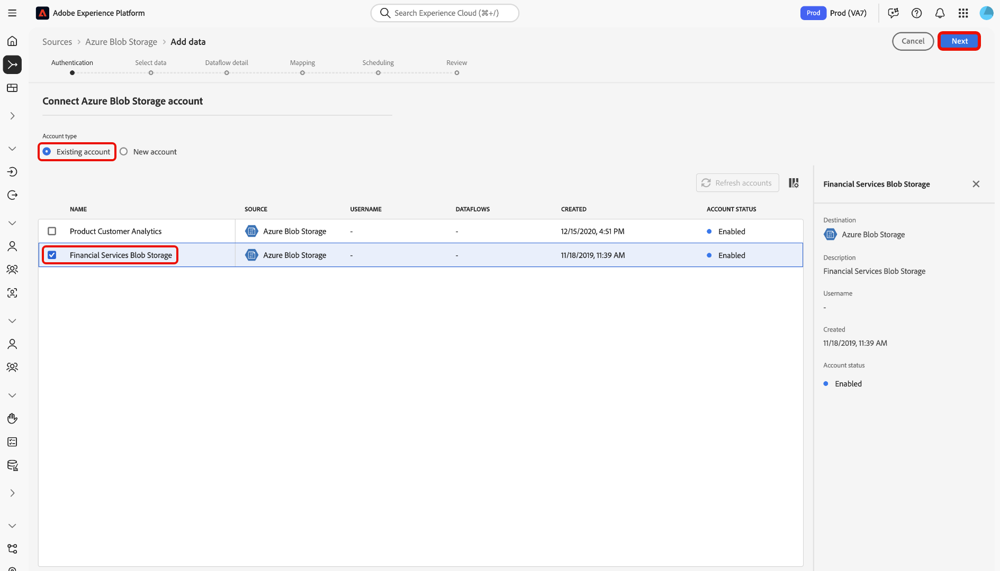

# 在UI中 [!DNL Azure Blob] 建立來源連接器

Adobe Experience Platform中的來源連接器可讓您依計畫吸收外部來源的資料。 本教學課程提供使用使 [!DNL Azure Blob] 用者介面建立([!DNL Blob]以下稱為「 [!DNL Platform] 」)的步驟。

## 快速入門

本教學課程需要對Adobe Experience Platform的下列元件有正確的認識：

- [[!DNL Experience Data Model] (XDM)系統](../../../../../xdm/home.md):Experience Platform組織客戶體驗資料的標準化架構。
   - [架構構成基礎](../../../../../xdm/schema/composition.md):瞭解XDM架構的基本建置區塊，包括架構組合的主要原則和最佳實務。
   - [架構編輯器教程](../../../../../xdm/tutorials/create-schema-ui.md):瞭解如何使用架構編輯器UI建立自訂架構。
- [[!DNL即時客戶基本資料]](../../../../../profile/home.md):根據來自多個來源的匯整資料，提供統一、即時的消費者個人檔案。

如果您已經有有效的 [!DNL Blob] 連接，則可以跳過本文檔的其餘部分，並繼續有關配置資料 [流的教程](../../dataflow/batch/cloud-storage.md)。

### 支援的檔案格式

[!DNL Experience Platform] 支援從外部儲存中提取的以下檔案格式：

- 分隔字元分隔值(DSV):目前，對DSV格式化資料檔案的支援僅限於逗號分隔值。 DSV格式檔案中欄位標題的值只能由字母數字字元和下划線組成。 將來將提供對一般DSV檔案的支援。
- JavaScript物件符號(JSON):JSON格式的資料檔案必須符合XDM規範。
- Apache Parce:拼花格式化的資料檔案必須與XDM相容。

### 收集必要的認證

為了在上訪問您 [!DNL Blob] 的儲存 [!DNL Platform]，您必須為以下憑據提供有效值：

| 憑證 | 說明 |
| ---------- | ----------- |
| `connectionString` | 訪問Blob儲存中的資料所需的連接字串。 連接字串 [!DNL Blob] 模式是： `DefaultEndpointsProtocol=https;AccountName={ACCOUNT_NAME};AccountKey={ACCOUNT_KEY}`. |

如需快速入門的詳細資訊，請造 [ [!DNL Azure Blob] 訪此檔案](https://docs.microsoft.com/en-us/azure/storage/common/storage-configure-connection-string)。

## 連接您的Blob帳戶

收集完所需的認證後，您可依照下列步驟將帳戶連結 [!DNL Blob] 至 [!DNL Platform]。

登入 [Adobe Experience Platform](https://platform.adobe.com) ，然後從左側導覽列選取 **[!UICONTROL Sources]** ，以存取 **** Sources工作區。 「目 **[!UICONTROL 錄]** 」畫面會顯示多種來源，您可以用來建立帳戶。

您可以從畫面左側的目錄中選取適當的類別。 或者，您也可以使用搜尋選項找到您要使用的特定來源。

在「數 **[!UICONTROL 據庫]** 」類別下，選 **[!UICONTROL 擇「Azure Blob儲存」]**。 如果這是您第一次使用此連接器，請選擇「配 **[!UICONTROL 置」]**。 否則，請選 **[!UICONTROL 擇「添加資料]** 」(Add data [!DNL Blob])以建立新連接器。

此時 **[!UICONTROL 將顯示「連接到Azure Blob儲存]** 」頁。 在此頁上，您可以使用新認證或現有認證。

### 新帳戶

如果您使用新認證，請選擇「新 **[!UICONTROL 帳戶」]**。 在出現的輸入表單上，提供名稱、選用說明和您的認 [!DNL Blob] 證。 完成後，選擇 **[!UICONTROL Connect]** ，然後為建立新連接留出一些時間。

### 現有帳戶

若要連線現有帳戶，請選 [!DNL Blob] 取您要連線的帳戶，然後選取「下 **[!UICONTROL 一]** 步」繼續。

## 後續步驟和其他資源

遵循本教學課程，您已建立與帳戶的 [!DNL Blob] 連線。 您現在可以繼續下一個教學課程，並 [設定資料流，將雲端儲存空間的資料匯入 [!DNL Platform]](../../dataflow/batch/cloud-storage.md)。