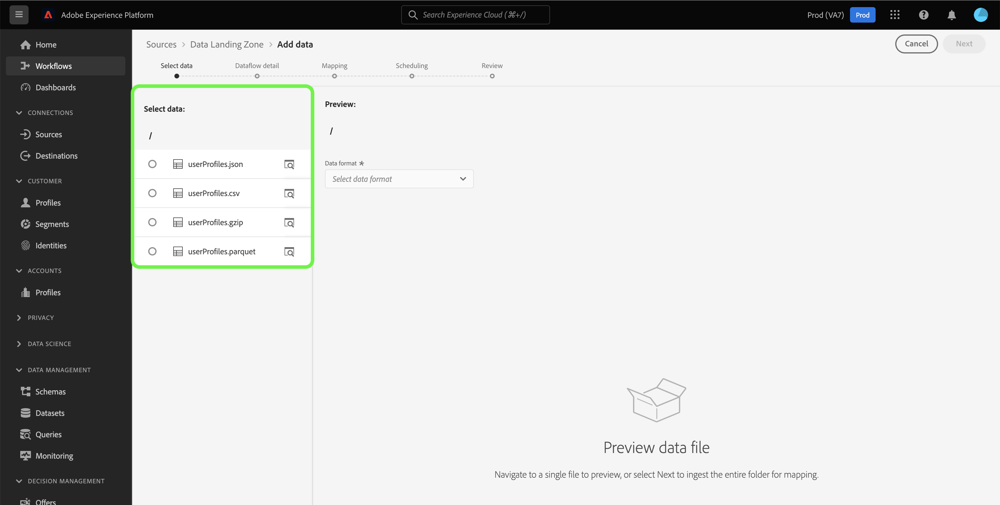
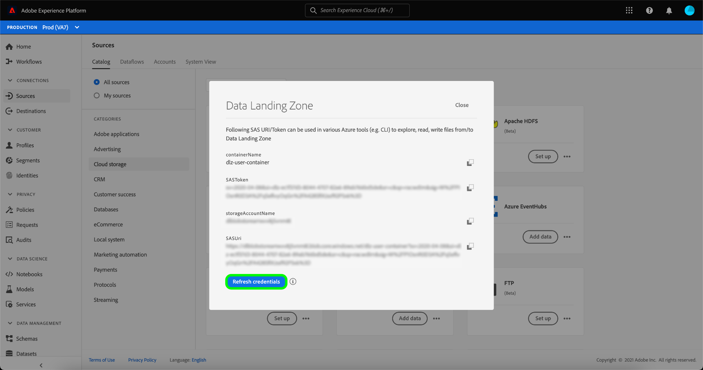

# Connect [!DNL Data Landing Zone] 使用UI設為Platform

>[!IMPORTANT]
>
>此頁面專屬於 [!DNL Data Landing Zone] *來源* 連接器Experience Platform。 有關連接到 [!DNL Data Landing Zone] *目的地* 連接器，請參閱 [[!DNL Data Landing Zone] 目的地檔案頁面](/help/destinations/catalog/cloud-storage/data-landing-zone.md).

[!DNL Data Landing Zone] 是安全的雲端檔案儲存功能，可將檔案匯入Adobe Experience Platform。 資料會自動從 [!DNL Data Landing Zone] 七天後。

本教學課程提供建立 [!DNL Data Landing Zone] 源連接。

## 快速入門

本教學課程需要妥善了解下列Adobe Experience Platform元件：

* [來源](../../../../home.md):Experience Platform可讓您從各種來源擷取資料，同時使用Platform服務來建構、加標籤及增強傳入資料。
* [沙箱](../../../../../sandboxes/home.md):Experience Platform提供可將單一Platform執行個體分割成個別虛擬環境的虛擬沙箱，以協助開發及改進數位體驗應用程式。

## 將檔案從 [!DNL Data Landing Zone] 到平台

在平台UI中，選取 **[!UICONTROL 來源]** 從左側導覽器存取 [!UICONTROL 來源] 工作區。 此 [!UICONTROL 目錄] 畫面會顯示您可以用來建立帳戶的各種來源。

您可以從畫面左側的目錄中選取適當的類別。 或者，您也可以使用搜尋列找到您要使用的特定來源。

在 [!UICONTROL 雲端儲存] 類別，選擇 [!DNL Data Landing Zone] 然後選取 **[!UICONTROL 新增資料]**.

此 [!UICONTROL 新增資料] 步驟，提供您選取並預覽您要帶入Platform的資料的介面。

* 介面的左側是資料夾瀏覽器，提供您容器中的檔案清單，接著可將這些檔案帶入Platform。
* 介面的右側可讓您從相容的檔案中預覽最多100列資料。

選取您要帶入Platform的檔案，並讓適當的介面在數分鐘內更新至預覽畫面。

>[!TIP]
>
>Platform會自動偵測您選取之檔案的屬性資訊，包括檔案資料格式、指定欄分隔字元和壓縮類型的相關資訊。

預覽介面可讓您檢查檔案的內容和結構。 預設情況下，預覽介面將顯示所選資料夾中的第一個檔案。

要預覽不同的檔案，請在要檢查的檔案名稱旁選擇預覽表徵圖。

完成後，請選取 **[!UICONTROL 下一個]**.

有關如何為雲儲存源建立資料流的詳細分步指南，請參閱 [建立雲儲存資料流，將資料帶入平台](../../dataflow/batch/cloud-storage.md).

## 擷取並重新整理您的 [!DNL Data Landing Zone] 憑據

[!DNL Data Landing Zone] 是隨Adobe Experience Platform來源授權提供的現成可用來源。 [!DNL Data Landing Zone] 使用基於SAS URI和SAS令牌的身份驗證。 您可以從 [!UICONTROL 來源目錄] 頁面。

在 [!UICONTROL 來源目錄]，在 [!UICONTROL 雲端儲存空間] 類別，選取點(**...**) **[!UICONTROL 資料登陸區]** 卡片。 從顯示的下拉式功能表中，選取 **[!UICONTROL 查看憑據]**.

此時將出現彈出窗口，顯示您的容器名稱、SAS令牌、儲存帳戶名稱和SAS URI。

選擇 **[!UICONTROL 刷新憑據]** 並且需要幾秒鐘時間，才能處理您更新的憑證。

>[!TIP]
>
>您的 [!DNL Data Landing Zone] 憑證會設為在90天後自動過期，而您必須使用新憑證才能重新連線至 [!DNL Data Landing Zone] 過期之後。 Platform中的資料流不受即將到期的憑證影響，您仍可以繼續使用具有新憑證的新資料流和現有資料流。

## 後續步驟

依照本教學課程，您已存取 [!DNL Data Landing Zone] 容器，並學習擷取和重新整理憑證。 您現在可以繼續下一個教學課程，以了解 [建立資料流，將資料從雲儲存帶到平台](../../dataflow/batch/cloud-storage.md).
