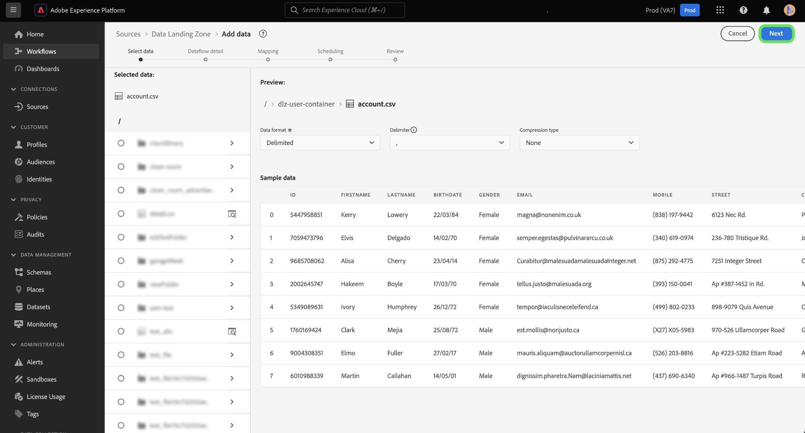

# 使用UI連線[!DNL Data Landing Zone]至Experience Platform

>[!IMPORTANT]
>
>此頁面特定於Experience Platform中的[!DNL Data Landing Zone] *來源*&#x200B;聯結器。 如需有關連線至[!DNL Data Landing Zone] *目的地*&#x200B;聯結器的資訊，請參閱[[!DNL Data Landing Zone] 目的地檔案頁面](/help/destinations/catalog/cloud-storage/data-landing-zone.md)。

[!DNL Data Landing Zone]是安全的雲端型檔案儲存裝置，可將檔案帶入Adobe Experience Platform。 資料會在七天後自動從[!DNL Data Landing Zone]中刪除。

本教學課程提供使用Experience Platform使用者介面建立[!DNL Data Landing Zone]來源連線的步驟。

## 快速入門

本教學課程需要您實際瞭解下列Adobe Experience Platform元件：

* [來源](../../../../home.md)： Experience Platform允許從各種來源擷取資料，同時讓您能夠使用Experience Platform服務來建構、加標籤以及增強傳入的資料。
* [沙箱](../../../../../sandboxes/home.md)： Experience Platform提供的虛擬沙箱可將單一Experience Platform執行個體分割成個別的虛擬環境，以利開發及改進數位體驗應用程式。

## 將您的檔案從[!DNL Data Landing Zone]帶到Experience Platform

>[!IMPORTANT]
>
> 若要連線到來源，您需要&#x200B;**[!UICONTROL 檢視來源]**&#x200B;和&#x200B;**[!UICONTROL 管理來源]**&#x200B;存取控制許可權。 閱讀[存取控制總覽](../../../../../access-control/home.md)或連絡您的產品管理員以取得必要的許可權。

在Experience Platform UI中，從左側導覽選取&#x200B;**[!UICONTROL 來源]**&#x200B;以存取[!UICONTROL 來源]工作區。 [!UICONTROL 目錄]畫面會顯示您可以用來建立帳戶的各種來源。

您可以從熒幕左側的目錄中選取適當的類別。 或者，您可以使用搜尋列來尋找您要使用的特定來源。

在[!UICONTROL 雲端儲存空間]類別下，選取[!DNL Data Landing Zone]，然後選取&#x200B;**[!UICONTROL 新增資料]**。

[!UICONTROL 新增資料]步驟隨即顯示，為您提供介面，讓您選取並預覽要帶到Experience Platform的資料。

* 介面的左側是資料夾瀏覽器，為您提供來自容器的檔案清單，您可以將這些檔案帶到Experience Platform。
* 介面的右側部分可讓您預覽相容檔案中最多100列的資料。

選取您要帶入Experience Platform的檔案，並等待片刻，讓正確的介面更新到預覽畫面中。

>[!TIP]
>
>Experience Platform會自動偵測您選取之檔案的屬性資訊，包括檔案資料格式、指定的欄分隔符號和壓縮型別的相關資訊。

預覽介面可讓您檢查檔案的內容和結構。 依預設，預覽介面會顯示所選資料夾中的第一個檔案。

若要預覽其他檔案，請選取要檢查的檔案名稱旁的預覽圖示。

完成後，選取&#x200B;**[!UICONTROL 下一步]**。

如需有關如何為雲端儲存空間來源建立資料流的詳細逐步指南，請參閱有關[建立雲端儲存空間資料流以將資料帶到Experience Platform](../../dataflow/batch/cloud-storage.md)的教學課程。

## 擷取您的[!DNL Data Landing Zone]認證

[!DNL Data Landing Zone]是您的Adobe Experience Platform來源授權隨附的來源。 [!DNL Data Landing Zone]使用SAS URI和SAS權杖式驗證。 您可以從[!UICONTROL 來源目錄]頁面擷取您的驗證認證。

若要擷取您的認證，請選取&#x200B;**[!UICONTROL 資料登陸區域]**&#x200B;卡片，然後從顯示的右側邊欄複製您的認證。

此時畫面會顯示彈出視窗，其中顯示您的容器名稱、SAS權杖、儲存體帳戶名稱、SAS URI以及到期日。

## 重新整理您的[!DNL Data Landing Zone]認證

您的[!DNL Data Landing Zone]認證已設定為90天後自動過期，而且您必須使用新認證，才能在過期後重新連線到[!DNL Data Landing Zone]。 您的Experience Platform資料流不會受到即將到期的認證的影響，您仍然可以使用新認證繼續使用新的和現有的資料流。

有兩種方式可重新整理您的[!DNL Data Landing Zone]認證：

>[!BEGINTABS]

>[!TAB 使用來源卡]

若要從來源目錄頁面重新整理您的認證，請選取[!DNL Data Landing Zone]卡片中的省略符號(**`...`**)，然後選取&#x200B;**[!UICONTROL 重新整理認證]**。

此時會出現一個快顯視窗，提示您確認後再繼續。 準備就緒後，選取&#x200B;**[!UICONTROL 重新整理認證]**。

>[!TAB 使用右邊欄]

若要使用右邊欄重新整理您的認證，請選取&#x200B;**[!UICONTROL 資料登陸區域]**&#x200B;來源卡片，然後選取&#x200B;**[!UICONTROL 更多動作]**。 接著，選取&#x200B;**[!UICONTROL 重新整理認證]**，然後使用出現的快顯視窗確認。

>[!ENDTABS]

## 後續步驟

依照此教學課程，您已存取您的[!DNL Data Landing Zone]容器，並已學習如何擷取和重新整理您的認證。 您現在可以繼續進行有關[建立資料流以將資料從雲端儲存空間帶到Experience Platform](../../dataflow/batch/cloud-storage.md)的下一個教學課程。
