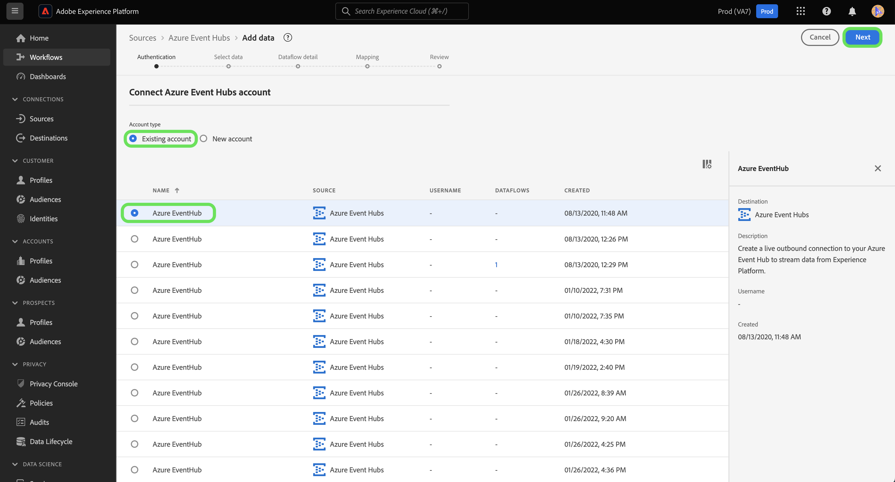

# 建立 [!DNL Azure Event Hubs] ui中的來源連線

>[!IMPORTANT]
>
>此 [!DNL Azure Event Hubs] 已購買Real-time Customer Data Platform Ultimate的使用者可在來源目錄中取得來源。

本教學課程提供建立 [!DNL Azure Event Hubs] 使用Adobe Experience Platform使用者介面的帳戶。

## 快速入門

本教學課程需要您實際瞭解下列Adobe Experience Platform元件：

* [[!DNL Experience Data Model (XDM)] 系統](../../../../../xdm/home.md)：作為依據的標準化架構 [!DNL Experience Platform] 組織客戶體驗資料。
   * [結構描述組合基本概念](../../../../../xdm/schema/composition.md)：瞭解XDM結構描述的基本建置區塊，包括結構描述組合中的關鍵原則和最佳實務。
   * [結構描述編輯器教學課程](../../../../../xdm/tutorials/create-schema-ui.md)：瞭解如何使用結構編輯器UI建立自訂結構描述。
* [[!DNL Real-Time Customer Profile]](../../../../../profile/home.md)：根據來自多個來源的彙總資料，提供統一的即時消費者個人檔案。

如果您已有有效的 [!DNL Event Hubs] 連線時，您可以略過本檔案的其餘部分，並繼續進行上的教學課程 [設定資料流](../../dataflow/streaming/cloud-storage-streaming.md).

### 收集必要的認證

為了驗證您的 [!DNL Event Hubs] 來源聯結器，您必須提供下列連線屬性的值：

>[!BEGINTABS]

>[!TAB 標準驗證]

| 認證 | 說明 |
| --- | --- |
| SAS金鑰名稱 | 授權規則的名稱，也稱為SAS金鑰名稱。 |
| SAS金鑰 | 的主要索引鍵 [!DNL Event Hubs] 名稱空間。 此 `sasPolicy` 該 `sasKey` 對應到必須具有 `manage` 已設定的許可權，以用於 [!DNL Event Hubs] 要填入的清單。 |
| 命名空間 | 的名稱空間 [!DNL Event Hubs] 您正在存取。 一個 [!DNL Event Hubs] namespace提供唯一的範圍設定容器，您可以在其中建立一或多個 [!DNL Event Hubs]. |

>[!TAB SAS驗證]

| 認證 | 說明 |
| --- | --- |
| SAS金鑰名稱 | 授權規則的名稱，也稱為SAS金鑰名稱。 |
| SAS金鑰 | 的主要索引鍵 [!DNL Event Hubs] 名稱空間。 此 `sasPolicy` 該 `sasKey` 對應到必須具有 `manage` 已設定的許可權，以用於 [!DNL Event Hubs] 要填入的清單。 |
| 命名空間 | 的名稱空間 [!DNL Event Hubs] 您正在存取。 一個 [!DNL Event Hubs] namespace提供唯一的範圍設定容器，您可以在其中建立一或多個 [!DNL Event Hubs]. |
| 事件中心名稱 | 您的名稱 [!DNL Event Hubs] 來源。 |

>[!ENDTABS]

如需這些值的詳細資訊，請參閱 [此事件中樞檔案](https://docs.microsoft.com/en-us/azure/event-hubs/authenticate-shared-access-signature).

收集必要的認證後，您可以依照下列步驟連結 [!DNL Event Hubs] 要Experience Platform的帳戶。

## 連線您的 [!DNL Event Hubs] 帳戶

在Platform UI中選取 **[!UICONTROL 來源]** 從左側導覽存取 [!UICONTROL 來源] 工作區。 此 [!UICONTROL 目錄] 畫面會顯示各種來源，供您建立帳戶。

您可以從熒幕左側的目錄中選取適當的類別。 或者，您可以使用搜尋選項來尋找您要使用的特定來源。

在 [!UICONTROL 雲端儲存空間] 類別，選取 **[!UICONTROL Azure事件中樞]**，然後選取 **[!UICONTROL 新增資料]**.

此 **[!UICONTROL 連線到Azure事件中樞]** 對話方塊隨即顯示。 您可以在此頁面使用新的證明資料或現有的證明資料。

### 現有帳戶

若要使用現有帳戶，請選取 [!DNL Event Hubs] 要使用的帳戶，然後選取 **[!UICONTROL 下一個]** 以繼續進行。

### 新帳戶

>[!TIP]
>
>建立後，您就無法變更的驗證型別 [!DNL Event Hubs] 基礎連線。 若要變更驗證型別，您必須建立新的基礎連線。

若要建立新帳戶，請選取 **[!UICONTROL 新帳戶]**，然後為您的新專案提供名稱和說明（選用） [!DNL Event Hubs] 帳戶。

>[!BEGINTABS]

>[!TAB 標準驗證]

若要建立 [!DNL Event Hubs] 具有標準驗證的帳戶，請選取 **[!UICONTROL 標準驗證]** 然後為您的欄位提供值 [!UICONTROL SAS金鑰名稱]， [!UICONTROL SAS金鑰]、和 [!UICONTROL 名稱空間].

輸入驗證認證後，請選取 **[!UICONTROL 連線到來源]**.

>[!TAB SAS驗證]

若要建立 [!DNL Event Hubs] 具有SAS驗證的帳戶，請選取 **[!UICONTROL SAS驗證]** 然後為您的欄位提供值 [!UICONTROL SAS金鑰名稱]， [!UICONTROL SAS金鑰]， [!UICONTROL 名稱空間]、和 [!UICONTROL 事件中樞名稱].

輸入驗證認證後，請選取 **[!UICONTROL 連線到來源]**.

>[!ENDTABS]

## 後續步驟

依照本教學課程所述，您已連線 [!DNL Event Hubs] 要Experience Platform的帳戶。 您現在可以繼續進行下一個教學課程及 [設定資料流，將雲端儲存空間中的資料匯入Experience Platform](../../dataflow/streaming/cloud-storage-streaming.md).
