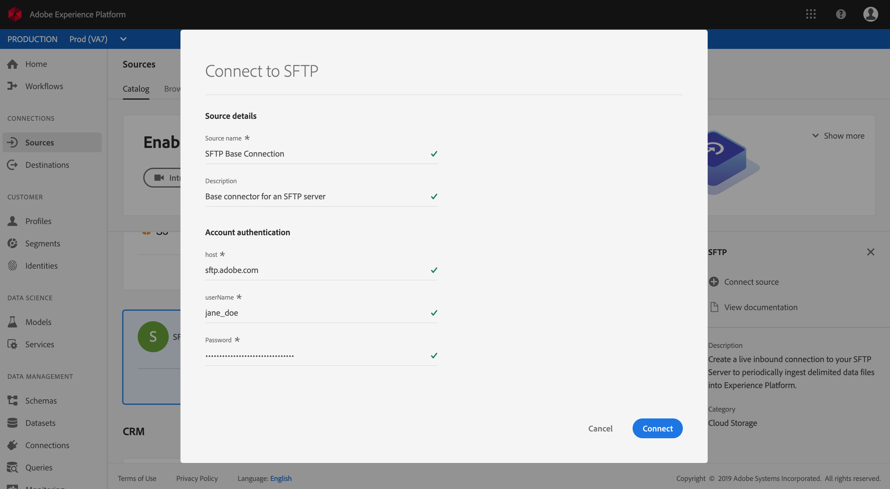

# 在UI中建立FTP或SFTP來源連接器

>[!NOTE]
>FTP和SFTP連接器為測試版。 功能和檔案可能會有所變更。

Adobe Experience Platform中的來源連接器可讓您依計畫吸收外部來源的資料。 本教學課程提供使用平台使用者介面建立FTP或SFTP來源連接器的步驟。

## 快速入門

本教學課程需要對Adobe Experience Platform的下列元件有正確的認識：

* [體驗資料模型(XDM)系統](../../../../../xdm/home.md): Experience Platform組織客戶體驗資料的標準化架構。
   * [架構構成基礎](../../../../../xdm/schema/composition.md): 瞭解XDM架構的基本建置區塊，包括架構組合的主要原則和最佳實務。
   * [架構編輯器教程](../../../../../xdm/tutorials/create-schema-ui.md): 瞭解如何使用架構編輯器UI建立自訂架構。
* [即時客戶個人檔案](../../../../../profile/home.md): 根據來自多個來源的匯整資料，提供統一、即時的消費者個人檔案。

如果您已經有有效的FTP或SFTP連線，則可略過本文檔的其餘部分，並繼續有關配置資料 [流的教程](../../dataflow/batch/cloud-storage.md)。

### 支援的檔案格式

Experience Platform支援下列從外部來源擷取的檔案格式：

* 分隔字元分隔值(DSV): 目前，對DSV格式化資料檔案的支援僅限於逗號分隔值(CSV)。 DSV格式檔案中欄位標題的值只能由字母數字字元和下划線組成。 今後將提供對一般DSV的支援。
* JavaScript物件符號(JSON): JSON格式的資料檔案必須符合XDM規範。
* Apache Parce: 拼花格式化的資料檔案必須與XDM相容。

### 收集必要的認證

若要在平台上存取您的FTP或SFTP伺服器，您必須提供伺服器的 **主機名稱**、 **使用者名稱**，以及 **密碼**。

## 連線至您的伺服器

在伺服器的認證就緒後，您可以依照下列步驟建立新的傳入基本連線，將FTP或SFTP伺服器連結至平台。

登入 <a href="https://platform.adobe.com" target="_blank">Adobe Experience Platform</a> ，然後從左側導覽列選 **取Sources** ，以存取來源工作區。 「目 *錄* 」螢幕顯示各種源，您可以為其建立入站基本連接，而每個源顯示與其關聯的現有基本連接數。

在「 *雲端儲存* 」類別下，選取 **FTP** 或 **SFTP** ，以顯示螢幕右側的資訊列。 資訊列提供所選來源的簡短說明，以及檢視其檔案或連線來源的選項。 要建立新的入站基本連接，請按一下「連 **接源」**。

在輸入表單中，提供基本連線名稱、選用說明和您的FTP或SFTP憑證。 最後，按一下 **Connect** ，然後允許一些時間建立新的基本連接。

建立與FTP或SFTP伺服器的基本連線後，您可以繼續下一節，並設定資料流，將資料匯入平台。

## 後續步驟

在本教學課程中，您已建立與FTP或SFTP伺服器的連線。 您現在可以繼續下一個教程，並 [配置資料流以將資料導入平台](../../dataflow/batch/cloud-storage.md)。
