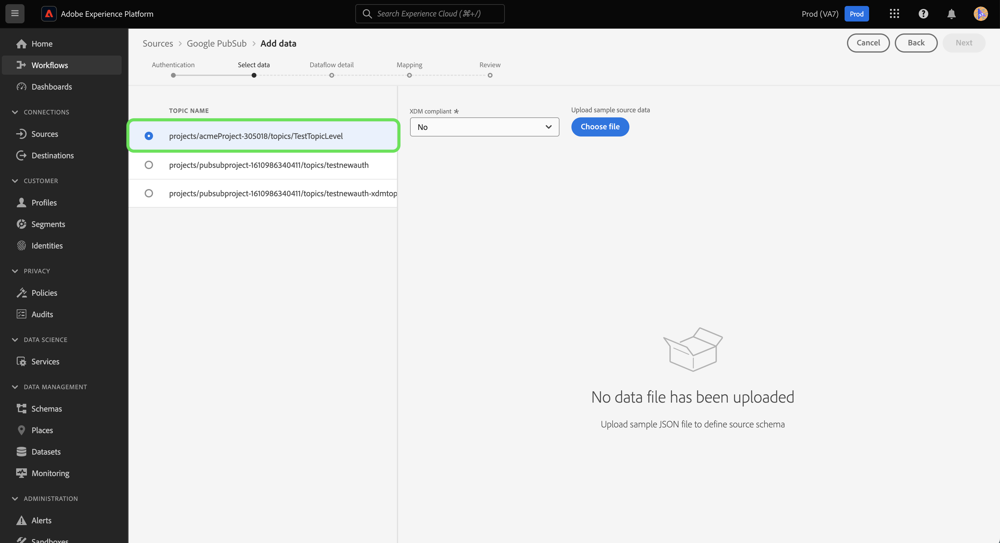

# 建立 [!DNL Google PubSub] ui中的來源連線

>[!IMPORTANT]
>
>此 [!DNL Google PubSub] 已購買Real-time Customer Data Platform Ultimate的使用者可在來源目錄中取得來源。

本教學課程提供建立 [!DNL Google PubSub] (以下稱「[!DNL PubSub]&quot;)使用Platform使用者介面。

## 快速入門

本教學課程需要您實際瞭解下列Adobe Experience Platform元件：

* [來源](../../../../home.md)：Experience Platform可讓您從各種來源擷取資料，同時使用Platform服務來建構、加標籤及增強傳入資料。
* [沙箱](../../../../../sandboxes/home.md)：Experience Platform提供的虛擬沙箱可將單一Platform執行個體分割成個別的虛擬環境，以利開發及改進數位體驗應用程式。

如果您已有有效的 [!DNL PubSub] 連線時，您可以略過本檔案的其餘部分，並繼續進行上的教學課程 [設定資料流](../../dataflow/batch/cloud-storage.md).

### 收集必要的認證

為了連線 [!DNL PubSub] 對於Platform，您必須提供下列認證的有效值：

>[!BEGINTABS]

>[!TAB 專案型驗證]

| 認證 | 說明 |
| --- | --- |
| 專案 ID | 驗證所需的專案ID [!DNL PubSub]. |
| 認證 | 驗證所需的認證 [!DNL PubSub]. 您必須確保在移除認證的空格後，放入完整的JSON檔案。 |

>[!TAB 主題和訂閱型驗證]

| 認證 | 說明 |
| --- | --- |
| 認證 | 驗證所需的認證 [!DNL PubSub]. 您必須確保在移除認證的空格後，放入完整的JSON檔案。 |
| 主題名稱 | 您的名稱 [!DNL PubSub] 訂閱。 在 [!DNL PubSub]，訂閱可讓您訂閱訊息發佈至的主題，以接收訊息。 **注意**：單一 [!DNL PubSub] 訂閱只能用於一個資料流。 若要建立多個資料流，您必須有多個訂閱。 |
| 訂閱名稱 | 您的名稱 [!DNL PubSub] 訂閱。 在 [!DNL PubSub]，訂閱可讓您訂閱訊息發佈至的主題，以接收訊息。 |

>[!ENDTABS]

如需這些值的詳細資訊，請參閱下列內容 [PubSub驗證](https://cloud.google.com/pubsub/docs/authentication) 檔案。 如果您使用以服務帳戶為基礎的驗證，請參閱下列內容 [PubSub指南](https://cloud.google.com/docs/authentication/production#create_service_account) 以取得如何產生認證的步驟。

>[!TIP]
>
>如果您使用以服務帳戶為基礎的驗證，在複製和貼上認證時，請確保您已授予足夠的使用者存取權給您的服務帳戶，並且JSON中沒有額外的空格。

收集必要的認證後，您可以依照下列步驟連結 [!DNL PubSub] 帳戶至平台。

## 連線您的 [!DNL PubSub] 帳戶

在Platform UI中選取 **[!UICONTROL 來源]** 從左側導覽存取 [!UICONTROL 來源] 工作區。 此 [!UICONTROL 目錄] 畫面會顯示各種來源，供您建立帳戶。

您可以從熒幕左側的目錄中選取適當的類別。 或者，您可以使用搜尋選項來尋找您要使用的特定來源。

在 [!UICONTROL 雲端儲存空間] 類別，選取 **[!UICONTROL Google PubSub]**，然後選取 **[!UICONTROL 新增資料]**.

此 **[!UICONTROL 連線至Google PubSub]** 頁面便會顯示。 您可以在此頁面使用新的證明資料或現有的證明資料。

### 現有帳戶

若要使用現有帳戶，請選取 [!DNL PubSub] 要用來建立新資料流的帳戶，然後選取 **[!UICONTROL 下一個]** 以繼續進行。

### 新帳戶

>[!TIP]
>
>* 建立存取受限的帳戶時，您必須至少提供一個主題名稱或訂閱名稱。 如果缺少這兩個值，驗證將會失敗。
>* 建立後，您就無法變更的驗證型別 [!DNL Google PubSub] 基礎連線。 若要變更驗證型別，您必須建立新的基礎連線。

如果您要建立新帳戶，請選取 **[!UICONTROL 新帳戶]**，然後為您的新專案提供名稱和說明（選用） [!DNL PubSub] 帳戶。

此 [!DNL PubSub] 來源可讓您指定在驗證期間允許使用的存取型別。 您可以將帳戶設定為使用專案型驗證、主題與訂閱型驗證。 專案型驗證可讓您授與帳戶中根層級專案的存取權，而主題和訂閱型驗證則可讓您限制特定專案的存取權 [!DNL PubSub] 主題和訂閱。

>[!BEGINTABS]

>[!TAB 專案型驗證]

若要建立可存取您根目錄的帳戶 [!DNL PubSub] 專案資料夾。 選取 **[!UICONTROL Google PubSub驗證認證]** 作為您的驗證型別，並提供您的專案ID和認證。 完成後，選取 **[!UICONTROL 連線到來源]** 然後等待一段時間以建立新連線。

>[!TAB 主題和訂閱型驗證]

若要建立只對特定具有受限制存取權的帳戶 [!DNL PubSub] 主題和訂閱，選取 **[!UICONTROL Google PubSub範圍驗證認證]** 然後提供您的認證、主題名稱和/或訂閱名稱。 完成後，選取 **[!UICONTROL 連線到來源]** 然後等待一段時間以建立新連線。

>[!ENDTABS]

>[!NOTE]
>
>指派給的主體（角色） [!DNL PubSub] 專案會繼承內建立的所有主題和訂閱中 [!DNL PubSub] 專案。 如果您希望主參與者（角色）能夠存取特定主題，則也必須將該主參與者（角色）新增到主題的對應訂閱中。 如需詳細資訊，請閱讀 [[!DNL PubSub] 存取控制檔案](<https://cloud.google.com/pubsub/docs/access-control>).

## 選擇資料

成功的驗證會帶您前往 [!UICONTROL 選取資料] 步驟，您可在此導覽至 [!DNL PubSub] 資料階層，並選取您要帶入Experience Platform的資料。

>[!BEGINTABS]

>[!TAB 專案型驗證]

如果您已透過專案型存取進行驗證， [!UICONTROL 選取資料] 介面會顯示專案中所有已附加主題的訂閱。

>[!TAB 主題和訂閱型驗證]

如果您已透過主題和訂閱型存取權進行驗證， [!UICONTROL 選取資料] 介面顯示可能會依您提供的資訊而有所不同。

* 如果您只提供主題名稱，介面會顯示與所提供之主題對應的所有主題訂閱配對。
* 如果您只提供訂閱名稱，介面會顯示與提供的訂閱名稱對應的所有主題 — 訂閱配對。
* 如果同時提供主題和訂閱名稱，介面會顯示與兩個提供值對應的主題 — 訂閱配對。

>[!ENDTABS]

## 後續步驟

依照本教學課程，您已建立 [!DNL PubSub] 帳戶和平台。 您現在可以繼續進行下一個教學課程及 [設定資料流，將雲端儲存空間中的串流資料匯入Platform](../../dataflow/streaming/cloud-storage-streaming.md).
