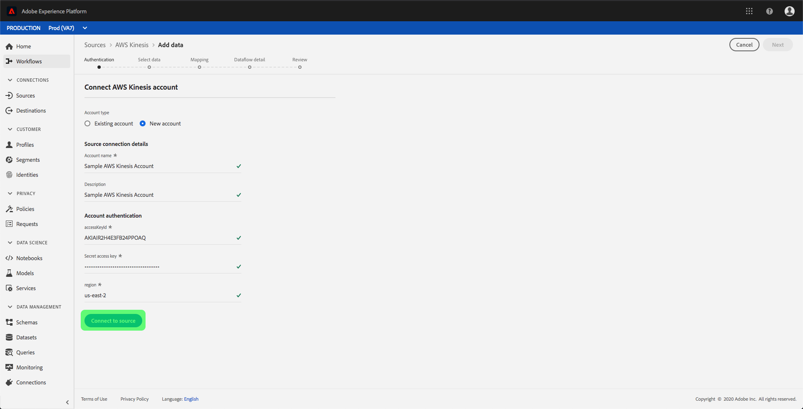

# 建立 [!DNL Amazon Kinesis] ui中的來源連線

>[!IMPORTANT]
>
>此 [!DNL Amazon Kinesis] 已購買Real-time Customer Data Platform Ultimate的使用者可在來源目錄中取得來源。

Adobe Experience Platform中的來源聯結器提供依排程擷取外部來源資料的功能。 本教學課程提供驗證 [!DNL Amazon Kinesis] (以下簡稱： [!DNL "Kinesis"])來源聯結器使用 [!DNL Platform] 使用者介面。

## 快速入門

本教學課程需要您實際瞭解下列Adobe Experience Platform元件：

- [[!DNL Experience Data Model (XDM)] 系統](../../../../../xdm/home.md)：作為依據的標準化架構 [!DNL Experience Platform] 組織客戶體驗資料。
   - [結構描述組合基本概念](../../../../../xdm/schema/composition.md)：瞭解XDM結構描述的基本建置區塊，包括結構描述組合中的關鍵原則和最佳實務。
   - [結構描述編輯器教學課程](../../../../../xdm/tutorials/create-schema-ui.md)：瞭解如何使用結構編輯器UI建立自訂結構描述。
- [[!DNL Real-Time Customer Profile]](../../../../../profile/home.md)：根據來自多個來源的彙總資料，提供統一的即時消費者個人檔案。

如果您已有有效的 [!DNL Kinesis] 連線時，您可以略過本檔案的其餘部分，並繼續進行上的教學課程 [設定資料流](../../dataflow/streaming/cloud-storage-streaming.md).

### 收集必要的認證

為了驗證您的 [!DNL Kinesis] 來源聯結器，您必須提供下列連線屬性的值：

| 認證 | 說明 |
| ---------- | ----------- |
| `accessKeyId` | 您的存取金鑰ID [!DNL Kinesis] 帳戶。 |
| `Secret access key` | 您的秘密存取金鑰 [!DNL Kinesis] 帳戶。 |
| `region` | AWS伺服器的地區。 |

如需這些值的詳細資訊，請參閱 [此 [!DNL Kinesis] 檔案](https://docs.aws.amazon.com/streams/latest/dev/getting-started.html).

## 連線您的 [!DNL Kinesis] 帳戶

收集必要的認證後，您可以依照下列步驟連結 [!DNL Kinesis] 帳戶至 [!DNL Platform].

登入 [Adobe Experience Platform](https://platform.adobe.com) 然後選取 **[!UICONTROL 來源]** 從左側導覽列存取 **[!UICONTROL 來源]** 工作區。 此 **[!UICONTROL 目錄]** 畫面會顯示各種來源，供您建立帳戶。

您可以從熒幕左側的目錄中選取適當的類別。 或者，您可以使用搜尋選項來尋找您要使用的特定來源。

在 **[!UICONTROL 雲端儲存空間]** 類別，選取 **[!UICONTROL Amazon Kinesis]**. 如果您是第一次使用此聯結器，請選取 **[!UICONTROL 設定]**. 否則，請選取 **[!UICONTROL 新增資料]** 以建立新的 [!DNL Kinesis] 聯結器。

此 **[!UICONTROL 連線至Amazon Kinesis]** 對話方塊隨即顯示。 您可以在此頁面使用新的證明資料或現有的證明資料。

### 新帳戶

如果您正在使用新認證，請選取 **[!UICONTROL 新帳戶]**. 在出現的輸入表單上，提供名稱、選擇性說明，以及 [!DNL Kinesis] 認證。 完成後，選取 **[!UICONTROL 連線]** 然後等待一段時間以建立新連線。

### 現有帳戶

若要連線現有帳戶，請選取 [!DNL Kinesis] 您要連線的帳戶，然後選取 **[!UICONTROL 下一個]** 以繼續進行。

## 後續步驟

依照本教學課程指示，您已連線至 [!DNL Kinesis] 帳戶至 [!DNL Platform]. 您現在可以繼續進行下一個教學課程及 [設定資料流以將雲端儲存空間中的資料帶入 [!DNL Platform]](../../dataflow/streaming/cloud-storage-streaming.md).
