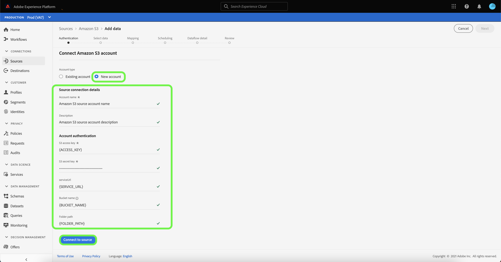

# 建立 [!DNL Amazon S3] UI中的源連接

Adobe Experience Platform中的來源連接器可讓您依排程內嵌外部來源資料。 本教學課程提供建立 [!DNL Amazon S3]  (下稱「[!DNL S3]&quot;)使用Platform使用者介面的來源連接器。

## 快速入門

本教學課程需要妥善了解下列Adobe Experience Platform元件：

- [[!DNL Experience Data Model (XDM)] 系統](../../../../../xdm/home.md):Experience Platform組織客戶體驗資料的標準化架構。
   - [結構構成基本概念](../../../../../xdm/schema/composition.md):了解XDM結構描述的基本建置組塊，包括結構描述的主要原則和最佳實務。
   - [結構編輯器教學課程](../../../../../xdm/tutorials/create-schema-ui.md):了解如何使用結構編輯器UI建立自訂結構。
- [[!DNL Real-Time Customer Profile]](../../../../../profile/home.md):根據來自多個來源的匯總資料，提供統一的即時消費者設定檔。

如果您已有有效 [!DNL S3] 連線，您可以略過本檔案的其餘部分，並繼續進行有關 [配置資料流](../../dataflow/batch/cloud-storage.md).

### 收集所需憑據

若要存取 [!DNL S3] Platform上的貯體，您必須為下列憑證提供有效值：

| 憑據 | 說明 |
| ---------- | ----------- |
| `s3AccessKey` | 您 [!DNL S3] 桶。 |
| `s3SecretKey` | 您 [!DNL S3] 桶。 |
| `serviceUrl` | （選用）自訂 [!DNL S3] 端點連接到。 若您的 [!DNL S3] 貯體是特定區域。 的格式 `serviceUrl` 為： `https://s3.{REGION}.amazonaws.com/)`. |
| `bucketName` | 此 [!DNL S3] 貯體包含您的資料及其對應的描述性中繼資料。 您的 [!DNL S3] 貯體名稱的長度必須介於3到63個字元之間，且必須以字母或數字開頭和結尾。 貯體名稱只能有小寫字母、數字或連字型大小(`-`)，且無法格式化為IP位址。 |
| `folderPath` | 您的 [!DNL S3] 儲存資料的貯體。 當用戶具有受限訪問權限時，此憑據是必需的。 |

如需快速入門的詳細資訊，請造訪 [此AWS檔案](https://aws.amazon.com/blogs/security/wheres-my-secret-access-key/).

## 連接您的 [!DNL S3] 帳戶

在平台UI中，選取 **[!UICONTROL 來源]** 從左側導覽列存取 [!UICONTROL 來源] 工作區。 此 [!UICONTROL 目錄] 畫面會顯示您可以為其建立帳戶的各種來源。

您可以從畫面左側的目錄中選取適當的類別。 或者，您也可以使用搜尋選項找到您要使用的特定來源。

在 **[!UICONTROL 雲端儲存空間]** 類別，選擇 **[!UICONTROL Amazon S3]** 然後選取 **[!UICONTROL 新增資料]**.

此 **[!UICONTROL 連線至Amazon S3]** 頁。 在此頁面上，您可以使用新憑證或現有憑證。

### 新帳戶

如果使用新憑據，請選擇 **[!UICONTROL 新帳戶]**. 在顯示的輸入表單中，提供名稱、選用說明和您的 [!DNL S3] 憑證。 完成後，請選取 **[!UICONTROL 連接到源]** 然後讓新連接建立一段時間。

### 現有帳戶

若要連線現有帳戶，請選取 [!DNL S3] 要連接的帳戶，然後選擇 **[!UICONTROL 下一個]** 繼續。

## 後續步驟和其他資源

依照本教學課程，您已建立與 [!DNL S3] 帳戶。 您現在可以繼續下一個教學課程，以及 [配置資料流以將資料從雲儲存帶入平台](../../dataflow/batch/cloud-storage.md).
