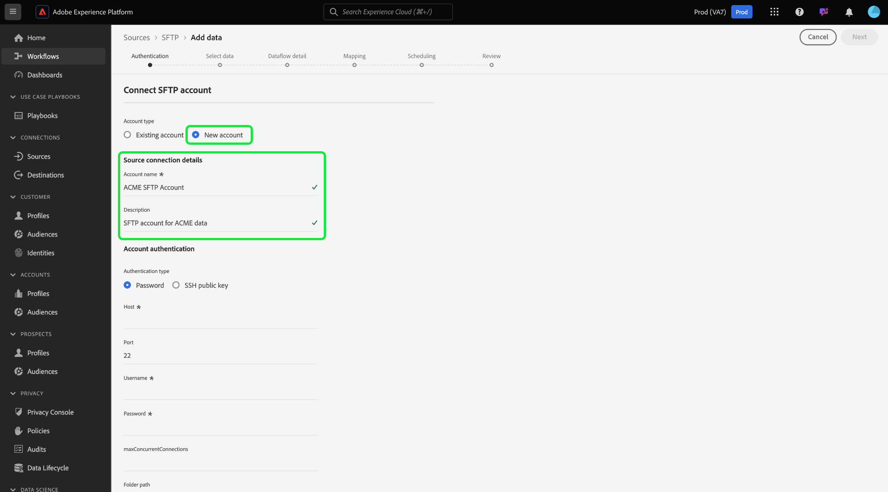

# 在使用者介面中建立[!DNL SFTP]來源連線

本教學課程提供使用Adobe Experience Platform UI建立[!DNL SFTP]來源連線的步驟。

## 快速入門

本教學課程需要您實際瞭解下列Platform元件：

* [[!DNL Experience Data Model (XDM)] 系統](../../../../../xdm/home.md)：Experience Platform用來組織客戶體驗資料的標準化架構。
   * [結構描述組合的基本概念](../../../../../xdm/schema/composition.md)：瞭解XDM結構描述的基本建置區塊，包括結構描述組合中的關鍵原則和最佳實務。
   * [結構描述編輯器教學課程](../../../../../xdm/tutorials/create-schema-ui.md)：瞭解如何使用結構描述編輯器使用者介面建立自訂結構描述。
* [[!DNL Real-Time Customer Profile]](../../../../../profile/home.md)：根據來自多個來源的彙總資料，提供統一的即時消費者設定檔。

>[!IMPORTANT]
>
>當擷取具有[!DNL SFTP]來源連線的JSON物件時，建議避免換行或歸位。 若要解決此限制，請在每行使用單一JSON物件，並使用多行作為後續檔案。

如果您已經有有效的[!DNL SFTP]連線，您可以略過本檔案的其餘部分，並繼續進行有關[設定資料流](../../dataflow/batch/cloud-storage.md)的教學課程。

### 收集必要的認證

為了連線到[!DNL SFTP]，您必須提供下列連線屬性的值：

| 認證 | 說明 |
| ---------- | ----------- |
| `host` | 與您的[!DNL SFTP]伺服器關聯的名稱或IP位址。 |
| `port` | 您正在連線的[!DNL SFTP]伺服器連線埠。 如果未提供，則值預設為`22`。 |
| `username` | 可存取您[!DNL SFTP]伺服器的使用者名稱。 |
| `password` | [!DNL SFTP]伺服器的密碼。 |
| `privateKeyContent` | Base64編碼SSH私密金鑰內容。 OpenSSH金鑰的型別必須分類為RSA或DSA。 |
| `passPhrase` | 如果金鑰檔案或金鑰內容受密語保護，則將私密金鑰解密的密語或密碼。 如果PrivateKeyContent受密碼保護，此引數必須搭配PrivateKeyContent的密碼短語作為值使用。 |
| `maxConcurrentConnections` | 此引數可讓您指定在連線至您的SFTP伺服器時，Platform將建立的同時連線數目上限。 您必須將此值設定為小於SFTP設定的限制。 **注意**：為現有SFTP帳戶啟用此設定時，只會影響未來的資料流，不會影響現有的資料流。 |
| 檔案夾路徑 | 您要提供存取權的資料夾路徑。 [!DNL SFTP]來源，您可以提供資料夾路徑，以指定使用者對您所選子資料夾的存取權。 |

收集必要的認證後，您可以依照下列步驟建立新的[!DNL SFTP]帳戶以連線至Platform。

## 連線到您的[!DNL SFTP]伺服器

在Platform UI中，從左側導覽列選取&#x200B;**[!UICONTROL 來源]**&#x200B;以存取[!UICONTROL 來源]工作區。 [!UICONTROL 目錄]畫面會顯示您可以建立帳戶的各種來源。

您可以從熒幕左側的目錄中選取適當的類別。 或者，您可以使用搜尋選項來尋找您要使用的特定來源。

在[!UICONTROL 雲端儲存空間]類別下，選取&#x200B;**[!UICONTROL SFTP]**，然後選取&#x200B;**[!UICONTROL 新增資料]**。

**[!UICONTROL 連線至SFTP]**&#x200B;頁面隨即顯示。 您可以在此頁面使用新的證明資料或現有的證明資料。

### 現有帳戶

若要連線現有帳戶，請選取您要連線的FTP或SFTP帳戶，然後選取[下一步] ]**以繼續。**[!UICONTROL 

### 新帳戶

>[!TIP]
>
>* 建立後，您無法變更[!DNL SFTP]基本連線的驗證型別。 若要變更驗證型別，您必須建立新的基礎連線。
>
>* SFTP支援RSA或DSA型別OpenSSH金鑰。 確定您的金鑰檔案內容以`"-----BEGIN [RSA/DSA] PRIVATE KEY-----"`開頭並以`"-----END [RSA/DSA] PRIVATE KEY-----"`結尾。 如果私密金鑰檔案是PPK格式檔案，請使用PuTTY工具從PPK轉換為OpenSSH格式。

如果您正在建立新帳戶，請選取&#x200B;**[!UICONTROL 新帳戶]**，然後為您新的[!DNL SFTP]帳戶提供名稱和選擇性說明。

[!DNL SFTP]來源支援基本驗證和透過SSH公開金鑰的驗證。

>[!BEGINTABS]

>[!TAB 基本驗證]

若要使用基本驗證，請選取&#x200B;**[!UICONTROL 密碼]**，然後提供要連線的主機與連線埠值，以及您的使用者名稱與密碼。 在此步驟中，您也可以指定要提供存取權的子資料夾路徑。 完成時，請選取&#x200B;**[!UICONTROL 連線到來源]**。

>[!TAB SSH公開金鑰驗證]

若要使用SSH公開金鑰型認證，請選取&#x200B;**[!UICONTROL SSH公開金鑰]**，然後提供您的主機和連線埠值，以及您的私密金鑰內容和密碼組合。 在此步驟中，您也可以指定要提供存取權的子資料夾路徑。 完成時，請選取&#x200B;**[!UICONTROL 連線到來源]**。

>[!ENDTABS]

## 後續步驟

依照本教學課程指示，您已建立與SFTP帳戶的連線。 您現在可以繼續進行下一個教學課程，並[設定資料流，以將雲端儲存空間中的資料帶入Platform](../../dataflow/batch/cloud-storage.md)。
