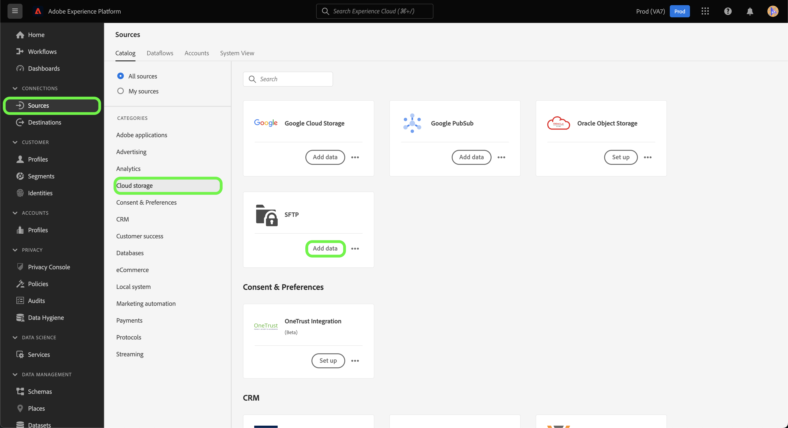

# 建立 [!DNL SFTP] UI中的源連接

本教學課程提供建立 [!DNL SFTP] 來源連線。

## 快速入門

本教學課程需要妥善了解Platform的下列元件：

* [[!DNL Experience Data Model (XDM)] 系統](../../../../../xdm/home.md):Experience Platform組織客戶體驗資料的標準化架構。
   * [結構構成基本概念](../../../../../xdm/schema/composition.md):了解XDM結構描述的基本建置組塊，包括結構描述的主要原則和最佳實務。
   * [結構編輯器教學課程](../../../../../xdm/tutorials/create-schema-ui.md):了解如何使用結構編輯器UI建立自訂結構。
* [[!DNL Real-Time Customer Profile]](../../../../../profile/home.md):根據來自多個來源的匯總資料，提供統一的即時消費者設定檔。

>[!IMPORTANT]
>
>建議您避免使用 [!DNL SFTP] 源連接。 若要解決限制，請每行使用單一JSON物件，然後使用多行來建立後續檔案。

如果您已有有效 [!DNL SFTP] 連線，您可以略過本檔案的其餘部分，並繼續進行有關 [配置資料流](../../dataflow/batch/cloud-storage.md).

### 收集所需憑據

為了連接 [!DNL SFTP]，您必須提供下列連線屬性的值：

| 憑據 | 說明 |
| ---------- | ----------- |
| `host` | 與您的 [!DNL SFTP] 伺服器。 |
| `port` | 此 [!DNL SFTP] 您連接到的伺服器埠。 若未提供，則值預設為 `22`. |
| `username` | 具有 [!DNL SFTP] 伺服器。 |
| `password` | 您 [!DNL SFTP] 伺服器。 |
| `privateKeyContent` | Base64編碼的SSH私密金鑰內容。 OpenSSH金鑰的類型必須分類為RSA或DSA。 |
| `passPhrase` | 如果密鑰檔案或密鑰內容受密碼短語保護，則解密私鑰的密碼短語或密碼。 如果PrivateKeyContent受密碼保護，則此參數需要與PrivateKeyContent的密碼短語一起使用，作為值。 |
| `maxConcurrentConnections` | 此參數可讓您指定平台在連線至您的SFTP伺服器時所建立的同時連線數量上限。 您必須將此值設為小於SFTP設定的限制。 **附註**:為現有SFTP帳戶啟用此設定時，它只會影響未來的資料流，而不會影響現有的資料流。 |

收集完所需憑證後，您可以依照下列步驟建立新憑證 [!DNL SFTP] 帳戶來連線至平台。

## 連線至您的 [!DNL SFTP] 伺服器

在平台UI中，選取 **[!UICONTROL 來源]** 從左側導覽列存取 [!UICONTROL 來源] 工作區。 此 [!UICONTROL 目錄] 畫面會顯示各種來源，您可以用來建立入站帳戶。

您可以從畫面左側的目錄中選取適當的類別。 或者，您也可以使用搜尋選項找到您要使用的特定來源。

在 [!UICONTROL 雲端儲存空間] 類別，選擇 **[!UICONTROL SFTP]** 然後選取 **[!UICONTROL 新增資料]**.

此 **[!UICONTROL 連線至SFTP]** 頁。 在此頁面上，您可以使用新憑證或現有憑證。

### 現有帳戶

若要連線現有帳戶，請選取您要連線的FTP或SFTP帳戶，然後選取 **[!UICONTROL 下一個]** 繼續。

### 新帳戶

如果您要建立新帳戶，請選取 **[!UICONTROL 新帳戶]**，然後提供您新 [!DNL SFTP] 帳戶。

#### 使用密碼進行驗證

[!DNL SFTP] 支援不同的身份驗證類型進行訪問。 在 **[!UICONTROL 帳戶驗證]** 選取 **[!UICONTROL 密碼]** 然後提供要連接的主機和埠值，以及您的用戶名和密碼。

#### 使用SSH公開金鑰進行驗證

若要使用SSH公開金鑰型憑證，請選取 **[!UICONTROL SSH公開金鑰]**  然後提供主機和埠值，以及您的私鑰內容和密碼短語組合。

>[!IMPORTANT]
>
>SFTP支援RSA或DSA類型OpenSSH金鑰。 確定您的關鍵檔案內容開頭為 `"-----BEGIN [RSA/DSA] PRIVATE KEY-----"` 結尾是 `"-----END [RSA/DSA] PRIVATE KEY-----"`. 如果私鑰檔案是PPK格式檔案，請使用PuTTY工具從PPK格式轉換為OpenSSH格式。

| 憑據 | 說明 |
| ---------- | ----------- |
| 私密金鑰內容 | Base64編碼的SSH私密金鑰內容。 OpenSSH金鑰的類型必須分類為RSA或DSA。 |
| 密碼短語 | 如果密鑰檔案或密鑰內容受密碼短語保護，則指定密碼短語或密碼以解密私鑰。 如果PrivateKeyContent受密碼保護，則此參數需要與PrivateKeyContent的密碼短語一起使用，作為其值。 |

## 後續步驟

依照本教學課程，您已建立與SFTP帳戶的連線。 您現在可以繼續下一個教學課程，以及 [配置資料流以將資料從雲儲存帶入平台](../../dataflow/batch/cloud-storage.md).
