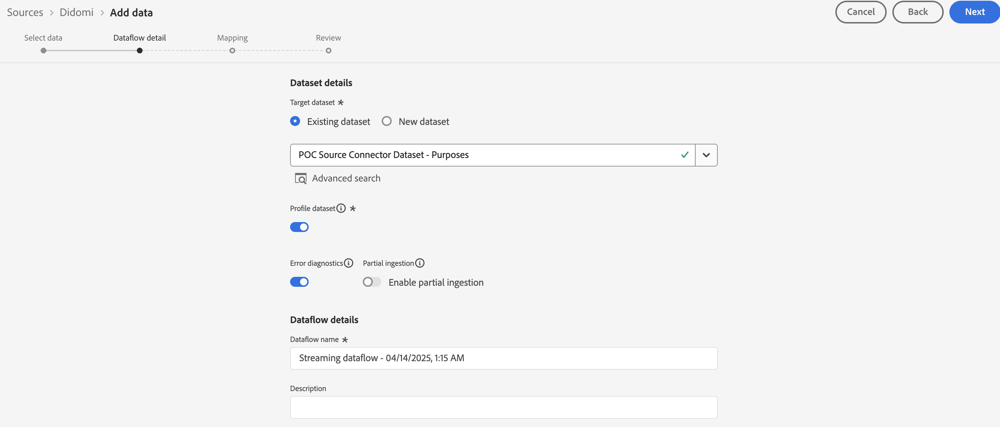

# 將[!DNL Didomi]連線至Experience Platform

>[!AVAILABILITY]
>
>[!DNL Didomi]來源是測試版。 閱讀來源概觀中的[條款與條件](../../../../home.md#terms-and-conditions)，以取得有關使用測試版標籤之來源的詳細資訊。

請閱讀本指南，瞭解如何使用UI中的來源工作區將您的[!DNL Didomi]帳戶連結至Adobe Experience Platform。

>[!IMPORTANT]
>
>* 此檔案頁面是由&#x200B;*Didomi*&#x200B;團隊建立。 若有任何查詢或更新要求，請直接透過&#x200B;*support@didomi.io*&#x200B;聯絡他們。
>* 如需產生連線的逐步指示，請參閱[Didomi Adobe來源聯結器檔案](https://developers.didomi.io/integrations/third-party-apps/preference-management-platform-integrations/Adobe-source-connector)。

## 快速入門

本教學課程需要您實際瞭解下列Adobe Experience Platform元件：

* [[!DNL Experience Data Model (XDM)] 系統](../../../../../xdm/home.md)： Experience Platform用來組織客戶體驗資料的標準化架構。
   * [結構描述組合的基本概念](../../../../../xdm/schema/composition.md)：瞭解XDM結構描述的基本建置區塊，包括結構描述組合中的關鍵原則和最佳實務。
   * [結構描述編輯器教學課程](../../../../../xdm/tutorials/create-schema-ui.md)：瞭解如何使用結構描述編輯器使用者介面建立自訂結構描述。
* [[!DNL Real-Time Customer Profile]](../../../../../profile/home.md)：根據來自多個來源的彙總資料，提供統一的即時消費者設定檔。

### 設定您的[!DNL Didomi]帳戶

繼續之前，請確定您已閱讀並完成[[!DNL Didomi] 總覽](../../../../connectors/consent-and-preferences/didomi.md#prerequisites)中概述的先決條件步驟，即可成功將您的帳戶連線至Experience Platform。

## 瀏覽來源目錄

在Experience Platform UI中，從左側導覽選取&#x200B;**[!UICONTROL 來源]**&#x200B;以存取&#x200B;*[!UICONTROL 來源]*&#x200B;工作區。 選擇類別或使用搜尋列來尋找您的來源。

若要連線到[!DNL Didomi]，請移至&#x200B;*[!UICONTROL 資料庫]*&#x200B;類別，選取&#x200B;**[!UICONTROL Didomi]**&#x200B;來源卡，然後選取&#x200B;**[!UICONTROL 設定]**。

>[!TIP]
>
>當指定的來源尚未具有已驗證的帳戶時，來源目錄中的來源會顯示&#x200B;**[!UICONTROL 設定]**&#x200B;選項。 建立已驗證的帳戶後，此選項會變更為&#x200B;**[!UICONTROL 新增資料]**。

## 新增您的來源資料結構

接下來，使用&#x200B;*[!UICONTROL 選取資料]*&#x200B;介面來上傳[在先決條件步驟](../../../../connectors/consent-and-preferences/didomi.md#download-the-sample-payload-file)中下載的JSON檔案。

您可以使用預覽介面來檢視裝載的檔案結構。 完成後，選取&#x200B;**[!UICONTROL 下一步]**。

## 提供資料流詳細資訊

接下來，您必須提供有關資料集和資料流的資訊。

### 資料集詳細資料

資料集是資料集合的儲存和管理結構，通常是包含方案 (欄) 和欄位 (列) 的表格。 成功內嵌至Experience Platform的資料會以資料集的形式保留在資料湖中。

在此步驟中，您可以使用現有的資料集或建立新的資料集。

>[!NOTE]
>
>無論您是使用現有資料集還是建立新資料集，都必須確保您的資料集已啟用設定檔&#x200B;**內嵌**。

+++選取步驟以啟用設定檔擷取、錯誤診斷及部分擷取。

如果您的資料集已啟用即時客戶個人檔案，那麼在此步驟中，您可以切換&#x200B;**[!UICONTROL 個人檔案資料集]**&#x200B;以啟用您的資料以進行個人檔案擷取。 您也可以使用此步驟來啟用&#x200B;**[!UICONTROL 錯誤診斷]**&#x200B;和&#x200B;**[!UICONTROL 部分擷取]**。

* **[!UICONTROL 錯誤診斷]**：選取&#x200B;**[!UICONTROL 錯誤診斷]**&#x200B;以指示來源產生錯誤診斷，以便您稍後在監視資料集活動和資料流狀態時參考。
* **[!UICONTROL 部分擷取]**：部分批次擷取可擷取含有錯誤的資料，最多可達到特定可設定的臨界值。 此功能可讓您將所有精確資料成功擷取到Experience Platform，同時所有不正確的資料會個別批次處理，並提供無效原因的資訊。

+++

### 資料流詳細資料

設定資料集後，您必須提供資料流的詳細資訊，包括名稱、選用的說明和警報設定。

| 資料流設定 | 說明 |
| --- | --- |
| 資料流名稱 | 資料流的名稱。  依預設，這將使用正在匯入的檔案名稱。 |
| 說明 | （選用）資料流的簡短說明。 |
| 警報 | Experience Platform可產生使用者可訂閱的事件型警報，這些選項都是執行中的資料流以觸發這些警報。  如需詳細資訊，請閱讀[警示概述](../../alerts.md) <ul><li>**來源資料流執行開始**：選取此警示以在您的資料流執行開始時收到通知。</li><li>**來源資料流執行成功**：選取此警示以在您的資料流結束且沒有任何錯誤時接收通知。</li><li>**來源資料流執行失敗**：選取此警示以在您的資料流執行結束時發生任何錯誤時接收通知。</li></ul> |

{style="table-layout:auto"}

## 對應

在將資料擷取至Experience Platform之前，請使用對應介面將來源資料對應至適當的結構描述欄位。  如需詳細資訊，請閱讀UI[中的](../../../../../data-prep/ui/mapping.md)對應指南

對應是專門用來將&#x200B;**用途資料**&#x200B;從[!DNL Didomi]傳輸到Experience Platform資料集。 這些目的代表使用者的同意選擇（例如，針對分析、個人化、廣告等），而且是此整合中唯一接受的對應欄位。

使用從[&#x200B; webhook設定下載的](../../../../connectors/consent-and-preferences/didomi.md#download-the-sample-payload-file)範例webhook裝載[!DNL Didomi]，將每個[!DNL Didomi]用途對應到Adobe資料集中的適當欄位。

完成後，選取&#x200B;**[!UICONTROL 下一步]**。

## 審閱

*[!UICONTROL 檢閱]*&#x200B;步驟隨即顯示，可讓您在建立資料流之前先檢閱資料流的詳細資訊。 詳細資料分為以下類別：

* **[!UICONTROL 連線]**：顯示帳戶名稱、來源平台和來源名稱。
* **[!UICONTROL 指派資料集和對應欄位]**：顯示目標資料集和資料集所遵守的結構描述。

確認詳細資料正確之後，請選取&#x200B;**[!UICONTROL 完成]**。

## 擷取串流端點URL

建立連線後，來源詳細資訊頁面就會顯示。 此頁面顯示您新建立之連線的詳細資料，包括先前執行的資料流、ID和串流端點URL。

## 在Adobe上完成設定

建立資料流後，請導覽至&#x200B;*[!UICONTROL 來源]*&#x200B;目錄，然後選取&#x200B;**[!UICONTROL 資料流]**。 使用資料流目錄來找出您的[!DNL Didomi]資料流並存取&#x200B;*[!UICONTROL 資料流活動]*&#x200B;介面。 接下來，使用右邊欄中的&#x200B;*[!UICONTROL 屬性]*&#x200B;面板，並擷取下列專案的值：

* [!UICONTROL 串流端點]
* [!UICONTROL 資料流ID]

在Experience Platform UI中：

1. 完成設定後，請檢閱初始webhook設定中缺少的設定引數。
2. 一旦這些值可用，請返回Didomi並更新webhook設定。

## 更新Webhook設定

完成設定後，請導覽回[!DNL Didomi]主控台，並使用您的&#x200B;**串流端點URL**&#x200B;和&#x200B;**資料流ID**&#x200B;更新您的webhook設定。

完成此操作後，[!DNL Didomi]將透過整合開始傳送同意管理和偏好設定管理事件，資料將儲存在您的Adobe資料集中。

## 後續步驟

依照本教學課程中的指示，您已成功建立資料流，以將批次資料從[!DNL Didomi]來源帶入Experience Platform。 如需其他資源，請瀏覽以下概述的檔案。

### 監視資料流

建立資料流後，您可以監視透過它擷取的資料，以檢視擷取率、成功和錯誤的資訊。 如需如何監視資料流的詳細資訊，請造訪有關UI[中](../../../../../dataflows/ui/monitor-sources.md)監視帳戶和資料流的教學課程。

### 更新您的資料流

若要更新資料流排程、對應和一般資訊的設定，請瀏覽有關[在UI中更新來源資料流的教學課程](../../update-dataflows.md)。

### 刪除您的資料流

您可以刪除不再需要的資料流，或使用&#x200B;**[!UICONTROL 資料流]**&#x200B;工作區中可用的&#x200B;**[!UICONTROL 刪除]**&#x200B;功能建立錯誤的資料流。 如需有關如何刪除資料流的詳細資訊，請瀏覽教學課程，瞭解如何在UI[中刪除資料流](../../delete.md)。
