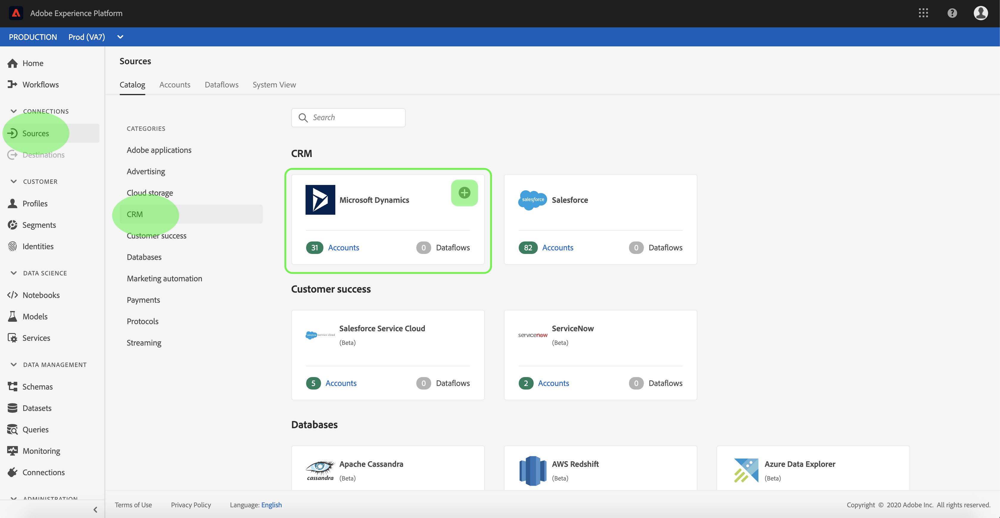

# 建立 [!DNL Microsoft Dynamics] UI中的源連接

本教學課程提供建立 [!DNL Microsoft Dynamics] (下稱「[!DNL Dynamics]&quot;)使用Adobe Experience Platform UI的來源連線。

## 快速入門

本教學課程需要妥善了解下列Adobe Experience Platform元件：

* [[!DNL Experience Data Model (XDM)] 系統](../../../../../xdm/home.md):Experience Platform組織客戶體驗資料的標準化架構。
   * [結構構成基本概念](../../../../../xdm/schema/composition.md):了解XDM結構描述的基本建置組塊，包括結構描述的主要原則和最佳實務。
   * [結構編輯器教學課程](../../../../../xdm/tutorials/create-schema-ui.md):了解如何使用結構編輯器UI建立自訂結構。
* [[!DNL Real-Time Customer Profile]](../../../../../profile/home.md):根據來自多個來源的匯總資料，提供統一的即時消費者設定檔。

如果您已有有效 [!DNL Dynamics] 帳戶，您可以略過本檔案的其餘部分，並繼續進行有關 [為CRM源配置資料流](../../dataflow/crm.md).

### 收集所需憑據

| 憑據 | 說明 |
| ---------- | ----------- |
| `serviceUri` | 您的 [!DNL Dynamics] 例項。 |
| `username` | 您 [!DNL Dynamics] 使用者帳戶。 |
| `password` | 您 [!DNL Dynamics] 帳戶。 |
| `servicePrincipalId` | 您 [!DNL Dynamics] 帳戶。 使用服務主體和基於密鑰的驗證時，需要此ID。 |
| `servicePrincipalKey` | 服務主密鑰。 使用服務主體和基於密鑰的身份驗證時需要此憑據。 |

如需快速入門的詳細資訊，請參閱 [此 [!DNL Dynamics] 檔案](https://docs.microsoft.com/en-us/powerapps/developer/common-data-service/authenticate-oauth).

## 連接您的 [!DNL Dynamics] 帳戶

收集完所需憑證後，您可以依照下列步驟連結您的 [!DNL Dynamics] 帳戶至Platform。

登入 [Adobe Experience Platform](https://platform.adobe.com) 然後選取 **[!UICONTROL 來源]** 從左側導覽列存取 [!UICONTROL 來源] 工作區。 此 **[!UICONTROL 目錄]** 畫面會顯示您可以為其建立帳戶的各種來源。

您可以從畫面左側的目錄中選取適當的類別。 或者，您也可以使用搜尋選項找到您要使用的特定來源。

在 **[!UICONTROL CRM]** 類別，選擇 **[!UICONTROL Microsoft Dynamics]**. 如果這是您第一次使用此連接器，請選取 **[!UICONTROL 設定]**. 否則，請選取 **[!UICONTROL 新增資料]** 建立新 [!DNL Dynamics] 連接器。

此 **[!UICONTROL 連接到Dynamics]** 頁。 在此頁面上，您可以使用新憑證或現有憑證。

### 新帳戶

如果使用新憑據，請選擇 **[!UICONTROL 新帳戶]**. 在顯示的輸入表單中，提供新表單的名稱和可選說明 [!DNL Dynamics] 帳戶。

此 [!DNL Dynamics] 連接器為存取提供不同的驗證類型。 在 [!UICONTROL 帳戶驗證] 選取 **[!UICONTROL 基本驗證]** 使用基於密碼的憑據。

完成後，請選取 **[!UICONTROL 連接到源]** 然後讓新帳戶有時間建立。

或者，您也可以選取 **[!UICONTROL 服務主體和密鑰驗證]** 連接 [!DNL Dynamics] 帳戶，使用 [!UICONTROL 服務主體ID] 和 [!UICONTROL 服務主體密鑰].

>[!IMPORTANT]
>
> 中的基本驗證 [!DNL Dynamics] 可能會遭到雙因素驗證的封鎖，而Platform目前不支援此功能。 在此情況下，建議您使用金鑰式驗證，以使用 [!DNL Dynamics].

| 憑據 | 說明 |
| ---------- | ----------- |
| [!UICONTROL 服務主體ID] | 您 [!DNL Dynamics] 帳戶。 使用服務主體和基於密鑰的驗證時，需要此ID。 |
| [!UICONTROL 服務主體密鑰] | 服務主密鑰。 使用服務主體和基於密鑰的身份驗證時需要此憑據。 |

### 現有帳戶

若要連線現有帳戶，請選取 [!DNL Dynamics] 要連接的帳戶，然後選擇 **[!UICONTROL 下一個]** 來繼續。

## 後續步驟

依照本教學課程，您已建立與 [!DNL Dynamics] 帳戶。 您現在可以繼續下一個教學課程，以及 [配置資料流以將資料導入Platform](../../dataflow/crm.md).
