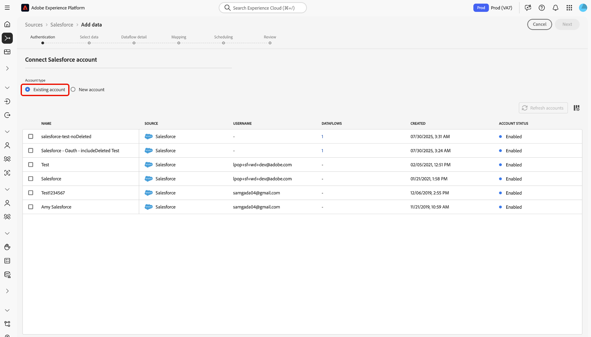

# 使用使用者介面將您的[!DNL Salesforce]帳戶連線至Experience Platform

本教學課程提供如何使用Experience Platform使用者介面連線您的[!DNL Salesforce]帳戶及將CRM資料帶入Adobe Experience Platform的步驟。

## 快速入門

本教學課程需要您實際瞭解下列Experience Platform元件：

* [[!DNL Experience Data Model (XDM)] 系統](../../../../../xdm/home.md)： Experience Platform用來組織客戶體驗資料的標準化架構。
   * [結構描述組合的基本概念](../../../../../xdm/schema/composition.md)：瞭解XDM結構描述的基本建置區塊，包括結構描述組合中的關鍵原則和最佳實務。
   * [結構描述編輯器教學課程](../../../../../xdm/tutorials/create-schema-ui.md)：瞭解如何使用結構描述編輯器使用者介面建立自訂結構描述。
* [[!DNL Real-Time Customer Profile]](../../../../../profile/home.md)：根據來自多個來源的彙總資料，提供統一的即時消費者設定檔。

如果您已經有已驗證的[!DNL Salesforce]帳戶，您可以略過本檔案的其餘部分，並繼續進行有關[為CRM資料設定資料流](../../dataflow/crm.md)的教學課程。

### 收集必要的認證 {#gather-required-credentials}

>[!WARNING]
>
>[!DNL Salesforce]來源的基本驗證將在2026年1月被取代。 您必須移至OAuth 2使用者端認證驗證，才能繼續使用該來源，並將資料從您的[!DNL Salesforce]帳戶擷取至Experience Platform。

[!DNL Salesforce]來源支援基本驗證和OAuth2使用者端認證。

>[!BEGINTABS]

>[!TAB 基本驗證]

您必須提供下列認證的值，才能使用基本驗證連線您的[!DNL Salesforce]帳戶。

| 認證 | 說明 |
| --- | --- |
| 環境 URL | [!DNL Salesforce]來源執行個體的網址。 環境URL的格式為`https://[domain].my.salesforce.com`。 |
| 使用者名稱 | [!DNL Salesforce]使用者帳戶的使用者名稱。 |
| 密碼 | [!DNL Salesforce]使用者帳戶的密碼。 |
| 安全性權杖 | [!DNL Salesforce]使用者帳戶的安全性權杖。 |
| API版本 | （選用）您正在使用的[!DNL Salesforce]執行個體的REST API版本。 API版本的值必須使用小數點格式化。 例如，如果您使用API版本`52`，則必須以`52.0`的形式輸入值。 如果此欄位留空，Experience Platform將自動使用最新可用版本。 |

如需驗證的詳細資訊，請參閱[此 [!DNL Salesforce] 驗證指南](https://developer.salesforce.com/docs/atlas.en-us.api_rest.meta/api_rest/quickstart_oauth.htm)。

>[!TAB OAuth2使用者端認證]

您必須提供下列認證的值，才能使用OAuth2使用者端認證連線您的[!DNL Salesforce]帳戶。

| 認證 | 說明 |
| --- | --- |
| 環境 URL | [!DNL Salesforce]來源執行個體的網址。 環境URL的格式為`https://[domain].my.salesforce.com`。 |
| 用戶端 ID | 使用者端ID會與使用者端密碼搭配使用，作為OAuth2驗證的一部分。 使用者端ID和使用者端密碼可讓您的應用程式透過向[!DNL Salesforce]識別您的應用程式，以代表您的帳戶運作。 |
| 用戶端密碼 | 使用者端密碼會與使用者端ID搭配使用，做為OAuth2驗證的一部分。 使用者端ID和使用者端密碼可讓您的應用程式透過向[!DNL Salesforce]識別您的應用程式，以代表您的帳戶運作。 |
| API版本 | 您正在使用的[!DNL Salesforce]執行個體的REST API版本。 API版本的值必須使用小數點格式化。 例如，如果您使用API版本`52`，則必須以`52.0`的形式輸入值。 如果此欄位留空，Experience Platform將自動使用最新可用版本。 |

如需針對[!DNL Salesforce]使用OAuth的詳細資訊，請參閱OAuth授權流程](https://help.salesforce.com/s/articleView?id=sf.remoteaccess_oauth_flows.htm&type=5)的[[!DNL Salesforce] 指南。

>[!ENDTABS]

收集必要的認證後，您可以依照下列步驟將[!DNL Salesforce]帳戶連線至Experience Platform。

## 連線您的[!DNL Salesforce]帳戶

在Experience Platform UI中，從左側導覽選取&#x200B;**[!UICONTROL 來源]**&#x200B;以存取[!UICONTROL 來源]工作區。 您可以從熒幕左側的目錄中選取適當的類別。 或者，您可以使用搜尋選項來尋找您要使用的特定來源。

在&#x200B;*[!UICONTROL CRM]*&#x200B;類別下選取&#x200B;**[!DNL Salesforce]**，然後選取&#x200B;**[!UICONTROL 新增資料]**。

>[!TIP]
>
>當指定的來源尚未具有已驗證的帳戶時，來源目錄中的來源會顯示&#x200B;**[!UICONTROL 設定]**&#x200B;選項。 一旦驗證帳戶存在，此選項就會變更為&#x200B;**[!UICONTROL 新增資料]**。

**[!UICONTROL 連線至Salesforce]**&#x200B;頁面隨即顯示。 您可以在此頁面使用新的證明資料或現有的證明資料。

### 使用現有帳戶

若要使用現有帳戶，請選取&#x200B;**[!UICONTROL 現有帳戶]**，然後從顯示的清單中選取您要使用的帳戶。 完成後，選取&#x200B;**[!UICONTROL 下一步]**&#x200B;以繼續。

### 建立新帳戶

若要建立新帳戶，請選取&#x200B;**[!UICONTROL 新帳戶]**，並為您新的[!DNL Salesforce]帳戶提供名稱和描述。

接著，選取您要用於新帳戶的驗證型別。

>[!BEGINTABS]

>[!TAB 基本驗證]

若要進行基本驗證，請選取&#x200B;**[!UICONTROL 基本驗證]**，然後提供下列認證的值：

* 環境 URL
* 使用者名稱
* 密碼
* API版本（選擇性）

完成時，請選取&#x200B;**[!UICONTROL 連線到來源]**。

>[!TAB OAuth2使用者端認證]

針對OAuth 2使用者端認證，請選取&#x200B;**[!UICONTROL OAuth2使用者端認證]**，然後提供下列認證的值：

* 環境 URL
* 用戶端 ID
* 用戶端密碼
* API版本

完成時，請選取&#x200B;**[!UICONTROL 連線到來源]**。

>[!ENDTABS]

### 略過範例資料預覽 {#skip-preview-of-sample-data}

在資料選擇步驟中，您可能會在擷取大型資料表或資料檔案時遭遇逾時。 您可以略過資料預覽以避開逾時，並且仍可檢視您的結構描述，不過沒有範例資料。 若要略過資料預覽，請啟用&#x200B;**[!UICONTROL 略過預覽範例資料]**&#x200B;切換按鈕。

工作流程的其餘部分將維持不變。 唯一的警告是，略過資料預覽可能會阻止在對應步驟期間自動驗證計算和必填欄位，然後您就必須在對應期間手動驗證這些欄位。

## 後續步驟

依照本教學課程中的指示，您已建立與[!DNL Salesforce]帳戶的連線。 您現在可以繼續進行下一個教學課程，並[設定資料流以將資料帶入 [!DNL Experience Platform]](../../dataflow/crm.md)。
