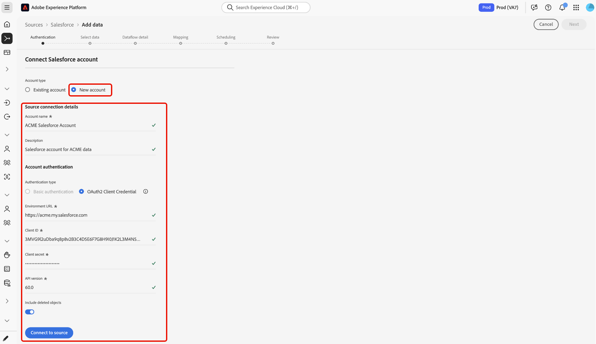

# 使用使用者介面將您的[!DNL Salesforce]帳戶連線至Experience Platform

閱讀本指南，瞭解如何使用Experience Platform使用者介面連線您的[!DNL Salesforce]帳戶並將CRM資料匯入Adobe Experience Platform。

## 快速入門

本教學課程需要您實際瞭解下列Experience Platform元件：

* [[!DNL Experience Data Model (XDM)] 系統](../../../../../xdm/home.md)： Experience Platform用來組織客戶體驗資料的標準化架構。
   * [結構描述組合的基本概念](../../../../../xdm/schema/composition.md)：瞭解XDM結構描述的基本建置區塊，包括結構描述組合中的關鍵原則和最佳實務。
   * [結構描述編輯器教學課程](../../../../../xdm/tutorials/create-schema-ui.md)：瞭解如何使用結構描述編輯器使用者介面建立自訂結構描述。
* [[!DNL Real-Time Customer Profile]](../../../../../profile/home.md)：根據來自多個來源的彙總資料，提供統一的即時消費者設定檔。

如果您已經有已驗證的[!DNL Salesforce]帳戶，您可以略過本檔案的其餘部分，並繼續進行有關[為CRM資料設定資料流](../../dataflow/crm.md)的教學課程。

### 收集必要的認證 {#gather-required-credentials}

[!DNL Salesforce]來源支援透過OAuth2使用者端認證進行驗證。

| 認證 | 說明 |
| --- | --- |
| 環境 URL | [!DNL Salesforce]來源執行個體的網址。 環境URL的格式為`https://[domain].my.salesforce.com`。 |
| 用戶端 ID | 使用者端ID會與使用者端密碼搭配使用，作為OAuth2驗證的一部分。 使用者端ID和使用者端密碼可讓您的應用程式透過向[!DNL Salesforce]識別您的應用程式，以代表您的帳戶運作。 |
| 用戶端密碼 | 使用者端密碼會與使用者端ID搭配使用，做為OAuth2驗證的一部分。 使用者端ID和使用者端密碼可讓您的應用程式透過向[!DNL Salesforce]識別您的應用程式，以代表您的帳戶運作。 |
| API 版本 | 您正在使用的[!DNL Salesforce]執行個體的REST API版本。 API版本的值必須使用小數點格式化。 例如，如果您使用API版本`52`，則必須以`52.0`的形式輸入值。 如果此欄位留空，Experience Platform將自動使用最新可用版本。 |
| 包含已刪除的物件 | 布林值，用來判斷是否包含軟性刪除的記錄。 若設為True，軟刪除的記錄可包含在您的[!DNL Salesforce]查詢中，並從您的帳戶擷取到Experience Platform如果未指定您的設定，此值預設為`false`。 |

如需針對[!DNL Salesforce]使用OAuth的詳細資訊，請參閱OAuth授權流程](https://help.salesforce.com/s/articleView?id=sf.remoteaccess_oauth_flows.htm&type=5)的[[!DNL Salesforce] 指南。

## 連線您的[!DNL Salesforce]帳戶

在Experience Platform UI中，從左側功能表導覽至&#x200B;**[!UICONTROL Sources]**&#x200B;以開啟[!UICONTROL Sources]工作區。 使用左側的目錄來瀏覽類別，或使用搜尋列來快速尋找您要連線的來源。

在&#x200B;*[!UICONTROL CRM]*&#x200B;類別下選取&#x200B;**[!DNL Salesforce]**，然後選取&#x200B;**[!UICONTROL Add data]**。

>[!TIP]
>
>在來源目錄中，如果未連線帳戶，您將會看到&#x200B;**[!UICONTROL Set up]**，如果已驗證帳戶，您將會看到&#x200B;**[!UICONTROL Add data]**。

**[!UICONTROL Connect to Salesforce]**&#x200B;頁面隨即顯示。 您可以在此頁面使用新的證明資料或現有的證明資料。

### 使用現有帳戶

若要使用現有帳戶，請選取&#x200B;**[!UICONTROL Existing account]**，然後從顯示的清單中選取您要使用的帳戶。 完成後，選取&#x200B;**[!UICONTROL Next]**&#x200B;以繼續。

### 建立新帳戶

若要建立新帳戶，請選取&#x200B;**[!UICONTROL New account]**&#x200B;並為您的新[!DNL Salesforce]帳戶提供名稱和說明。

針對OAuth 2使用者端認證，請選取&#x200B;**[!UICONTROL OAuth2 Client Credential]**，然後提供下列認證的值：

* 環境 URL
* 用戶端 ID
* 用戶端密碼
* API 版本
* 包含刪除物件

完成後，選取&#x200B;**[!UICONTROL Connect to source]**。

### 略過範例資料預覽 {#skip-preview-of-sample-data}

在資料選擇步驟中，您可能會在擷取大型資料表或資料檔案時遭遇逾時。 您可以略過資料預覽以避開逾時，並且仍可檢視您的結構描述，不過沒有範例資料。 若要略過資料預覽，請啟用&#x200B;**[!UICONTROL Skip previewing sample data]**&#x200B;切換按鈕。

工作流程的其餘部分將維持不變。 唯一的警告是，略過資料預覽可能會阻止在對應步驟期間自動驗證計算和必填欄位，然後您就必須在對應期間手動驗證這些欄位。

## 後續步驟

依照本教學課程中的指示，您已建立與[!DNL Salesforce]帳戶的連線。 您現在可以繼續進行下一個教學課程，並[設定資料流以將資料帶入 [!DNL Experience Platform]](../../dataflow/crm.md)。
