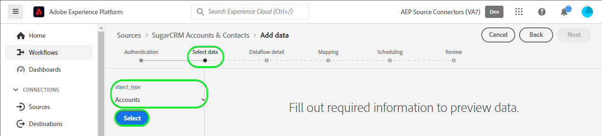

# 在使用者介面中建立[!DNL SugarCRM Accounts & Contacts]來源連線

本教學課程提供使用Adobe Experience Platform使用者介面建立[!DNL SugarCRM Accounts & Contacts]來源連線的步驟。

## 快速入門

本教學課程需要您實際瞭解下列Experience Platform元件：

* [[!DNL Experience Data Model (XDM)] 系統](../../../../../xdm/home.md)： [!DNL Experience Platform]用來組織客戶體驗資料的標準化架構。
   * [結構描述組合的基本概念](../../../../../xdm/schema/composition.md)：瞭解XDM結構描述的基本建置區塊，包括結構描述組合中的關鍵原則和最佳實務。
   * [結構描述編輯器教學課程](../../../../../xdm/tutorials/create-schema-ui.md)：瞭解如何使用結構描述編輯器使用者介面建立自訂結構描述。
* [[!DNL Real-Time Customer Profile]](../../../../../profile/home.md)：根據來自多個來源的彙總資料，提供統一的即時消費者設定檔。

如果您已經有有效的[!DNL SugarCRM]帳戶，您可以略過本檔案的其餘部分，並繼續進行有關[設定資料流](../../dataflow/crm.md)的教學課程。

### 收集必要的認證

若要將[!DNL SugarCRM Accounts & Contacts]連線至Experience Platform，您必須提供下列連線屬性的值：

| 認證 | 說明 | 範例 |
| --- | --- | --- |
| `Host` | 來源連線到的SugarCRM API端點。 | `developer.salesfusion.com` |
| `Username` | 您的SugarCRM開發人員帳戶使用者名稱。 | `abc.def@example.com@sugarmarketdemo000.com` |
| `Password` | 您的SugarCRM開發人員帳戶密碼。 | `123456789` |

### 建立Experience Platform結構描述

在建立[!DNL SugarCRM]來源連線之前，您也必須先建立Experience Platform結構描述以用於您的來源。 如需如何建立結構描述的完整步驟，請參閱有關[建立Experience Platform結構描述](../../../../../xdm/schema/composition.md)的教學課程。

[!DNL SugarCRM Accounts & Contacts]支援多個API。 這表示您必須根據要運用的物件型別，建立個別綱要。 請參閱下列帳戶和連絡人結構描述的範例：

>[!BEGINTABS]

>[!TAB 帳戶]

的結構描述範例

>[!TAB 連絡人]

>[!ENDTABS]

## 連線您的[!DNL SugarCRM Accounts & Contacts]帳戶

在Experience Platform UI中，從左側導覽列選取&#x200B;**[!UICONTROL 來源]**&#x200B;以存取[!UICONTROL 來源]工作區。 [!UICONTROL 目錄]畫面會顯示您可以建立帳戶的各種來源。

您可以從熒幕左側的目錄中選取適當的類別。 或者，您可以使用搜尋選項來尋找您要使用的特定來源。

在&#x200B;*CRM*&#x200B;類別下，選取&#x200B;**[!UICONTROL SugarCRM帳戶與聯絡人]**，然後選取&#x200B;**[!UICONTROL 新增資料]**。

**[!UICONTROL 連線SugarCRM帳戶與連絡人帳戶]**&#x200B;頁面隨即顯示。 您可以在此頁面使用新的證明資料或現有的證明資料。

### 現有帳戶

若要使用現有帳戶，請選取您要用來建立新資料流的[!DNL SugarCRM Accounts & Contacts]帳戶，然後選取[下一步] **以繼續。**

使用現有帳戶連線SugarCRM帳戶與連絡人帳戶的

### 新帳戶

如果您正在建立新帳戶，請選取&#x200B;**[!UICONTROL 新帳戶]**，然後提供名稱、選擇性說明和您的認證。 完成時，請選取&#x200B;**[!UICONTROL 連線到來源]**，然後等待一段時間以建立新連線。

使用新帳戶連線SugarCRM帳戶與連絡人帳戶的

### 選取資料

最後，您必須選取要擷取至Experience Platform的物件型別。

| 物件類型 | 說明 |
| --- | --- |
| `Accounts` | 與貴組織有關係的公司。 |
| `Contacts` | 與您的組織建立關係的個人。 |

>[!BEGINTABS]

>[!TAB 帳戶]

>[!TAB 連絡人]

>[!ENDTABS]

## 後續步驟

依照本教學課程中的指示，您已建立與[!DNL SugarCRM Accounts & Contacts]帳戶的連線。 您現在可以繼續進行下一個教學課程，並[設定資料流以將資料帶入Experience Platform](../../dataflow/crm.md)。

## 其他資源

以下各節提供在使用[!DNL SugarCRM]來源時可以參考的其他資源。

### 護欄 {#guardrails}

[!DNL SugarCRM] API節流速率是每分鐘90次呼叫或每日2000次呼叫（以先發生者為準）。 不過，將引數新增至連線規格已避免此限制，這會延遲要求時間，使速率限制永遠無法達到。

### 驗證 {#validation}

若要驗證您已正確設定來源，而且正在擷取[!DNL SugarCRM Accounts & Contacts]資料，請遵循下列步驟：

* 在Experience Platform UI中，選取來源目錄上[!DNL SugarCRM Accounts & Contacts]卡片功能表旁的&#x200B;**[!UICONTROL 檢視資料流程]**。 接著，選取&#x200B;**[!UICONTROL 預覽資料集]**&#x200B;以驗證所擷取的資料。

* 根據您使用的物件型別，您可以根據以下[!DNL SugarMarket]個「帳戶」或「連絡人」頁面上顯示的計數，驗證彙總資料：

>[!BEGINTABS]

>[!TAB 帳戶]

>[!TAB 連絡人]

>[!ENDTABS]

>[!NOTE]
>
>[!DNL SugarMarket]頁面不包含已刪除的物件計數。 不過，透過此來源擷取的資料也會包含已刪除的計數，這些將會標示已刪除的旗標。
