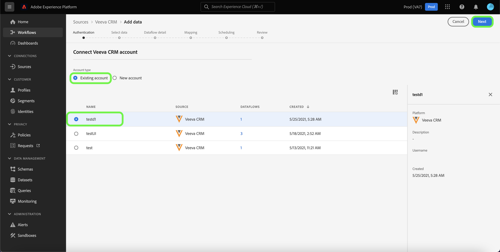

# 建立 [!DNL Veeva CRM] ui中的來源連線

Adobe Experience Platform中的來源聯結器可讓您依排程擷取外部來源的CRM資料。 本教學課程提供建立 [!DNL Veeva CRM] 來源聯結器使用 [!DNL Platform] 使用者介面。

## 快速入門

本教學課程需要您實際瞭解下列Adobe Experience Platform元件：

* [[!DNL Experience Data Model (XDM)] 系統](../../../../../xdm/home.md)：作為依據的標準化架構 [!DNL Experience Platform] 組織客戶體驗資料。
   * [結構描述組合基本概念](../../../../../xdm/schema/composition.md)：瞭解XDM結構描述的基本建置組塊，包括結構描述組合中的關鍵原則和最佳實務。
   * [結構描述編輯器教學課程](../../../../../xdm/tutorials/create-schema-ui.md)：瞭解如何使用結構描述編輯器UI建立自訂結構描述。
* [[!DNL Real-Time Customer Profile]](../../../../../profile/home.md)：根據來自多個來源的彙總資料，提供統一的即時消費者設定檔。

如果您已有有效的 [!DNL Veeva CRM] 帳戶，您可以略過本檔案的其餘部分，並前往上的教學課程 [設定資料流](../../dataflow/crm.md).

### 收集必要的認證

| 認證 | 說明 |
| ---------- | ----------- |
| `environmentUrl` | 的URL [!DNL Veeva CRM] 來源執行個體。 |
| `username` | 的使用者名稱 [!DNL Veeva CRM] 使用者帳戶。 |
| `password` | 的密碼 [!DNL Veeva CRM] 使用者帳戶。 |
| `securityToken` | 的安全性權杖 [!DNL Veeva CRM] 使用者帳戶。 |

如需入門的詳細資訊，請參閱此 [[!DNL Veeva CRM] 檔案](https://developer.veevacrm.com/doc/Content/rest-api.htm).

## 連線您的 [!DNL Veeva CRM] 帳戶

收集完所需的認證後，您可以依照下列步驟連結 [!DNL Veeva CRM] 帳戶至 [!DNL Platform].

在Platform UI中選取 **[!UICONTROL 來源]** 以存取 [!UICONTROL 來源] 工作區。 此 [!UICONTROL 目錄] 畫面會顯示您可以用來建立帳戶的各種來源。

您可以從畫面左側的目錄中選取適當的類別。 或者，您也可以使用搜尋選項來尋找您要使用的特定來源。

在 [!UICONTROL CRM] 類別，選取 **[!UICONTROL Veeva CRM]**，然後選取 **[!UICONTROL 新增資料]**.

此 **[!UICONTROL 連線Veeva CRM帳戶]** 頁面便會顯示。 您可以在此頁面使用新的證明資料或現有的證明資料。

### 現有帳戶

若要使用現有帳戶，請選取 [!DNL Veeva CRM] 要用來建立新資料流的帳戶，然後選取 **[!UICONTROL 下一個]** 以繼續進行。

### 新帳戶

如果您要建立新帳戶，請選取 **[!UICONTROL 新帳戶]**，然後提供名稱、選擇性說明和您的 [!DNL Veeva CRM] 認證。 完成後，選取 **[!UICONTROL 連線到來源]** 然後等待一段時間以建立新連線。

## 後續步驟

依照本教學課程，您已建立與的連線， [!DNL Veeva CRM] 帳戶。 您現在可以繼續下一節教學課程和 [設定資料流以將資料匯入Platform](../../dataflow/crm.md).
