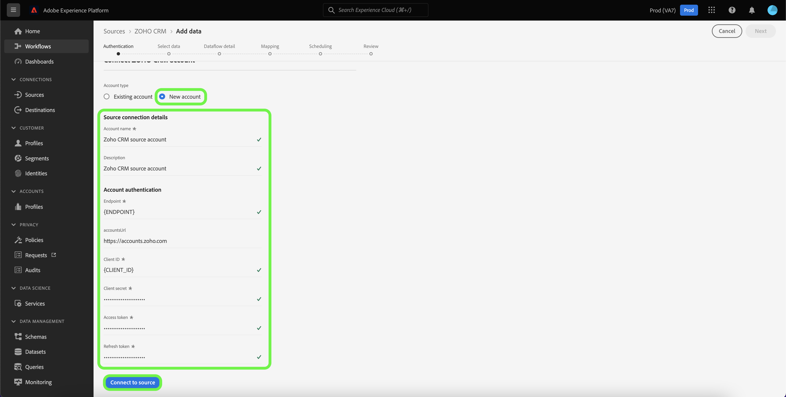

# 建立 [!DNL Zoho CRM] UI中的源連接

Adobe Experience Platform的源連接器提供定期接收外部來源的CRM資料的能力。 本教程提供建立 [!DNL Zoho CRM] 源連接器使用 [!DNL Platform] 用戶介面。

## 快速入門

本教程需要對Adobe Experience Platform的以下部分進行有效的理解：

* [[!DNL Experience Data Model (XDM)] 系統](../../../../../xdm/home.md):標準化框架 [!DNL Experience Platform] 組織客戶體驗資料。
   * [架構組合的基礎](../../../../../xdm/schema/composition.md):瞭解XDM架構的基本構建基塊，包括架構組成中的關鍵原則和最佳做法。
   * [架構編輯器教程](../../../../../xdm/tutorials/create-schema-ui.md):瞭解如何使用架構編輯器UI建立自定義架構。
* [[!DNL Real-Time Customer Profile]](../../../../../profile/home.md):基於來自多個源的聚合資料提供統一、即時的用戶配置檔案。

如果您已經有 [!DNL Zoho CRM] 帳戶，您可以跳過本文檔的其餘部分，繼續學習本教程。 [配置資料流](../../dataflow/crm.md)。

### 收集所需憑據

為了連接 [!DNL Zoho CRM] 到平台，必須提供以下連接屬性的值：

| 憑據 | 說明 |
| --- | --- |
| 端點 | 的端點 [!DNL Zoho CRM] 伺服器。 |
| 帳戶URL | 帳戶URL用於生成訪問和刷新令牌。 該URL必須是特定於域的。 |
| 客戶端ID | 與您的 [!DNL Zoho CRM] 用戶帳戶。 |
| 客戶端密碼 | 與您的 [!DNL Zoho CRM] 用戶帳戶。 |
| 訪問令牌 | 訪問令牌授權您對您的 [!DNL Zoho CRM] 帳戶。 |
| 刷新令牌 | 刷新令牌是用於在訪問令牌過期後生成新訪問令牌的令牌。 |

有關這些憑據的詳細資訊，請參閱 [[!DNL Zoho CRM] 認證](https://www.zoho.com/crm/developer/docs/api/v2/oauth-overview.html)。

## 連接 [!DNL Zoho CRM] 帳戶

收集了所需的憑據後，您可以按照以下步驟連結 [!DNL Zoho CRM] 帳戶 [!DNL Platform]。

在平台UI中，選擇 **[!UICONTROL 源]** 從左導航欄訪問 [!UICONTROL 源] 工作區。 的 [!UICONTROL 目錄] 螢幕顯示可建立帳戶的各種源。

可以從螢幕左側的目錄中選擇相應的類別。 或者，您可以使用搜索選項找到要使用的特定源。

在 [!UICONTROL CRM] 類別，選擇 **[!UICONTROL 佐霍CRM]**，然後選擇 **[!UICONTROL 添加資料]**。

的 **[!UICONTROL 連接Zoho CRM帳戶]** 的子菜單。 在此頁上，您可以使用新憑據或現有憑據。

### 現有帳戶

要使用現有帳戶，請選擇 [!DNL Zoho CRM] 要使用建立新資料流的帳戶，然後選擇 **[!UICONTROL 下一個]** 繼續。

### 新帳戶

如果要建立新帳戶，請選擇 **[!UICONTROL 新帳戶]**，然後提供名稱、可選說明，以及 [!DNL Zoho CRM] 憑據。 完成後，選擇 **[!UICONTROL 連接到源]** 然後再給新連接建立一段時間。

>[!TIP]
>
>您的帳戶URL域必須與相應的域位置對應。 以下是各種域及其相應帳戶URL:<ul><li>美國：https://accounts.zoho.com</li><li>澳大利亞：https://accounts.zoho.com.au</li><li>歐洲：https://accounts.zoho.eu</li><li>印度：https://accounts.zoho.in</li><li>中國：https://accounts.zoho.com.cn</li></ul>

## 後續步驟

按照本教程，您已建立到 [!DNL Zoho CRM] 帳戶。 現在，您可以繼續下一個教程， [配置資料流以將資料引入平台](../../dataflow/crm.md)。
