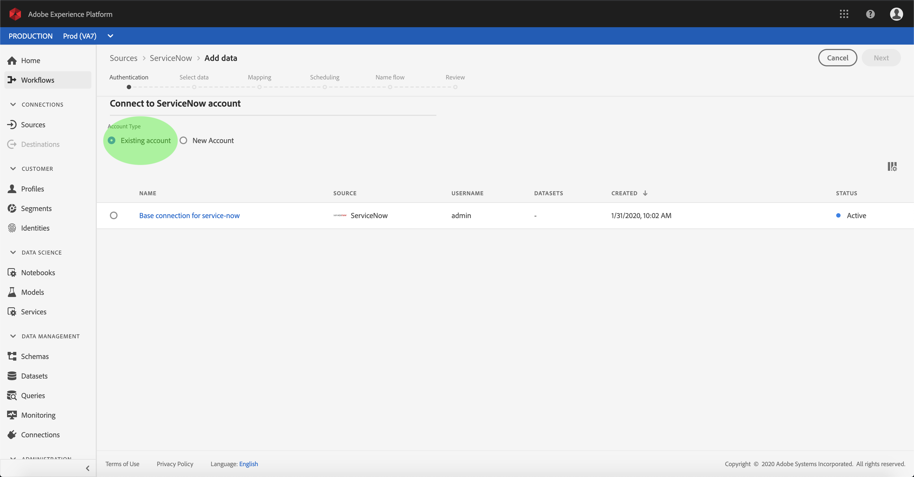

# 在UI中建立ServiceNow來源連接器

Adobe Experience Platform中的來源連接器可讓您依計畫吸收外部來源的資料。 本教學課程提供使用平台使用者介面建立ServiceNow來源連接器的步驟。

## 快速入門

本教學課程需要對Adobe Experience Platform的下列元件有正確的認識：

* [體驗資料模型(XDM)系統](../../../../../xdm/home.md):Experience Platform組織客戶體驗資料的標準化架構。
   * [架構構成基礎](../../../../../xdm/schema/composition.md):瞭解XDM架構的基本建置區塊，包括架構組合的主要原則和最佳實務。
   * [架構編輯器教程](../../../../../xdm/tutorials/create-schema-ui.md):瞭解如何使用架構編輯器UI建立自訂架構。
* [即時客戶個人檔案](../../../../../profile/home.md):根據來自多個來源的匯整資料，提供統一、即時的消費者個人檔案。

如果您已經有ServiceNow連接，則可以跳過本文檔的其餘部分，並繼續有關配置資料流 [的教程](../../dataflow/customer-success.md)

### 收集必要的認證

若要存取您在平台上的ServiceNow帳戶，您必須提供下列值：

| 憑證 | 說明 |
| ---------- | ----------- |
| `endpoint` | ServiceNow伺服器的端點。 |
| `username` | 用於連接到ServiceNow伺服器進行驗證的用戶名。 |
| `password` | 連接到ServiceNow伺服器以進行驗證的密碼。 |

有關快速入門的詳細資訊，請參 [閱本ServiceNow檔案](https://developer.servicenow.com/app.do#!/rest_api_doc?v=newyork&amp;id=r_TableAPI-GET)。

## 連接您的ServiceNow帳戶

收集完所需的憑證後，您可依照下列步驟建立新的ServiceNow帳戶以連線至平台。

登入 <a href="https://platform.adobe.com" target="_blank">Adobe Experience Platform</a> ，然後從左側導覽列選取 **Sources** ，以存取 ** Sources工作區。 「目 *錄* 」畫面會顯示您可建立帳戶的各種來源，而每個來源會顯示與其相關的現有帳戶和資料集流量。

您可以從畫面左側的目錄中選取適當的類別。 或者，您也可以使用搜尋選項找到您要使用的特定來源。

在「客 *戶成功* 」類別下，選 **擇ServiceNow** ，以在螢幕右側顯示資訊列。 資訊列提供所選來源的簡短說明，以及與來源連線或檢視其檔案的選項。 若要建立新帳戶，請選取「連 **接來源」**。

此時 *將顯示「連接到ServiceNow* 」頁。 在此頁上，您可以使用新認證或現有認證。

### 新帳戶

如果您使用新認證，請選擇「新 **帳戶」**。 在出現的輸入表單上，提供連線名稱、選用說明和您的ServiceNow憑證。 完成後，選擇 **Connect** ，然後為新帳戶建立留出一些時間。

### 現有帳戶

要連接現有帳戶，請選擇要連接的ServiceNow帳戶，然後選擇「下 **一步** 」繼續。

## 後續步驟

在本教學課程之後，您已建立與ServiceNow帳戶的連線。 您現在可以繼續下一個教程，並 [配置資料流以將資料導入平台](../../dataflow/customer-success.md)。
