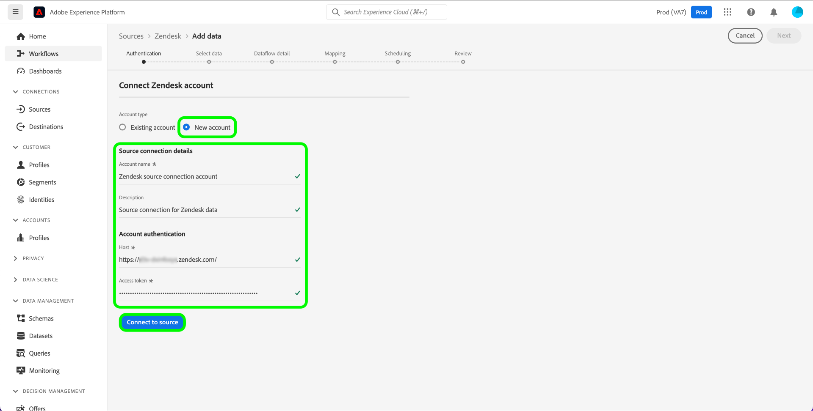

# (Beta)建立 [!DNL Zendesk] ui中的來源連線

>[!NOTE]
>
>此 [!DNL Zendesk] 來源為測試版。 請參閱 [來源概觀](../../../../home.md#terms-and-conditions) 以取得有關使用測試版標籤來源的詳細資訊。

本教學課程提供建立 [!DNL Zendesk] 使用Adobe Experience Platform使用者介面的來源連線。

## 快速入門

本教學課程需要您實際瞭解下列Adobe Experience Platform元件：

* [[!DNL Experience Data Model (XDM)] 系統](../../../../../xdm/home.md)：作為依據的標準化架構 [!DNL Experience Platform] 組織客戶體驗資料。
   * [結構描述組合基本概念](../../../../../xdm/schema/composition.md)：瞭解XDM結構描述的基本建置組塊，包括結構描述組合中的關鍵原則和最佳實務。
   * [結構描述編輯器教學課程](../../../../../xdm/tutorials/create-schema-ui.md)：瞭解如何使用結構描述編輯器UI建立自訂結構描述。
* [[!DNL Real-Time Customer Profile]](../../../../../profile/home.md)：根據來自多個來源的彙總資料，提供統一的即時消費者設定檔。

### 收集必要的認證

為了存取您的 [!DNL Zendesk] Platform上的帳戶，您必須提供下列認證的值：

| 認證 | 說明 | 範例 |
| --- | --- | --- |
| 子網域 | 您在註冊過程中建立之帳戶的特定唯一網域。 | `yoursubdomain` |
| 存取權杖 | Zendesk API權杖。 | `0lZnClEvkJSTQ7olGLl7PMhVq99gu26GTbJtf` |

如需驗證您的憑證的詳細資訊 [!DNL Zendesk] 來源，請參閱 [[!DNL Zendesk] 來源概觀](../../../../connectors/customer-success/zendesk.md).

### 建立平台結構描述 [!DNL Zendesk]

建立之前 [!DNL Zendesk] 來源連線時，您必須先建立平台結構描述以用於您的來源。 請參閱教學課程，位置如下： [建立平台結構描述](../../../../../xdm/schema/composition.md) 有關如何建立方案的完整步驟。

如需更多有關您的電腦的指引， [!DNL Zendesk] 結構描述是 [!DNL Zendesk Search API]，請參閱 [限制](#limits) 區段底下。

## 連線您的 [!DNL Zendesk] 帳戶

在Platform UI中選取 **[!UICONTROL 來源]** 以存取 [!UICONTROL 來源] 工作區。 此 [!UICONTROL 目錄] 畫面會顯示您可以用來建立帳戶的各種來源。

您可以從畫面左側的目錄中選取適當的類別。 或者，您也可以使用搜尋選項來尋找您要使用的特定來源。

在 *客戶成功* 類別，選取 **[!UICONTROL Zendesk]**，然後選取 **[!UICONTROL 新增資料]**.

此 **[!UICONTROL 連線Zendesk帳戶]** 頁面便會顯示。 您可以在此頁面使用新的證明資料或現有的證明資料。

### 現有帳戶

若要使用現有帳戶，請選取 *Zendesk* 要用來建立新資料流的帳戶，然後選取 **[!UICONTROL 下一個]** 以繼續進行。

### 新帳戶

如果您要建立新帳戶，請選取 **[!UICONTROL 新帳戶]**，然後提供名稱、選擇性說明和您的認證。 完成後，選取 **[!UICONTROL 連線到來源]** 然後等待一段時間以建立新連線。

### 選擇資料

來源通過驗證後，頁面會更新為互動式結構描述樹狀結構，讓您探索和檢查資料的階層。 選取 **[!UICONTROL 下一個]** 以繼續進行。

## 後續步驟

依照本教學課程所述，您已驗證並建立您與 [!DNL Zendesk] 帳戶和平台。 您現在可以繼續下一節教學課程和 [建立資料流，將客戶成功資料匯入Platform](../../dataflow/customer-success.md).

## 其他資源

以下各節提供您在使用時，可參考的其他資源 [!DNL Zendesk] 來源。

### 驗證 {#validation}

以下概述驗證您已成功連線至您的主機時可採取的步驟。 [!DNL Zendesk] 來源及 [!DNL Zendesk] 設定檔正在擷取至Platform。

在Platform UI中選取 **[!UICONTROL 資料集]** 從左側導覽存取 [!UICONTROL 資料集] 工作區。 此 [!UICONTROL 資料集活動] 畫面會顯示執行的詳細資訊。

接著，選取您要檢視之資料流的資料流執行ID，以檢視有關該資料流執行的特定詳細資訊。

最後，選取 **[!UICONTROL 預覽資料集]** 以顯示所擷取的資料。

您也可以根據您網站上的資料，驗證Platform資料。 [!DNL Zendesk] > [!DNL Customers] 頁面。

### Zendesk結構描述

下表列出必須為Zendesk設定的支援對應。

>[!TIP]
>
>另請參閱 [Zendesk Search API >匯出搜尋結果](https://developer.zendesk.com/api-reference/ticketing/ticket-management/search/#export-search-results) 以取得有關API的詳細資訊。

| 來源 | 類型 |
|---|---|
| `results.active` | 布林值 |
| `results.alias` | 字串 |
| `results.created_at` | 字串 |
| `results.custom_role_id` | 整數 |
| `results.default_group_id` | 整數 |
| `results.details` | 字串 |
| `results.email` | 字串 |
| `results.external_id` | 整數 |
| `results.iana_time_zone` | 字串 |
| `results.id` | 整數 |
| `results.last_login_at` | 字串 |
| `results.locale` | 字串 |
| `results.locale_id` | 整數 |
| `results.moderator` | 布林值 |
| `results.name` | 字串 |
| `results.notes` | 字串 |
| `results.only_private_comments` | 布林值 |
| `results.organization_id` | 整數 |
| `results.phone` | 字串 |
| `results.photo` | 字串 |
| `results.report_csv` | 布林值 |
| `results.restricted_agent` | 布林值 |
| `results.result_type` | 字串 |
| `results.role` | 字串 |
| `results.role_type` | 整數 |
| `results.shared` | 布林值 |
| `results.shared_agent` | 布林值 |
| `results.shared_phone_number` | 布林值 |
| `results.signature` | 字串 |
| `results.suspended` | 布林值 |
| `results.ticket_restriction` | 字串 |
| `results.time_zone` | 字串 |
| `results.two_factor_auth_enabled` | 布林值 |
| `results.updated_at` | 字串 |
| `results.url` | 字串 |
| `results.verified` | 布林值 |

{style="table-layout:auto"}

### 限制 {#limits}

* 此 [Zendesk Search API >匯出搜尋結果](https://developer.zendesk.com/api-reference/ticketing/ticket-management/search/#export-search-results) 每頁最多傳回1000筆記錄。
   * 的值 ``filter[type]`` 引數已設為 ``user`` 因此，Zendesk連線只會傳回使用者。
   * 每頁的結果數量由 ``page[size]`` 引數。 值設為 ``100``. 這麼做是為了減少Zendesk設定的減速限制的影響。
   * 另請參閱 [限制](https://developer.zendesk.com/api-reference/ticketing/ticket-management/search/#limits) 和 [分頁](https://developer.zendesk.com/api-reference/ticketing/ticket-management/search/#pagination-1).
   * 您也可以參閱 [使用游標分頁來分頁清單](https://developer.zendesk.com/documentation/developer-tools/pagination/paginating-through-lists-using-cursor-pagination/).
