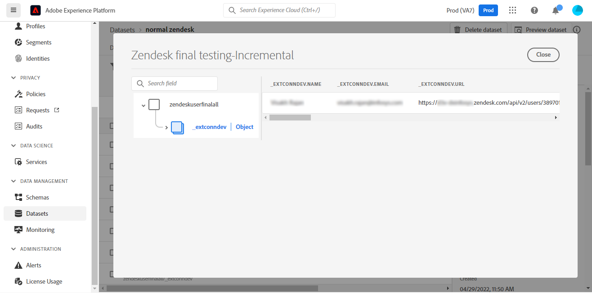

# (Beta)建立 [!DNL Zendesk] UI中的源連接

>[!NOTE]
>
>的 [!DNL Zendesk] 源為beta。 查看 [源概述](../../../../home.md#terms-and-conditions) 的子菜單。

本教程提供建立 [!DNL Zendesk] 源連接，使用Adobe Experience Platform用戶介面。

## 快速入門

本教程需要對Adobe Experience Platform的以下部分進行有效的理解：

* [[!DNL Experience Data Model (XDM)] 系統](../../../../../xdm/home.md):標準化框架 [!DNL Experience Platform] 組織客戶體驗資料。
   * [架構組合的基礎](../../../../../xdm/schema/composition.md):瞭解XDM架構的基本構建基塊，包括架構組成中的關鍵原則和最佳做法。
   * [架構編輯器教程](../../../../../xdm/tutorials/create-schema-ui.md):瞭解如何使用架構編輯器UI建立自定義架構。
* [[!DNL Real-Time Customer Profile]](../../../../../profile/home.md):基於來自多個源的聚合資料提供統一、即時的用戶配置檔案。

### 收集所需憑據

為了訪問 [!DNL Zendesk] 帳戶，必須為以下憑據提供值：

| 憑據 | 說明 | 範例 |
| --- | --- | --- |
| 子網域 | 在註冊過程中建立的特定於您帳戶的唯一域。 | `yoursubdomain` |
| 訪問令牌 | Zendesk API令牌。 | `0lZnClEvkJSTQ7olGLl7PMhVq99gu26GTbJtf` |

有關驗證您 [!DNL Zendesk] 源，請參閱 [[!DNL Zendesk] 源概述](../../../../connectors/customer-success/zendesk.md)。

### 建立平台架構 [!DNL Zendesk]

在建立 [!DNL Zendesk] 源連接，還必須確保首先建立用於源的平台架構。 請參閱上的教程 [建立平台架構](../../../../../xdm/schema/composition.md) 有關如何建立架構的全面步驟。

有關您的 [!DNL Zendesk] 需要的架構 [!DNL Zendesk Search API]，請參閱 [限制](#limits) 的下界。

## 連接 [!DNL Zendesk] 帳戶

在平台UI中，選擇 **[!UICONTROL 源]** 從左導航欄訪問 [!UICONTROL 源] 工作區。 的 [!UICONTROL 目錄] 螢幕顯示可建立帳戶的各種源。

可以從螢幕左側的目錄中選擇相應的類別。 或者，您可以使用搜索選項找到要使用的特定源。

在 *客戶成功* 類別，選擇 **[!UICONTROL 森德克]**，然後選擇 **[!UICONTROL 添加資料]**。

的 **[!UICONTROL 連接Zendesk帳戶]** 的子菜單。 在此頁上，您可以使用新憑據或現有憑據。

### 現有帳戶

要使用現有帳戶，請選擇 *森德克* 要使用建立新資料流的帳戶，然後選擇 **[!UICONTROL 下一個]** 繼續。

### 新帳戶

如果要建立新帳戶，請選擇 **[!UICONTROL 新帳戶]**，然後提供名稱、可選說明和您的憑據。 完成後，選擇 **[!UICONTROL 連接到源]** 然後再給新連接建立一段時間。

### 選擇資料

在對源進行身份驗證後，該頁將更新到互動式架構樹中，以便您瀏覽和檢查資料的層次結構。 選擇 **[!UICONTROL 下一個]** 繼續。

## 後續步驟

按照本教程，您已經驗證並建立了源連接 [!DNL Zendesk] 帳戶和平台。 現在，您可以繼續下一個教程， [建立資料流，將客戶成功資料引入平台](../../dataflow/customer-success.md)。

## 其他資源

以下各節提供了在使用 [!DNL Zendesk] 源。

### 驗證 {#validation}

以下概述了驗證您已成功連接時可以採取的步驟 [!DNL Zendesk] 來源 [!DNL Zendesk] 正在將配置檔案接收到平台。

在平台UI中，選擇 **[!UICONTROL 資料集]** 從左側導航 [!UICONTROL 資料集] 工作區。 的 [!UICONTROL 資料集活動] 螢幕顯示執行的詳細資訊。

接下來，選擇要查看的資料流的資料流運行ID，以查看有關該資料流運行的特定詳細資訊。

最後，選擇 **[!UICONTROL 預覽資料集]** 來顯示所攝資料。

您還可以根據您的 [!DNL Zendesk] > [!DNL Customers] 的子菜單。

### Zendesk架構

下表列出了必須為Zendesk設定的受支援映射。

>[!TIP]
>
>請參閱 [Zendesk搜索API >導出搜索結果](https://developer.zendesk.com/api-reference/ticketing/ticket-management/search/#export-search-results) 的子菜單。

| 來源 | 類型 |
|---|---|
| `results.active` | 布林值 |
| `results.alias` | 字串 |
| `results.created_at` | 字串 |
| `results.custom_role_id` | 整數 |
| `results.default_group_id` | 整數 |
| `results.details` | 字串 |
| `results.email` | 字串 |
| `results.external_id` | 整數 |
| `results.iana_time_zone` | 字串 |
| `results.id` | 整數 |
| `results.last_login_at` | 字串 |
| `results.locale` | 字串 |
| `results.locale_id` | 整數 |
| `results.moderator` | 布林值 |
| `results.name` | 字串 |
| `results.notes` | 字串 |
| `results.only_private_comments` | 布林值 |
| `results.organization_id` | 整數 |
| `results.phone` | 字串 |
| `results.photo` | 字串 |
| `results.report_csv` | 布林值 |
| `results.restricted_agent` | 布林值 |
| `results.result_type` | 字串 |
| `results.role` | 字串 |
| `results.role_type` | 整數 |
| `results.shared` | 布林值 |
| `results.shared_agent` | 布林值 |
| `results.shared_phone_number` | 布林值 |
| `results.signature` | 字串 |
| `results.suspended` | 布林值 |
| `results.ticket_restriction` | 字串 |
| `results.time_zone` | 字串 |
| `results.two_factor_auth_enabled` | 布林值 |
| `results.updated_at` | 字串 |
| `results.url` | 字串 |
| `results.verified` | 布林值 |

{style="table-layout:auto"}

### 限制 {#limits}

* 的 [Zendesk搜索API >導出搜索結果](https://developer.zendesk.com/api-reference/ticketing/ticket-management/search/#export-search-results) 返回每頁最多1000條記錄。
   * 的值 ``filter[type]`` 參數設定為 ``user`` 因此Zendesk連接只返回用戶。
   * 每頁的結果數由 ``page[size]`` 的下界。 值設定為 ``100``。 這樣做是為了減少由Zendesk設定的減速限制的影響。
   * 請參閱 [限制](https://developer.zendesk.com/api-reference/ticketing/ticket-management/search/#limits) 和 [分頁](https://developer.zendesk.com/api-reference/ticketing/ticket-management/search/#pagination-1)。
   * 您還可以參考 [使用游標分頁通過清單分頁](https://developer.zendesk.com/documentation/developer-tools/pagination/paginating-through-lists-using-cursor-pagination/)。
