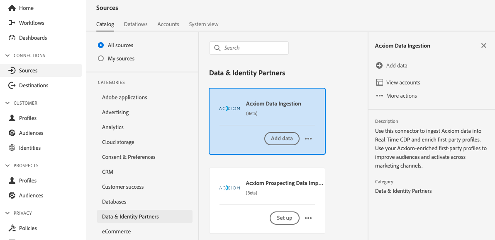
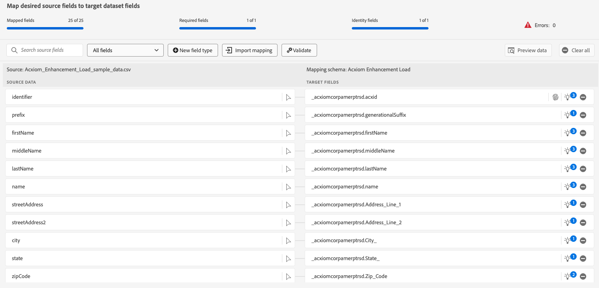

# 建立 [!DNL Acxiom Data Ingestion] UI中的來源連線和資料流

>[!NOTE]
>
>此 [!DNL Acxiom Data Ingestion] 來源為測試版。 閱讀 [條款與條件](../../../../home.md#terms-and-conditions) 如需使用Beta版標籤來源的詳細資訊，請參閱來源概觀。

使用 [!DNL Acxiom Data Ingestion] 要擷取的來源 [!DNL Acxiom] 將資料匯入Real-time Customer Data Platform並豐富第一方設定檔。 然後，您可以使用您的 [!DNL Acxiom] — 擴充第一方設定檔，以改善對象並跨行銷管道啟用。

閱讀本教學課程以瞭解如何建立 [!DNL Acxiom Data Ingestion] 使用Adobe Experience Platform使用者介面的來源連線和資料流。 此 [!DNL Acxiom Data Ingestion] source是用來從擷取及對應回應 [!DNL Acxiom] 使用Amazon S3作為放置點的增強服務。

## 先決條件 {#prerequisites}

本教學課程需要您實際瞭解下列Experience Platform元件：

* [[!DNL Experience Data Model (XDM)] 系統](../../../../../xdm/home.md)：Experience Platform組織客戶體驗資料的標準化架構。
   * [結構描述組合基本概念](../../../../../xdm/schema/composition.md)：瞭解XDM結構描述的基本建置區塊，包括結構描述組合中的關鍵原則和最佳實務。
   * [結構描述編輯器教學課程](../../../../../xdm/tutorials/create-schema-ui.md)：瞭解如何使用結構編輯器UI建立自訂結構描述。
* [[!DNL Real-Time Customer Profile]](../../../../../profile/home.md)：根據來自多個來源的彙總資料，提供統一的即時消費者個人檔案。

### 收集必要的認證

若要在Experience Platform上存取貯體，您必須提供下列憑證的有效值：

| 認證 | 說明 |
| --- | --- |
| [!DNL Acxiom] 驗證金鑰 | 驗證金鑰。 此值可取自 [!DNL Acxiom] 團隊。 |
| [!DNL Amazon S3] 存取金鑰 | 貯體的存取金鑰ID。 此值可取自 [!DNL Acxiom] 團隊。 |
| [!DNL Amazon S3] 秘密金鑰 | 貯體的秘密金鑰ID。 此值可取自 [!DNL Acxiom] 團隊。 |
| 貯體名稱 | 這是您的貯體，檔案將在此共用。 此值可取自 [!DNL Acxiom] 團隊。 |

>[!IMPORTANT]
>
>您必須同時擁有兩者 **[!UICONTROL 檢視來源]** 和 **[!UICONTROL 管理來源]** 為您的帳戶啟用的許可權以連線您的 [!DNL Acxiom] 要Experience Platform的帳戶。 請聯絡您的產品管理員以取得必要許可權。 如需詳細資訊，請閱讀 [存取控制UI指南](../../../../../access-control/ui/overview.md).

## 連線您的 [!DNL Acxiom] 帳戶

在Platform UI中選取 **[!UICONTROL 來源]** 從左側導覽列存取 [!UICONTROL 來源] 工作區。 此 [!UICONTROL 目錄] 畫面會顯示各種來源，供您建立帳戶。

您可以從熒幕左側的目錄中選取適當的類別。 或者，您可以使用搜尋選項來尋找您要使用的特定來源。

在 **[!UICONTROL 資料與身分識別合作夥伴]** 類別，選取 **[!UICONTROL Acxiom資料擷取]** 然後選取 **[!UICONTROL 設定]**.

>[!TIP]
>
>顯示的來源卡片 **[!UICONTROL 新增資料]** 表示來源已有已驗證的帳戶。 另一方面，顯示的來源卡片 **[!UICONTROL 設定]** 這表示您必須提供認證並建立新帳戶才能使用該來源。

### 建立新帳戶

如果您正在使用新認證，請選取 **[!UICONTROL 新帳戶]**. 在出現的輸入表單上，提供名稱、選擇性說明，以及 [!DNL Acxiom] 認證。 完成後，選取 **[!UICONTROL 連線到來源]** 然後等待一段時間以建立新連線。

| 認證 | 說明 |
| --- | --- |
| 帳戶名稱 | 帳戶的名稱。 |
| 說明 | （選用）帳戶用途的簡短說明。 |
| [!DNL Acxiom] 驗證金鑰 | 此 [!DNL Acxiom]帳戶核准需要提供的金鑰。 在連線到資料庫之前，這必須符合適當的值。  此索引鍵必須是24個字元，而且只能包含： A-Z、a-z和0-9。 |
| S3存取金鑰 | S3存取金鑰會參照Amazon S3位置。 這由您的管理員在定義S3角色許可權時提供。 |
| S3秘密金鑰 | S3秘密金鑰會參照Amazon S3位置。 這由您的管理員在定義S3角色許可權時提供。 |
| s3SessionToken | （選用）連線至S3時的驗證Token值。 |
| serviceUrl | （選用）連線至非標準位置的S3時要使用的URL位置。 |
| 貯體名稱 | （選用）在S3上設定的S3貯體名稱，可作為資料選取的開始路徑。 |
| 檔案夾路徑 | 如果使用貯體中的子目錄，則也可以在資料選取中將路徑指定為起始路徑。 |

### 使用現有帳戶

若要使用現有帳戶，請選取 **[!UICONTROL 現有帳戶]**.

從清單中選取一個帳戶，以檢視該帳戶的詳細資訊。 選取帳戶後，選取 **[!UICONTROL 下一個]** 以繼續進行。

## 選取資料

選取您要從所需儲存貯體和子目錄中擷取的檔案。 一旦定義了分隔符號和壓縮型別，就可以提供資料的預覽。 選取檔案後，選取 **[!UICONTROL 下一個]** 以繼續進行。

>[!NOTE]
>
>雖然JSON和Parquet檔案型別已列出，但您並非需要在以下期間使用這些型別： [!DNL Acxiom] 來源工作流程。

## 提供資料集和資料流詳細資料

接下來，您必須提供有關資料集和資料流的資訊。

### 資料集詳細資訊

>[!BEGINTABS]

>[!TAB 使用新資料集]

資料集是資料集合的儲存和管理結構，通常是包含方案 (欄) 和欄位 (列) 的表格。 成功擷取至Experience Platform的資料會以資料集的形式保留在資料湖中。 若要使用新資料集，請選取「 」 **[!UICONTROL 新資料集]**.

| 新資料集詳細資料 | 說明 |
| --- | --- |
| 輸出資料集名稱 | 新資料集的名稱。 |
| 說明 | （選用）資料集用途的簡短說明。 |
| 綱要 | 貴組織中現有的結構描述下拉式清單。 您也可以在來源設定程式之前建立自己的結構描述。 如需詳細資訊，請閱讀以下指南： [在UI中建立結構描述](../../../../../xdm/tutorials/create-schema-ui.md). |

>[!TAB 使用現有的資料集]

若要使用現有的資料集，請選取 **[!UICONTROL 現有資料集]**.

您可以選取 **[!UICONTROL 進階搜尋]** 以檢視貴組織所有資料集的視窗，包括其各自的詳細資料，例如是否啟用這些資料集以擷取至Real-Time Customer Profile。

>[!ENDTABS]

+++選取步驟以啟用設定檔擷取、錯誤診斷及部分擷取。

如果您的資料集已啟用即時客戶個人檔案，那麼在此步驟中，您可以切換 **[!UICONTROL 設定檔資料集]** 啟用您的資料以供設定檔擷取。 您也可以使用此步驟來啟用 **[!UICONTROL 錯誤診斷]** 和 **[!UICONTROL 部分擷取]**.

* **[!UICONTROL 錯誤診斷]**：選取 **[!UICONTROL 錯誤診斷]** 指示來源產生錯誤診斷，以便您稍後在監控資料集活動和資料流狀態時參考。
* **[!UICONTROL 部分擷取]**：部分批次擷取是指擷取包含錯誤的資料的能力，上限為特定可設定的臨界值。 此功能可讓您將所有精確資料成功擷取到Experience Platform，同時所有不正確的資料會個別批次處理，並提供無效原因的資訊。

+++

### 資料流詳細資料

設定資料集後，您必須提供資料流的詳細資訊，包括名稱、選用的說明和警報設定。

| 資料流設定 | 說明 |
| --- | --- |
| 資料流名稱 | 資料流的名稱。  依預設，這將使用正在匯入的檔案名稱。 |
| 說明 | （選用）資料流的簡短說明。 |
| 警報 | Experience Platform可產生使用者可訂閱的事件型警報，這些選項都是執行中的資料流以觸發這些警報。  如需詳細資訊，請閱讀 [警報概觀](../../alerts.md) <ul><li>**來源資料流執行開始**：選取此警報以在資料流執行開始時收到通知。</li><li>**來源資料流執行成功**：選取此警報可在您的資料流結束且沒有任何錯誤時收到通知。</li><li>**來源資料流執行失敗**：選取此警報可在您的資料流執行結束時，收到任何錯誤的通知。</li></ul> |

## 映射

使用對應介面將來源資料對應到適當的結構描述欄位，然後再將資料擷取到Experience Platform。  如需詳細資訊，請閱讀 [UI中的對應指南](../../../../../data-prep/ui/mapping.md)

## 排程您的資料流擷取

接下來，使用排程介面來定義資料流的擷取排程。

| 正在排程設定 | 說明 |
| --- | --- |
| 頻率 | 設定頻率以指出資料流執行的頻率。 您可以將頻率設為： <ul><li>**一次**：將頻率設為 `once` 以建立一次性內嵌。 建立一次性擷取資料流時，無法使用間隔和回填的設定。 依預設，排程頻率會設定為一次。</li><li>**分鐘**：將頻率設為 `minute` 排程您的資料流以每分鐘擷取資料。</li><li>**小時**：將頻率設為 `hour` 排程您的資料流以每小時擷取資料。</li><li>**日**：將頻率設為 `day` 排程您的資料流每日擷取資料。</li><li>**周**：將頻率設為 `week` 排程您的資料流每週擷取資料。</li></ul> |
| 間隔 | 選取頻率後，您就可以設定間隔設定，以建立每次擷取之間的時間範圍。 例如，如果您將頻率設為「天」，並將間隔設為15，則您的資料流將每隔15天執行一次。 **注意**：您無法將間隔設為零。 |
| 開始時間 | 預計執行的時間戳記，以UTC時區顯示。 |
| 回填 | 回填會決定最初要擷取的資料。 如果已啟用回填，則會在第一次排程擷取期間擷取指定路徑中的所有目前檔案。 如果停用回填，則只會擷取在第一次內嵌執行到開始時間之間載入的檔案。 將不會擷取在開始時間之前載入的檔案。 |

## 檢閱您的資料流

使用「複查」頁面可在擷取前取得資料流的摘要。 詳細資料會分組到以下類別中：

* **連線**  — 顯示來源型別、所選來源檔案的相關路徑，以及該來源檔案中的欄數。
* **指派資料集並對映欄位**  — 顯示要將來源資料擷取到哪個資料集中，包括資料集所堅持的結構描述。
* **正在排程**  — 顯示擷取排程的有效期間、頻率和間隔。
檢閱資料流後，請按一下「完成」 ，然後等待一些時間建立資料流。

## 後續步驟

依照本教學課程中的指示，您已成功建立資料流，以將批次資料從 [!DNL Acxiom] 來源以Experience Platform。 如需其他資源，請瀏覽以下概述的檔案。

### 監視資料流

建立資料流後，您可以監視透過它擷取的資料，以檢視擷取率、成功和錯誤的資訊。 如需如何監視資料流的詳細資訊，請瀏覽上的教學課程 [在UI中監視帳戶和資料流](../../../../../dataflows/ui/monitor-sources.md).

### 更新您的資料流

若要更新資料流排程、對應和一般資訊的設定，請造訪本教學課程： [在UI中更新來源資料流程](../../update-dataflows.md).

### 刪除您的資料流

您可以刪除不再需要的資料流，或是使用建立的資料流不正確。 **[!UICONTROL 刪除]** 函式位於 **[!UICONTROL 資料流]** 工作區。 如需如何刪除資料流的詳細資訊，請前往上的教學課程： [在UI中刪除資料流](../../delete.md).

## 其他資源 {#additional-resources}

如需詳細資訊，請閱讀 [[!DNL Acxiom] 資訊庫](https://www.acxiom.com/wp-content/uploads/2022/02/fs-acxiom-infobase_AC-0268-22.pdf).
