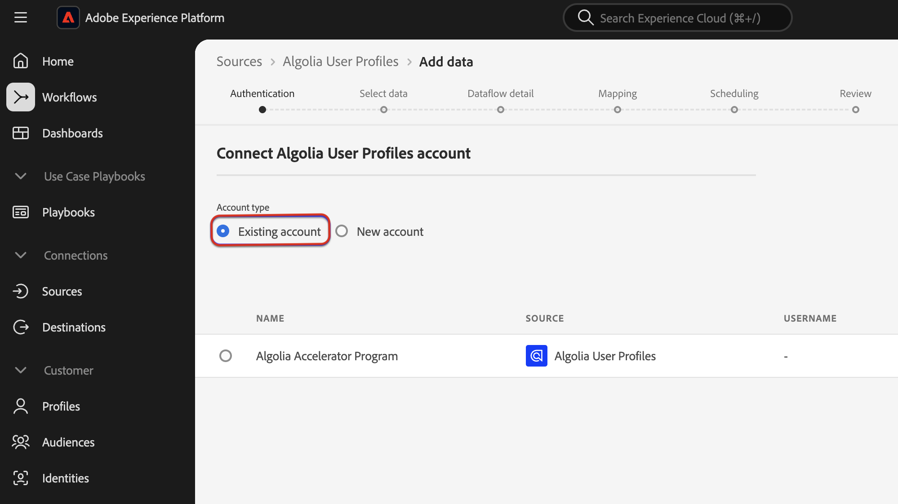

# 使用UI將[!DNL Algolia User Profiles]資料擷取至Experience Platform

本教學課程會透過使用者介面，引導您從[!DNL Algolia User Profiles]帳戶擷取資料至Adobe Experience Platform。

## 快速入門

>[!IMPORTANT]
>
>開始之前，請確定您已完成[[!DNL Algolia User Profiles] 概述](../../../../connectors/data-partners/algolia-user-profiles.md#prerequisites)中概述的必要條件。

本教學課程假設您已熟悉下列Experience Platform元件：

* [[!DNL Experience Data Model (XDM)] 系統](../../../../../xdm/home.md)： Experience Platform用來組織客戶體驗資料的標準化架構。

   * [結構描述組合基本概念](../../../../../xdm/schema/composition.md)：瞭解結構描述組合，包括關鍵原則和最佳實務。
   * [結構描述編輯器教學課程](../../../../../xdm/tutorials/create-schema-ui.md)：瞭解如何使用結構描述編輯器使用者介面建立自訂結構描述。
* [[!DNL Real-Time Customer Profile]](../../../../../profile/home.md)：以多個來源彙總資料為基礎的統一即時客戶設定檔。
* [來源](../../../../home.md)：從各種來源擷取資料，並使用Experience Platform服務來建構、加標籤及增強資料。

### 收集必要的認證

若要將[!DNL Algolia]連線至Adobe Experience Platform，請提供下列認證：

| 認證 | 說明 |
| -------------- | ----------------------------------------------------------------------------------------- |
| 應用程式ID | 指派給您[!DNL Algolia]帳戶的唯一識別碼。 |
| API金鑰 | 用於向[!DNL Algolia]的服務驗證及授權API要求的認證。 |

如需詳細資訊，請參閱[!DNL Algolia] [驗證檔案](https://www.algolia.com/doc/tools/cli/get-started/authentication/)。

## 連線您的[!DNL Algolia]帳戶

在Experience Platform UI中，從左側導覽選取&#x200B;**[!UICONTROL 來源]**&#x200B;以開啟&#x200B;*[!UICONTROL 來源]*&#x200B;工作區。 使用&#x200B;*[!UICONTROL 類別]*&#x200B;面板或搜尋列來尋找您想要的來源。

若要連線[!DNL Algolia]，請選擇&#x200B;*[!UICONTROL Data &amp; Identity Partners]*&#x200B;底下的&#x200B;**[!UICONTROL Algoria]**&#x200B;來源卡，並選取&#x200B;**[!UICONTROL 設定]**。

>[!TIP]
>
> 如果來源尚未擁有已驗證的帳戶，則會顯示&#x200B;**[!UICONTROL 設定]**&#x200B;選項。 驗證後，此變更為&#x200B;**[!UICONTROL 新增資料]**。

## Authentication

### 使用現有帳戶

若要使用現有帳戶，請選擇&#x200B;**[!UICONTROL 現有帳戶]**，然後選取您要使用的[!DNL Algolia User Profiles]帳戶。 然後選取&#x200B;**[!UICONTROL 下一步]**。

### 建立新帳戶

若要建立新帳戶，請選取&#x200B;**[!UICONTROL 新帳戶]**，然後輸入名稱、選擇性說明以及您的[!DNL Algolia]認證。 選取&#x200B;**[!UICONTROL 連線至來源]**&#x200B;並等待連線建立。

## 新增資料

建立[!DNL Algolia User Profiles]帳戶後，**[!UICONTROL 新增資料]**&#x200B;步驟就會顯示。 使用它來選取和預覽要擷取的使用者設定檔資料。

* 在左側，輸入選用的&#x200B;**[!UICONTROL 索引]**&#x200B;和&#x200B;**[!UICONTROL 相似性]**。
* 在右側，預覽最多100列的使用者設定檔。

完成後，選取&#x200B;**[!UICONTROL 下一步]**。

## 提供資料流詳細資訊

如果使用現有的資料集，請選擇與包含[!DNL Algolia Profile]欄位群組的結構描述相關聯的資料集。 確定[!DNL Algolia User Token]欄位正在使用[!DNL Algolia User Token]身分名稱空間。  如果[!DNL Algolia User Token]目前未建立或指派，以下提供指示。

如果建立新資料集，請使用[!DNL Algolia Profile]欄位群組選取結構描述。

### 建立[!DNL Algolia User Token]身分名稱空間

如果您的組織中尚未存在[!DNL Algolia User Token]身分名稱空間，則需要建立它。

使用左側導覽並選取&#x200B;**[!UICONTROL 身分]**&#x200B;以存取[身分識別服務](../../../../../identity-service/home.md)使用者介面工作區，然後選取&#x200B;**[!UICONTROL 建立身分識別名稱空間]**。

接下來，為您的自訂名稱空間提供&#x200B;**[!UICONTROL 顯示名稱]**&#x200B;和&#x200B;**[!UICONTROL 身分識別符號]**。 在此步驟中，您還必須設定名稱空間的型別。 完成後，選取&#x200B;**[!UICONTROL 建立]**。

| 自訂名稱空間設定 | 值 |
| --- | --- |
| **[!UICONTROL 顯示名稱]** | [!DNL Algolia User Token] |
| **[!UICONTROL 身分符號]** | [!DNL AlgoliaUserToken] |
| **[!UICONTROL 選取型別]** | [!DNL Cookie ID] |

新增後，名稱空間會顯示在清單中。 您現在可以在結構描述中套用它。

### 將名稱空間套用至結構描述

使用左側導覽並選取&#x200B;**[!UICONTROL 結構描述]**&#x200B;以存取[結構描述](../../../../../xdm/ui/overview.md) UI工作區。 使用結構描述工作區來建立或更新具有[!DNL Algolia Profile Details]欄位群組的結構描述。 接著，瀏覽至&#x200B;**[!UICONTROL 使用者權杖]**&#x200B;欄位，並使用右邊欄選取&#x200B;**[!UICONTROL 身分識別]**&#x200B;方塊。 此外，請使用輸入方塊來定義[!DNL Algolia User Token]身分名稱空間。 完成後，選取&#x200B;**[!UICONTROL 儲存]**。

在&#x200B;**[!UICONTROL 使用者權杖]**&#x200B;欄位被指派[!DNL Algolia User Token]身分名稱空間後，該身分就會出現在任何設定檔的使用者設定檔中。

## 將資料欄位對應至XDM結構描述

使用對應介面將來源資料對應至結構描述欄位。 如需詳細資訊，請參閱[對應指南](../../../../../data-prep/ui/mapping.md)。

## 排程內嵌執行

接下來，使用排程介面來定義資料流的擷取排程。

| 正在排程設定 | 說明 |
| --- | --- |
| 頻率 | 設定頻率以指出資料流執行的頻率。 您可以將頻率設為： <ul><li>**一次**：將您的頻率設定為`once`以建立一次性內嵌。 建立一次性擷取資料流時，無法使用間隔和回填的設定。 依預設，排程頻率會設定為一次。</li><li>**分鐘**：將頻率設為`minute`，排程您的資料流以每分鐘擷取資料。</li><li>**小時**：將頻率設為`hour`，排程您的資料流以每小時為基礎擷取資料。</li><li>**天**：將您的頻率設為`day`，排程您的資料流每天擷取資料。</li><li>**周**：將頻率設為`week`，排程您的資料流每週擷取資料。</li></ul> |
| 間隔 | 選取頻率後，您就可以設定間隔設定，以建立每次擷取之間的時間範圍。 例如，如果您將頻率設為「天」，並將間隔設為15，則您的資料流將每隔15天執行一次。 您不能將間隔設定為零。 每個頻率的最小接受間隔值如下：<ul><li>**一次**：不適用</li><li>**分鐘**： 15</li><li>**小時**： 1</li><li>**天**： 1</li><li>**周**： 1</li></ul> |
| 開始時間 | 預計執行的時間戳記，以UTC時區顯示。 |
| 回填 | 回填會決定最初要擷取的資料。 如果已啟用回填，則會在第一次排程擷取期間擷取指定路徑中的所有目前檔案。 如果停用回填，則只會擷取在第一次內嵌執行到開始時間之間載入的檔案。 將不會擷取在開始時間之前載入的檔案。 |

## 檢閱您的資料流

使用「複查」頁面可在擷取前取得資料流的摘要。 詳細資料會分組到以下類別中：

* **連線** — 顯示來源型別、所選來源檔案的相關路徑，以及該來源檔案中的欄數。
* **指派資料集與對應欄位** — 顯示要將來源資料擷取到哪個資料集，包括資料集所堅持的結構描述。
* **排程** — 顯示內嵌排程的有效期間、頻率和間隔。

檢閱您的資料流後，請選取&#x200B;**[!UICONTROL 完成]**，並等待一些時間來建立資料流。

## 後續步驟

依照本教學課程中的指示，您已成功建立資料流，以將意圖資料從[!DNL Algolia]來源帶入Experience Platform。 如需其他資源，請瀏覽以下概述的檔案。

### 監視資料流

建立資料流後，您可以監視透過它擷取的資料，以檢視擷取率、成功和錯誤的資訊。 如需如何監視資料流的詳細資訊，請造訪有關UI](../../../../../dataflows/ui/monitor-sources.md)中[監視帳戶和資料流的教學課程。

### 更新您的資料流

若要更新資料流排程、對應和一般資訊的設定，請瀏覽有關[在UI中更新來源資料流的教學課程](../../update-dataflows.md)。

### 刪除您的資料流

您可以刪除不再需要的資料流，或使用&#x200B;**[!UICONTROL 資料流]**&#x200B;工作區中可用的&#x200B;**[!UICONTROL 刪除]**&#x200B;功能建立錯誤的資料流。 如需有關如何刪除資料流的詳細資訊，請瀏覽教學課程，瞭解如何在UI](../../delete.md)中刪除資料流[。
