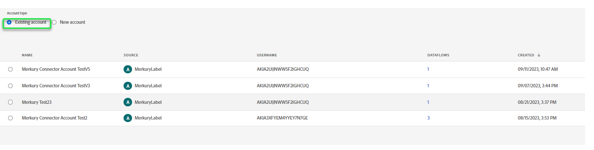

# 建立 [!DNL Merkury Enterprise Identity Resolution] UI中的來源連線和資料流

>[!NOTE]
>
>此 [!DNL Merkury Enterprise Identity Resolution] 來源為測試版。 請閱讀 [來源概觀](../../../../home.md#terms-and-conditions) 以取得有關使用測試版標籤來源的詳細資訊。

本教學課程提供建立 [!DNL Merkury Enterprise Identity Resolution] 使用Adobe Experience Platform使用者介面的來源連線和資料流。

## 快速入門

本教學課程需要您實際瞭解下列Experience Platform元件：

* [[!DNL Experience Data Model (XDM)] 系統](../../../../../xdm/home.md)：Experience Platform組織客戶體驗資料的標準化架構。
   * [結構描述組合基本概念](../../../../../xdm/schema/composition.md)：瞭解XDM結構描述的基本建置區塊，包括結構描述組合中的關鍵原則和最佳實務。
   * [結構描述編輯器教學課程](../../../../../xdm/tutorials/create-schema-ui.md)：瞭解如何使用結構編輯器UI建立自訂結構描述。
* [[!DNL Real-Time Customer Profile]](../../../../../profile/home.md)：根據來自多個來源的彙總資料，提供統一的即時消費者個人檔案。

### 收集必要的認證

若要在Experience Platform上存取貯體，您必須提供下列憑證的有效值：

| 認證 | 說明 |
| --- | --- |
| 存取金鑰 | 貯體的存取金鑰ID。 您可以從您的網站擷取此值 [!DNL Merkury] 團隊。 |
| 秘密金鑰 | 貯體的秘密金鑰ID。 您可以從您的網站擷取此值 [!DNL Merkury] 團隊。 |
| 貯體名稱 | 這是您的Merkury貯體，檔案將在此共用。 您可以從您的網站擷取此值 [!DNL Merkury] 團隊。 |

有關設定的詳細資訊 [!DNL Merkury] 及其他必要條件，請參閱 [[!DNL Merkury] 來源概觀](../../../../connectors/data-partners/merkury.md).

## 連線您的Merkury帳戶

在Platform UI中選取 **[!UICONTROL 來源]** 從左側導覽列存取 [!UICONTROL 來源] 工作區。 此 [!UICONTROL 目錄] 畫面會顯示各種來源，供您建立帳戶。

您可以從熒幕左側的目錄中選取適當的類別。 或者，您可以使用搜尋選項來尋找您要使用的特定來源。

在 **[!UICONTROL 資料合作夥伴]** 類別，選取 **[!UICONTROL Merkury]** 然後選取 **[!UICONTROL 設定]**.

此 **[!UICONTROL 連線至Merkury]** 頁面便會顯示。 您可以在此頁面使用新的證明資料或現有的證明資料。

### 建立新帳戶

如果您正在使用新認證，請選取 **[!UICONTROL 新帳戶]**. 在出現的輸入表單上，提供名稱、選擇性說明，以及 [!DNL Merkury] 認證。 完成後，選取 **[!UICONTROL 連線到來源]** 然後等待一段時間以建立新連線。

### 使用現有帳戶

若要使用現有帳戶，請選取 **[!UICONTROL 現有帳戶]** 然後選取 [!DNL Merkury] 您希望使用的帳戶。 選取 **[!UICONTROL 下一個]** 以繼續進行。

>[!BEGINSHADEBOX]

**支援的檔案格式**

您可以使用擷取以下檔案格式 [!DNL Merkury] 來源：

* 分隔符號分隔值(DSV)：任何單一字元值都可以當作DSV格式資料檔案的分隔符號。
* [!DNL JavaScript Object Notation] (JSON)： JSON格式的資料檔案必須符合XDM規範。
* [!DNL Apache Parquet]：Parquet格式的資料檔案必須符合XDM標準。
* 壓縮檔案：JSON和分隔檔案可壓縮為： `bzip2`， `gzip`， `deflate`， `zipDeflate`， `tarGzip`、和 `tar`.

>[!ENDSHADEBOX]

## 新增資料

建立您的 [!DNL Merkury] 帳戶， **[!UICONTROL 新增資料]** 步驟隨即出現，為您提供介面以探索 [!DNL Merkury] 檔案階層，並選取您要帶入Experience Platform的資料夾或特定檔案。

* 介面的左側是目錄瀏覽器，顯示 [!DNL Merkury] 檔案階層。
* 介面的右側部分可讓您預覽相容資料夾或檔案中最多100列的資料。

選取根資料夾以存取資料夾階層。 從這裡，您可以選取單一資料夾，以遞回方式擷取資料夾中的所有檔案。 擷取整個資料夾時，您必須確保該資料夾中的所有檔案都共用相同的資料格式和結構描述。

選取資料夾後，正確的介面會更新為所選資料夾中第一個檔案的內容和結構預覽。

在此步驟中，您可以在繼續之前對資料進行數個設定。 首先，選取 **[!UICONTROL 資料格式]** 然後在出現的下拉式面板中，為您的檔案選取適當的資料格式。

下表顯示支援的檔案型別適用的資料格式：

| 檔案型別 | 資料格式 |
| --- | --- |
| CSV | [!UICONTROL 已分隔] |
| JSON | [!UICONTROL JSON] |
| Parquet | [!UICONTROL XDM Parquet] |

### 選取欄分隔符號

+++選取以檢視如何設定分隔字元的步驟

設定資料格式後，您可以在擷取分隔檔案時設定欄分隔符號。 選取 **[!UICONTROL 分隔符號]** 選項，然後從下拉式選單中選取分隔符號。 功能表會顯示分隔字元最常使用的選項，包括逗號(`,`)，索引標籤(`\t`)和垂直號(`|`)。

如果您偏好使用自訂分隔字元，請選取 **[!UICONTROL 自訂]** 並在快顯視窗輸入列中輸入您選取的單一字元分隔符號。

+++

### 擷取壓縮檔案

+++ 選取以檢視如何擷取壓縮檔案的步驟

您也可以指定其壓縮型別，以內嵌壓縮的JSON或分隔檔案。

在 [!UICONTROL 選取資料] 步驟，選取要擷取的壓縮檔案，然後選取其適當的檔案型別以及是否符合XDM規範。 接下來，選取 **[!UICONTROL 壓縮型別]** 然後為您的來源資料選取適當的壓縮檔案型別。

若要將特定檔案帶入Platform，請選取資料夾，然後選取您要擷取的檔案。 在此步驟中，您也可以使用檔案名稱旁的預覽圖示，來預覽指定資料夾中其他檔案的內容。

完成後，選取 **[!UICONTROL 下一個]**.

+++

## 提供資料流詳細資料

此 [!UICONTROL 資料流詳細資料] 頁面可讓您選取要使用現有資料集還是新資料集。 在此過程中，您也可以設定要擷取至設定檔的資料，並啟用以下設定 [!UICONTROL 錯誤診斷]， [!UICONTROL 部分擷取]、和 [!UICONTROL 警報].

### 使用現有的資料集

若要將資料內嵌至現有的資料集，請選取「 」 **[!UICONTROL 現有資料集]**. 您可以使用來擷取現有的資料集 [!UICONTROL 進階搜尋] 選項，或捲動下拉式選單中的現有資料集清單來進行分類。 選取資料集後，請為資料流提供名稱和說明。

### 使用新資料集

若要擷取到新資料集中，請選取「 」 **[!UICONTROL 新資料集]** 然後提供輸出資料集名稱和選用的說明。 接下來，使用 [!UICONTROL 進階搜尋] 選項或捲動下拉式選單中的現有方案清單。 選取結構描述後，請為資料流提供名稱和說明。

### 啟用設定檔和錯誤診斷

+++選取此選項可檢視步驟，以啟用錯誤診斷和設定檔擷取

接下來，選取 **[!UICONTROL 設定檔資料集]** 切換以啟用您的資料集以存取Real-time Customer Profile。 這可讓您建立實體屬性和行為的整體檢視。 來自所有啟用設定檔的資料集的資料將會包含在設定檔中，當您儲存資料流時，將會套用變更。

[!UICONTROL 錯誤診斷] 針對資料流中發生的任何錯誤記錄，啟用詳細的錯誤訊息產生，同時 [!UICONTROL 部分擷取] 可讓您擷取包含錯誤的資料，最多可擷取您手動定義的特定臨界值。 請參閱 [部分批次擷取概觀](../../../../../ingestion/batch-ingestion/partial.md) 以取得詳細資訊。

+++

### 啟用警示

+++選取此選項可檢視啟用警示的步驟

您可以啟用警報以接收有關資料流狀態的通知。 從清單中選取警報以訂閱接收有關資料流狀態的通知。 如需警示的詳細資訊，請參閱以下指南： [使用UI訂閱來源警報](../../alerts.md).

當您完成提供詳細資訊給資料流時，請選取「 」 **[!UICONTROL 下一個]**.

+++

## 將資料欄位對應至XDM結構描述

此 [!UICONTROL 對應] 步驟隨即顯示，為您提供介面，用於將來源結構描述中的來源欄位對應到目標結構描述中適當的目標XDM欄位。

Platform會根據您選取的目標結構或資料集，為自動對應的欄位提供智慧型建議。 您可以手動調整對應規則以符合您的使用案例。 您可以根據自己的需求，選擇直接對應欄位，或使用資料準備函式來轉換來源資料，以衍生計算或計算的值。 如需使用對應程式介面和計算欄位的完整步驟，請參閱 [資料準備UI指南](../../../../../data-prep/ui/mapping.md).

成功對應來源資料後，請選取 **[!UICONTROL 下一個]**.

## 排程內嵌執行

此 [!UICONTROL 正在排程] 步驟隨即顯示，可讓您設定擷取排程，以使用已設定的對應自動擷取選取的來源資料。 根據預設，排程設定為 `Once`. 若要調整您的擷取頻率，請選取 **[!UICONTROL 頻率]** ，然後從下拉式選單中選取選項。

>[!TIP]
>
>在一次性內嵌期間看不到間隔和回填。

如果您將擷取頻率設為 `Minute`， `Hour`， `Day`，或 `Week`，則您必須設定間隔，以建立每次擷取之間的設定時間範圍。 例如，擷取頻率設為 `Day` 而間隔設為 `15` 表示您的資料流已排程每15天擷取一次資料。

在此步驟中，您也可以啟用 **回填** 和定義資料增量內嵌欄。 回填是用來擷取歷史資料，而您為增量擷取定義的欄則可區分新資料與現有資料。

請參閱下表以取得排程設定的詳細資訊。

| 欄位 | 說明 |
| --- | --- |
| 頻率 | 內嵌發生的頻率。 可選取的頻率包括 `Once`， `Minute`， `Hour`， `Day`、和 `Week`. |
| 間隔 | 設定所選頻率間隔的整數。 間隔值應為非零整數，且應設定為大於或等於15。 |
| 開始時間 | UTC時間戳記，指出第一次擷取設定的時間。 開始時間必須大於或等於您目前的UTC時間。 |
| 回填 | 布林值，決定最初擷取的資料。 如果已啟用回填，則會在第一次排程擷取期間擷取指定路徑中的所有目前檔案。 如果停用回填，則只會擷取在第一次內嵌執行到開始時間之間載入的檔案。 將不會擷取在開始時間之前載入的檔案。 |

>[!NOTE]
>
>對於批次擷取，每個後續資料流會根據其 **上次修改時間** 時間戳記。 這表示批次資料流會從來源選取新的或自上次資料流執行以來經過修改的檔案。 此外，您必須確保檔案上傳與排定的資料流執行之間有足夠的時間跨度，因為在排定的資料流執行時間之前未完全上傳到您的雲端儲存體帳戶的檔案可能無法擷取以進行內嵌。

完成擷取排程的設定後，請選取「 」 **[!UICONTROL 下一個]**.

## 檢閱您的資料流

此 **[!UICONTROL 檢閱]** 步驟隨即顯示，可讓您在建立新資料流之前對其進行檢閱。 詳細資料會分組到以下類別中：

* **[!UICONTROL 連線]**：顯示來源型別、所選來源檔案的相關路徑，以及該來源檔案中的欄數。
* **[!UICONTROL 指派資料集並對映欄位]**：顯示要將來源資料擷取到哪個資料集中，包括資料集所堅持的結構描述。
* **[!UICONTROL 正在排程]**：顯示擷取排程的作用中期間、頻率和間隔。

檢閱資料流後，請按一下 **[!UICONTROL 完成]** 並留出一些時間建立資料流。

## 後續步驟

依照本教學課程中的指示，您已成功建立資料流，以將批次資料從 [!DNL Merkury] 來源以Experience Platform。 如需其他資源，請瀏覽以下概述的檔案。

### 監視資料流

建立資料流後，您可以監視透過它擷取的資料，以檢視擷取率、成功和錯誤的資訊。 如需如何監視資料流的詳細資訊，請瀏覽上的教學課程 [在UI中監視帳戶和資料流](../../monitor.md).

### 更新您的資料流

若要更新資料流排程、對應和一般資訊的設定，請造訪本教學課程： [在UI中更新來源資料流程](../../update-dataflows.md)

### 刪除您的資料流

您可以刪除不再需要的資料流，或是使用建立的資料流不正確。 **[!UICONTROL 刪除]** 函式位於 **[!UICONTROL 資料流]** 工作區。 如需如何刪除資料流的詳細資訊，請前往上的教學課程： [在UI中刪除資料流](../../delete.md).