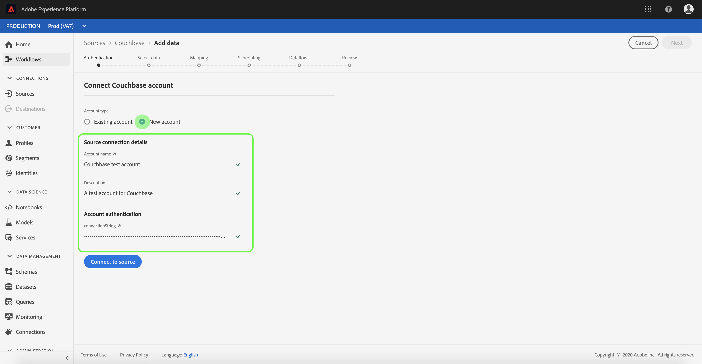

# 建立 [!DNL Couchbase] ui中的來源連線

>[!NOTE]
>
> 此 [!DNL Couchbase] 聯結器為測試版。 請參閱 [來源概觀](../../../../home.md#terms-and-conditions) 以取得使用Beta標籤聯結器的詳細資訊。

中的來源聯結器 [!DNL Adobe Experience Platform] 提供依排程擷取外部來源資料的功能。 本教學課程提供建立 [!DNL Couchbase] 來源聯結器使用 [!DNL Platform] 使用者介面。

## 快速入門

本教學課程需要您深入瞭解下列元件 [!DNL Platform]：

* [[!DNL Experience Data Model (XDM)] 系統](../../../../../xdm/home.md)：作為依據的標準化架構 [!DNL Experience Platform] 組織客戶體驗資料。
   * [結構描述組合基本概念](../../../../../xdm/schema/composition.md)：瞭解XDM結構描述的基本建置組塊，包括結構描述組合中的關鍵原則和最佳實務。
   * [結構描述編輯器教學課程](../../../../../xdm/tutorials/create-schema-ui.md)：瞭解如何使用結構描述編輯器UI建立自訂結構描述。
* [[!DNL Real-Time Customer Profile]](../../../../../profile/home.md)：根據來自多個來源的彙總資料，提供統一的即時消費者設定檔。

如果您已有有效的 [!DNL Couchbase] 連線時，您可以略過本檔案的其餘部分，並繼續進行上的教學課程 [設定資料流](../../dataflow/databases.md).

### 收集必要的認證

為了驗證您的 [!DNL Couchbase] 來源聯結器，您必須提供下列連線屬性的值：

| 認證 | 說明 |
| ---------- | ----------- |
| `connectionString` | 用來連線至您的電腦的連線字串 [!DNL Couchbase] 執行個體。 的連線字串模式 [!DNL Couchbase] 是 `Server={SERVER}; Port={PORT};AuthMech=1;CredString=[{\"user\": \"{USER}\", \"pass\":\"{PASS}\"}];`. 如需取得連線字串的詳細資訊，請參閱以下檔案： [[!DNL Couchbase] 連線](https://docs.Couchbase.com/c-sdk/2.10/client-settings.html#configuring-overview). |

## 連線您的 [!DNL Couchbase] 帳戶

收集完所需的認證後，您可以依照下列步驟連結 [!DNL Couchbase] 帳戶至 [!DNL Platform].

登入 [Adobe Experience Platform](https://platform.adobe.com) 然後選取 **[!UICONTROL 來源]** 以存取 **[!UICONTROL 來源]** 工作區。 此 **[!UICONTROL 目錄]** 畫面會顯示您可以用來建立帳戶的各種來源。

您可以從畫面左側的目錄中選取適當的類別。 或者，您也可以使用搜尋選項來尋找您要使用的特定來源。

在 **[!UICONTROL 資料庫]** 類別，選取 **[!UICONTROL Couchbase]**. 如果您是第一次使用此聯結器，請選取 **[!UICONTROL 設定]**. 否則，請選取 **[!UICONTROL 新增資料]** 以建立新的 [!DNL Couchbase] 聯結器。

此 **[!UICONTROL 連線到Couchbase]** 頁面便會顯示。 您可以在此頁面使用新的證明資料或現有的證明資料。

### 新帳戶

如果您使用新認證，請選取 **[!UICONTROL 新帳戶]**. 在出現的輸入表單上，提供名稱、選擇性說明，以及 [!DNL Couchbase] 認證。 完成後，選取 **[!UICONTROL 連線到來源]** 然後等待一段時間以建立新連線。

### 現有帳戶

若要連線現有帳戶，請選取 [!DNL Couchbase] 您要連線的帳戶，然後選取 **[!UICONTROL 下一個]** 前往右上角以繼續。

## 後續步驟

依照本教學課程，您已建立與的連線， [!DNL Couchbase] 帳戶。 您現在可以繼續下一節教學課程和 [設定資料流以將資料帶入 [!DNL Platform]](../../dataflow/databases.md).
