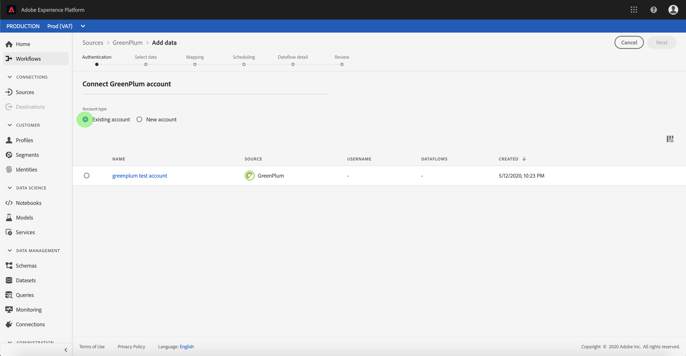

# 在UI中 [!DNL GreenPlum] 建立來源連接器

> [!NOTE]
> 連接 [!DNL GreenPlum] 器為測試版。 如需使用 [測試版標籤連接器的詳細資訊](../../../../home.md#terms-and-conditions) ，請參閱來源概觀。

Adobe Experience Platform中的來源連接器可讓您依計畫吸收外部來源的資料。 本教學課程提供使用使用者介 [!DNL GreenPlum] 面建立來源連接器 [!DNL Platform] 的步驟。

## 快速入門

本教學課程需要對Adobe Experience Platform的下列元件有正確的認識：

* [體驗資料模型(XDM)系統](../../../../../xdm/home.md): 組織客戶體驗資料 [!DNL Experience Platform] 的標準化架構。
   * [架構構成基礎](../../../../../xdm/schema/composition.md): 瞭解XDM架構的基本建置區塊，包括架構組合的主要原則和最佳實務。
   * [架構編輯器教程](../../../../../xdm/tutorials/create-schema-ui.md): 瞭解如何使用架構編輯器UI建立自訂架構。
* [即時客戶個人檔案](../../../../../profile/home.md): 根據來自多個來源的匯整資料，提供統一、即時的消費者個人檔案。

如果您已經有有效的 [!DNL GreenPlum] 連接，則可以跳過本文檔的其餘部分，並繼續有關配置資料 [流的教程](../../dataflow/databases.md)。

### 收集必要的認證

以下各節提供您必須知道的其他資訊，以便使用 [!DNL GreenPlum][!DNL Flow Service] API成功連線至。

| 憑證 | 說明 |
| ---------- | ----------- |
| `connectionString` | 用來連線至您例項的連線 [!DNL GreenPlum] 字串。 的連接字串模式 [!DNL GreenPlum] 是 `Server={SERVER};Port={PORT};Database={DATABASE};UID={USERNAME};PWD={PASSWORD}` |

有關快速入門的詳細資訊，請參 [閱此GreenPlum檔案](https://gpdb.docs.pivotal.io/580/security-guide/topics/Authenticate.html#topic_fzv_wb2_jr__config_ssl_client_conn)。

## 連線您的帳 [!DNL GreenPlum] 戶

收集完所需的認證後，您可依照下列步驟建立新帳戶以 [!DNL GreenPlum] 連接至 [!DNL Platform]。

登入 [Adobe Experience Platform](https://platform.adobe.com) ，然後從左側導覽列選取 **[!UICONTROL Sources]** ，以存取 ** Sources工作區。 「目 *[!UICONTROL 錄]* 」畫面會顯示多種來源，您可以為其建立傳入帳戶，而每個來源會顯示與其關聯的現有帳戶和資料集流量。

您可以從畫面左側的目錄中選取適當的類別。 或者，您也可以使用搜尋選項找到您要使用的特定來源。

在「數 *[!UICONTROL 據庫]* 」類別下，選擇「 **[!UICONTROL GreenPlum]** 」(綠 **李)，按一下+表徵圖(+)** ，建立新的 [!DNL GreenPlum] 連接器。

此時 *[!UICONTROL 將顯示「連接到GreenPlum]* 」頁。 在此頁上，您可以使用新認證或現有認證。

### 新帳戶

如果您使用新認證，請選擇「新 **[!UICONTROL 帳戶」]**。 在出現的輸入表單上，提供連線名稱、選用說明和您的認 [!DNL GreenPlum] 證。 完成後，選擇 **[!UICONTROL Connect]** ，然後為新帳戶建立留出一些時間。

### 現有帳戶

若要連線現有帳戶，請 [!DNL GreenPlum] 選取您要連線的帳戶，然後選取右上角的 **[!UICONTROL Next]** （下一步）以繼續。

## 後續步驟

遵循本教學課程，您已建立與帳戶的 [!DNL GreenPlum] 連線。 您現在可以繼續下一個教程，並 [配置資料流以將資料導入平台](../../dataflow/databases.md)。