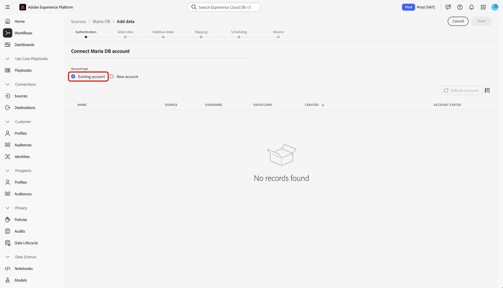

# 在UI中 [!DNL MariaDB] 建立來源連接器

>[!NOTE]
> 連接 [!DNL MariaDB] 器為測試版。 如需使用 [測試版標籤連接器的詳細資訊](../../../../home.md#terms-and-conditions) ，請參閱來源概觀。

Adobe Experience Platform中的來源連接器可讓您依計畫吸收外部來源的資料。 本教程提供使用用戶介面建立Maria DB源連接器 [!DNL Platform] 的步驟。

## 快速入門

本教學課程需要對Adobe Experience Platform的下列元件有正確的認識：

* [[!DNL Experience Data Model] (XDM)系統](../../../../../xdm/home.md):組織客戶體驗資料 [!DNL Experience Platform] 的標準化架構。
   * [架構構成基礎](../../../../../xdm/schema/composition.md):瞭解XDM架構的基本建置區塊，包括架構組合的主要原則和最佳實務。
   * [架構編輯器教程](../../../../../xdm/tutorials/create-schema-ui.md):瞭解如何使用架構編輯器UI建立自訂架構。
* [即時客戶個人檔案](../../../../../profile/home.md):根據來自多個來源的匯整資料，提供統一、即時的消費者個人檔案。

如果您已有連 [!DNL MariaDB] 接，則可以跳過本文檔的其餘部分，並繼續有關配置資料 [流的教程](../../dataflow/databases.md)。

### 收集必要的認證

若要存取您的帳 [!DNL MariaDB] 戶， [!DNL Platform]您必須提供下列值：

| 憑證 | 說明 |
| ---------- | ----------- |
| `connectionString` | 與您的MariaDB驗證相關聯的連接字串。 連接字串 [!DNL MariaDB] 模式是： `Server={HOST};Port={PORT};Database={DATABASE};UID={USERNAME};PWD={PASSWORD}`. |

如需快速入門的詳細資訊，請參閱本 [[!DNL MariaDB] 檔案](https://mariadb.com/kb/en/about-mariadb-connector-odbc/)。

## 連線您的帳 [!DNL Maria DB] 戶

收集完所需的認證後，您可依照下列步驟將帳戶連結 [!DNL Maria DB] 至 [!DNL Platform]。

登入 [Adobe Experience Platform](https://platform.adobe.com) ，然後從左側導覽列選取 **[!UICONTROL Sources]** ，以存取 **** Sources工作區。 「目 **[!UICONTROL 錄]** 」畫面會顯示多種來源，您可以用來建立帳戶。

在「數 **[!UICONTROL 據庫]** 」類別下，選 **[!UICONTROL 擇Maria DB]**。 如果這是您第一次使用此連接器，請選擇「配 **[!UICONTROL 置」]**。 否則，請選 **[!UICONTROL 擇「添加資料]** 」(Add data [!DNL Maria DB] )以建立新連接器。

此時 **[!UICONTROL 將顯示「連接到Maria DB]** 」頁。 在此頁上，您可以使用新認證或現有認證。

### 新帳戶

如果您使用新認證，請選擇「新 **[!UICONTROL 帳戶」]**。 在出現的輸入表單上，提供名稱、選用說明和您的認 [!DNL MariaDB] 證。 完成後，選擇 **[!UICONTROL Connect]** ，然後為建立新連接留出一些時間。

### 現有帳戶

若要連線現有帳戶，請選 [!DNL MariaDB] 取您要連線的帳戶，然後選取「下 **[!UICONTROL 一]** 步」繼續。

## 後續步驟

遵循本教學課程，您已建立與帳戶的 [!DNL MariaDB] 連線。 您現在可以繼續下一個教程，並 [配置資料流以將資料導入 [!DNL Platform]](../../dataflow/databases.md)。