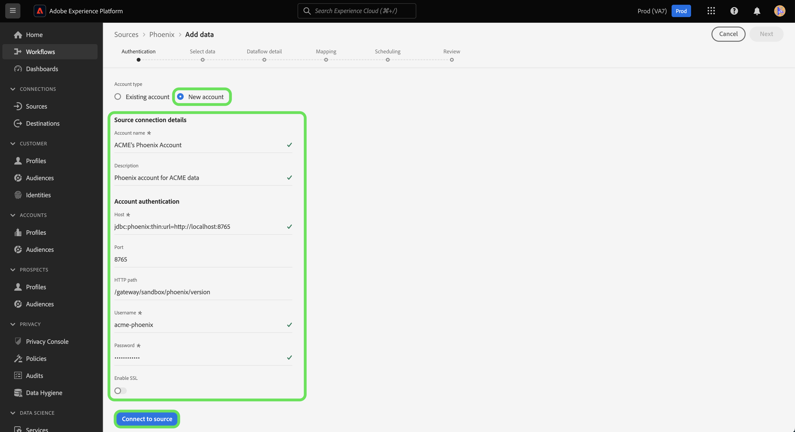

# 建立 [!DNL Phoenix] ui中的來源連線

>[!NOTE]
>
> 此 [!DNL Phoenix] 聯結器為測試版。 請參閱 [來源概觀](../../../../home.md#terms-and-conditions) 以取得使用Beta標籤聯結器的詳細資訊。

Adobe Experience Platform中的來源聯結器可讓您依排程擷取外部來源的資料。 本教學課程提供建立 [!DNL Phoenix] 來源聯結器使用 [!DNL Platform] 使用者介面。

## 快速入門

本教學課程需要您實際瞭解下列Adobe Experience Platform元件：

* [[!DNL Experience Data Model (XDM)] 系統](../../../../../xdm/home.md)：作為依據的標準化架構 [!DNL Experience Platform] 組織客戶體驗資料。
   * [結構描述組合基本概念](../../../../../xdm/schema/composition.md)：瞭解XDM結構描述的基本建置組塊，包括結構描述組合中的關鍵原則和最佳實務。
   * [結構描述編輯器教學課程](../../../../../xdm/tutorials/create-schema-ui.md)：瞭解如何使用結構描述編輯器UI建立自訂結構描述。
* [[!DNL Real-Time Customer Profile]](../../../../../profile/home.md)：根據來自多個來源的彙總資料，提供統一的即時消費者設定檔。

如果您已有有效的 [!DNL Phoenix] 連線時，您可以略過本檔案的其餘部分，並繼續進行上的教學課程 [設定資料流](../../dataflow/databases.md)

### 收集必要的認證

為了存取您的 [!DNL Phoenix] 帳戶於 [!DNL Platform]，您必須提供下列值：

| 認證 | 說明 |
| ---------- | ----------- |
| `host` | IP位址或主機名稱 [!DNL Phoenix] 伺服器。 |
| `port` | TCP連線埠， [!DNL Phoenix] 伺服器使用來監聽使用者端連線。 如果您連線至 [!DNL Azure HDInsights]，將連線埠指定為443。 |
| `httpPath` | 對應至的部份URL [!DNL Phoenix] 伺服器。 如果您使用，請指定/hbasephoenix0 [!DNL Azure HDInsights] 叢集。 |
| `username` | 您用來存取 [!DNL Phoenix] 伺服器。 |
| `password` | 與使用者對應的密碼。 |
| `enableSsl` | 指定是否使用SSL加密伺服器連線的切換按鈕。 |

如需入門的詳細資訊，請參閱 [此 [!DNL Phoenix] 檔案](https://python-phoenixdb.readthedocs.io/en/latest/api.html).

## 連線您的 [!DNL Phoenix] 帳戶

收集完所需的認證後，您可以依照下列步驟連結 [!DNL Phoenix] 要連線的帳戶 [!DNL Platform].

登入 [Adobe Experience Platform](https://platform.adobe.com) 然後選取 **[!UICONTROL 來源]** 以存取 **[!UICONTROL 來源]** 工作區。 此 **[!UICONTROL 目錄]** 畫面會顯示您可以用來建立帳戶的各種來源。

您可以從畫面左側的目錄中選取適當的類別。 或者，您也可以使用搜尋選項來尋找您要使用的特定來源。

在 **[!UICONTROL 資料庫]** 類別，選取 **[!UICONTROL Phoenix]**. 如果您是第一次使用此聯結器，請選取 **[!UICONTROL 設定]**. 否則，請選取 **[!UICONTROL 新增資料]** 以建立新的 [!DNL Phoenix] 帳戶。

此 **[!UICONTROL 連線至Phoenix]** 頁面便會顯示。 您可以在此頁面使用新的證明資料或現有的證明資料。

### 新帳戶

如果您使用新認證，請選取 **[!UICONTROL 新帳戶]**. 在出現的輸入表單上，提供名稱、選擇性說明，以及 [!DNL Phoenix] 認證。 完成後，選取 **[!UICONTROL Connect]** 然後等待一段時間以建立新連線。

### 現有帳戶

若要連線現有帳戶，請選取 [!DNL Phoenix] 您要連線的帳戶，然後選取 **[!UICONTROL 下一個]** 以繼續進行。

## 後續步驟

依照本教學課程，您已建立與的連線， [!DNL Phoenix] 帳戶。 您現在可以繼續下一節教學課程和 [設定資料流以將資料帶入 [!DNL Platform]](../../dataflow/databases.md).
