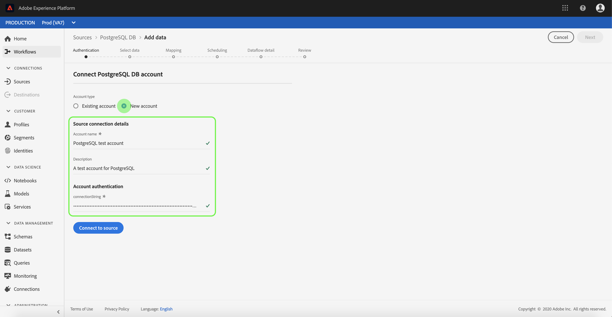
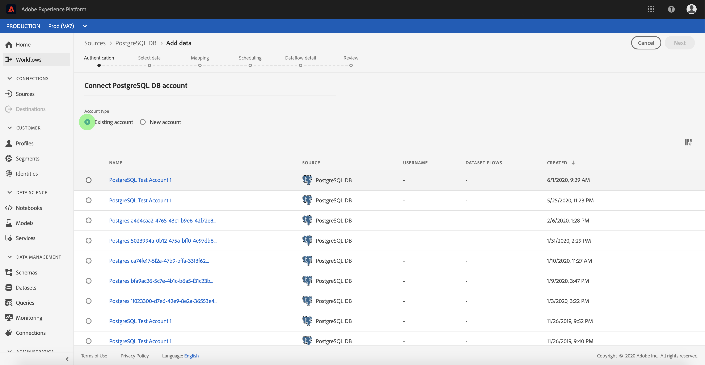

# 在UI中 [!DNL PostgreSQL] 建立來源連接器

>[!NOTE]
> 連接 [!DNL PostgreSQL] 器為測試版。 如需使用 [測試版標籤連接器的詳細資訊](../../../../home.md#terms-and-conditions) ，請參閱來源概觀。

Adobe Experience Platform中的來源連接器可讓您依計畫吸收外部來源的資料。 本教學課程提供使用使 [!DNL PostgreSQL] 用者介面來建立（以下稱為「PSQL」）來源連接器 [!DNL Platform] 的步驟。

## 快速入門

本教學課程需要對Adobe Experience Platform的下列元件有正確的認識：

* [體驗資料模型(XDM)系統](../../../../../xdm/home.md):組織客戶體驗資料 [!DNL Experience Platform] 的標準化架構。
   * [架構構成基礎](../../../../../xdm/schema/composition.md):瞭解XDM架構的基本建置區塊，包括架構組合的主要原則和最佳實務。
   * [架構編輯器教程](../../../../../xdm/tutorials/create-schema-ui.md):瞭解如何使用架構編輯器UI建立自訂架構。
* [即時客戶個人檔案](../../../../../profile/home.md):根據來自多個來源的匯整資料，提供統一、即時的消費者個人檔案。

如果您已經有PSQL基礎連接，則可以跳過本文檔的其餘部分，並繼續有關配置資料 [流的教程](../../dataflow/databases.md)。

### 收集必要的認證

要訪問PSQL帳戶， [!DNL Platform]必須提供以下值：

| 憑證 | 說明 |
| ---------- | ----------- |
| `connectionString` | 與PSQL帳戶關聯的連接字串。 PSQL連接字串模式是： `Server={SERVER};Database={DATABASE};Port={PORT};UID={USERNAME};Password={PASSWORD}`. |

有關快速入門的詳細資訊，請參閱此 [PSQL文檔](https://www.postgresql.org/docs/9.2/app-psql.html)。

## 連接您的PSQL帳戶

收集到所需的憑據後，您可以按照以下步驟建立新的入站基本連接，以將PSQL帳戶連結到 [!DNL Platform]。

登入 [Adobe Experience Platform](https://platform.adobe.com) ，然後從左側導覽列選取 **[!UICONTROL Sources]** ，以存取 ** Sources工作區。 「目 *[!UICONTROL 錄]* 」螢幕顯示各種源，您可以為其建立入站基本連接，而每個源顯示與其關聯的現有基本連接數。

在「數 *[!UICONTROL 據庫]* 」類別下，選擇 **[!UICONTROL PostgreSQL DB]** ，以在螢幕右側顯示資訊欄。 資訊列提供所選來源的簡短說明，以及與來源連線或檢視其檔案的選項。 要建立新的入站基本連接，請選擇「添 **[!UICONTROL 加資料」]**。

此時 *[!UICONTROL 將顯示「連接到PSQL]* 」頁。 在此頁上，您可以使用新認證或現有認證。

### 新帳戶

如果您使用新認證，請選擇「新 **[!UICONTROL 帳戶」]**。 在出現的輸入表單上，提供基本連線名稱、可選說明和您的PSQL認證。 完成後，選擇 **[!UICONTROL Connect]** ，然後為建立新的基本連接留出一些時間。

### 現有帳戶

要連接現有帳戶，請選擇要連接的PSQL帳戶，然後選擇「下 **[!UICONTROL 一步]** 」繼續。

## 後續步驟

在本教程中，您已建立了與PSQL帳戶的基本連接。 您現在可以繼續下一個教程，並 [配置資料流以將資料導入平台](../../dataflow/databases.md)。