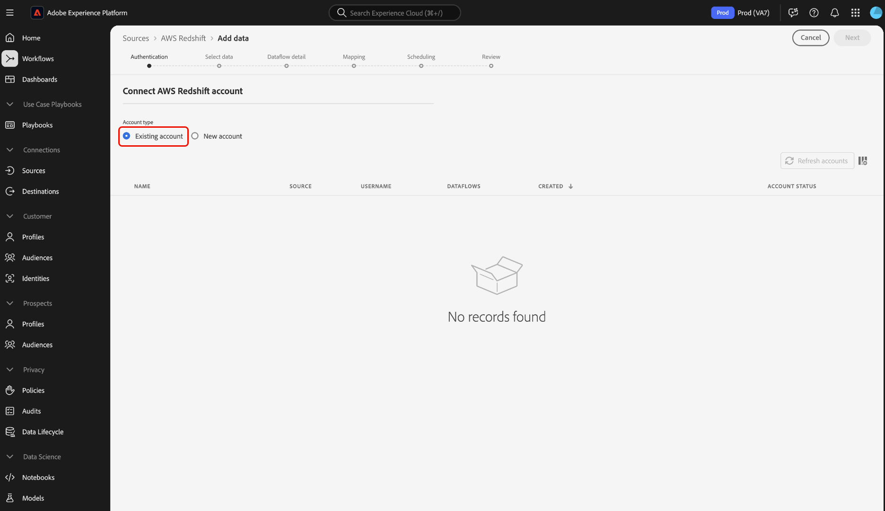

# 在UI中建立[!DNL Amazon Redshift]源連接

Adobe Experience Platform中的來源連接器可讓您依排程內嵌外部來源資料。 本教學課程提供使用[!DNL Platform]使用者介面建立[!DNL Amazon Redshift]（以下稱為「[!DNL Redshift]」）來源連接器的步驟。

## 快速入門

本教學課程需要妥善了解下列Adobe Experience Platform元件：

- [[!DNL Experience Data Model (XDM)] 系統](../../../../../xdm/home.md):組織客戶體驗資 [!DNL Experience Platform] 料的標準化架構。
   - [結構構成基本概念](../../../../../xdm/schema/composition.md):了解XDM結構描述的基本建置組塊，包括結構描述的主要原則和最佳實務。
   - [結構編輯器教學課程](../../../../../xdm/tutorials/create-schema-ui.md):了解如何使用結構編輯器UI建立自訂結構。
- [[!DNL Real-time Customer Profile]](../../../../../profile/home.md):根據來自多個來源的匯總資料，提供統一的即時消費者設定檔。

如果已經有有效的[!DNL Redshift]連接，則可以跳過本文檔的其餘部分，並繼續進行[配置資料流](../../dataflow/databases.md)的教程。

### 收集所需憑據

若要在[!DNL Platform]上存取您的[!DNL Redshift]帳戶，您必須提供下列值：

| **憑據** | **說明** |
| -------------- | --------------- |
| `server` | 與[!DNL Redshift]帳戶相關聯的伺服器。 |
| `username` | 與您的[!DNL Redshift]帳戶相關聯的使用者名稱。 |
| `password` | 與[!DNL Redshift]帳戶相關聯的密碼。 |
| `database` | 您正在訪問的[!DNL Redshift]資料庫。 |

有關入門的詳細資訊，請參閱[this [!DNL Redshift] document](https://docs.aws.amazon.com/redshift/latest/gsg/getting-started.html)。

## 連接您的[!DNL Redshift]帳戶

收集到所需憑據後，可以按照以下步驟將[!DNL Redshift]帳戶連結到[!DNL Platform]。

登入[Adobe Experience Platform](https://platform.adobe.com)，然後從左側導覽列選取&#x200B;**[!UICONTROL 來源]**&#x200B;以存取&#x200B;**[!UICONTROL 來源]**&#x200B;工作區。 **[!UICONTROL 目錄]**&#x200B;螢幕顯示了各種源，您可以用這些源建立帳戶。

您可以從畫面左側的目錄中選取適當的類別。 或者，您也可以使用搜尋選項找到您要使用的特定來源。

在&#x200B;**[!UICONTROL 資料庫]**&#x200B;類別下，選擇&#x200B;**[!UICONTROL Amazon Redshift]**。 如果這是您第一次使用此連接器，請選擇&#x200B;**[!UICONTROL 配置]**。 否則，選擇&#x200B;**[!UICONTROL 添加資料]**&#x200B;以建立新的[!DNL Redshift]連接器。

此時將顯示「**[!UICONTROL 連接到Amazon Redshift]**」頁。 在此頁面上，您可以使用新憑證或現有憑證。

### 新帳戶

如果您正在使用新憑據，請選擇&#x200B;**[!UICONTROL 新帳戶]**。 在顯示的輸入表單中，提供名稱、可選說明和您的[!DNL Redshift]憑證。 完成後，選擇&#x200B;**[!UICONTROL Connect]**，然後允許一些時間建立新連接。

### 現有帳戶

要連接現有帳戶，請選擇要連接的[!DNL Redshift]帳戶，然後選擇&#x200B;**[!UICONTROL Next]**&#x200B;以繼續。

## 後續步驟

依照本教學課程，您已建立與[!DNL Redshift]帳戶的連線。 您現在可以繼續下一個教程，並[配置資料流以將資料帶入 [!DNL Platform]](../../dataflow/databases.md)。
