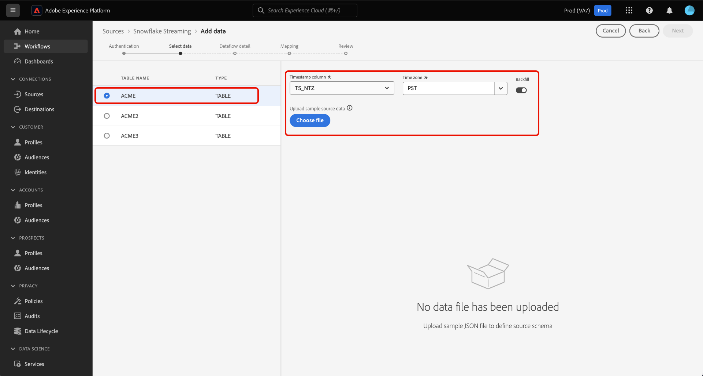
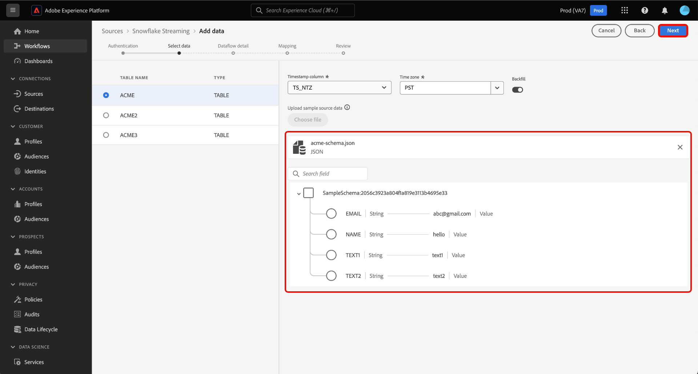
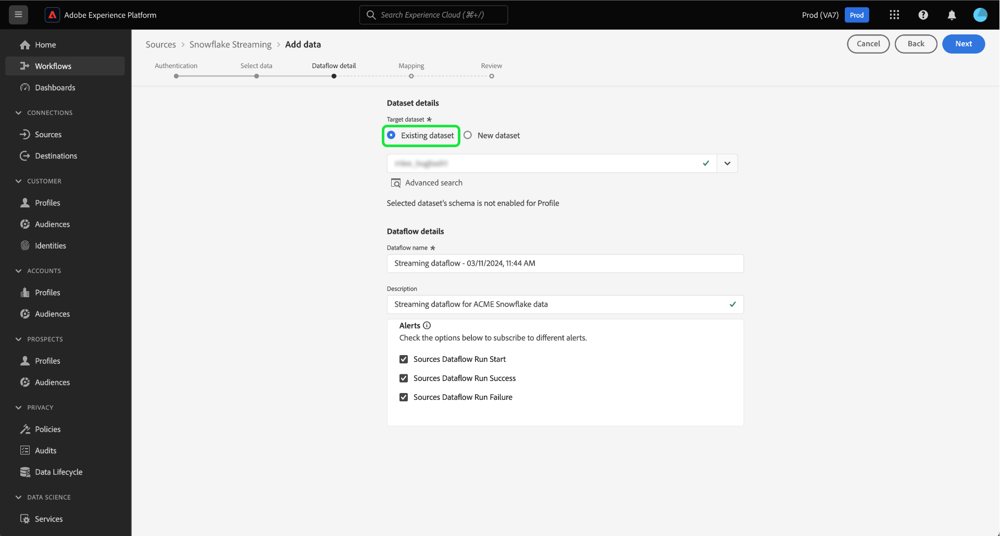

# 使用UI從您的[!DNL Snowflake]資料庫串流資料以Experience Platform

按照本指南瞭解如何使用使用者介面將資料從您的[!DNL Snowflake]資料庫串流到Adobe Experience Platform。

## 快速入門

本教學課程需要您實際瞭解下列Experience Platform元件：

* [[!DNL Experience Data Model (XDM)] 系統](../../../../../xdm/home.md)： [!DNL Experience Platform]用來組織客戶體驗資料的標準化架構。
   * [結構描述組合的基本概念](../../../../../xdm/schema/composition.md)：瞭解XDM結構描述的基本建置區塊，包括結構描述組合中的關鍵原則和最佳實務。
   * [結構描述編輯器教學課程](../../../../../xdm/tutorials/create-schema-ui.md)：瞭解如何使用結構描述編輯器使用者介面建立自訂結構描述。
* [[!DNL Real-Time Customer Profile]](../../../../../profile/home.md)：根據來自多個來源的彙總資料，提供統一的即時消費者設定檔。

### 驗證

閱讀 [!DNL Snowflake] 串流資料](../../../../connectors/databases/snowflake-streaming.md)的[必要條件設定指南，瞭解從[!DNL Snowflake]擷取串流資料至Experience Platform前，您需要完成的步驟。

## 使用[!DNL Snowflake Streaming]來源串流[!DNL Snowflake]資料以進行Experience Platform

在Platform UI中，從左側導覽選取&#x200B;**[!UICONTROL 來源]**&#x200B;以存取[!UICONTROL 來源]工作區。 您可以從熒幕左側的目錄中選取適當的類別。 或者，您可以使用搜尋選項來尋找您要使用的特定來源。

在&#x200B;*資料庫*&#x200B;類別下，選取&#x200B;**[!DNL Snowflake Streaming]**，然後選取&#x200B;**[!UICONTROL 新增資料]**。

>[!TIP]
>
>來源目錄中沒有已驗證帳戶的來源會顯示&#x200B;**[!UICONTROL 設定]**&#x200B;選項。 一旦驗證帳戶存在，此選項就會變更為&#x200B;**[!UICONTROL 新增資料]**。

**[!UICONTROL 連線Snowflake串流帳戶]**&#x200B;頁面隨即顯示。 您可以在此頁面使用新的或現有的證明資料。

>[!BEGINTABS]

>[!TAB 建立新帳戶]

若要建立新帳戶，請選取&#x200B;**[!UICONTROL 新帳戶]**，並提供名稱、選擇性說明和您的認證。

完成時，請選取&#x200B;**[!UICONTROL 連線到來源]**，然後等待一段時間以建立新連線。

| 認證 | 說明 |
| --- | --- |
| 帳戶 | 您的[!DNL Snowflake]帳戶名稱。 如需帳戶名稱的慣例，請閱讀[[!DNL Snowflake Streaming] 驗證指南](../../../../connectors/databases/snowflake-streaming.md#gather-required-credentials)。 |
| 倉儲 | [!DNL Snowflake]倉儲的名稱。 倉儲管理[!DNL Snowflake]中查詢的執行。 每個[!DNL Snowflake]倉儲彼此獨立，必須個別存取以便Experience Platform資料。 |
| 資料庫 | [!DNL Snowflake]資料庫的名稱。 資料庫包含您要帶入Experience Platform的資料。 |
| 綱要 | （選擇性）與您的[!DNL Snowflake]帳戶關聯的資料庫結構描述。 |
| 使用者名稱 | 您[!DNL Snowflake]帳戶的使用者名稱。 |
| 密碼 | 您的[!DNL Snowflake]帳戶密碼。 |
| 角色 | （選用）可以為使用者提供的自訂角色，用於特定連線。 如果未提供，此值會預設為`public`。 |

如需建立帳戶的詳細資訊，請參閱[!DNL Snowflake Streaming]概觀中[設定角色設定](../../../../connectors/databases/snowflake-streaming.md#configure-role-settings)一節。

>[!TAB 使用現有的帳戶]

若要使用現有帳戶，請選取&#x200B;**[!UICONTROL 現有帳戶]**，然後從現有帳戶目錄中選取所要的帳戶。

選取&#x200B;**[!UICONTROL 下一步]**&#x200B;以繼續。

>[!ENDTABS]

## 選取資料 {#select-data}

>[!IMPORTANT]
>
>* 時間戳記欄必須存在於您的來源表格中，才能建立串流資料流。 Experience Platform需有時間戳記，才能知道何時會擷取資料，以及何時會串流增量資料。 您可以回溯性地為現有連線新增時間戳記欄，並建立新的資料流。
>
>* 確保範例來源資料檔中的資料欄位大小寫符合[!DNL Snowflake]對於識別碼大小寫解決的指引。 如需詳細資訊，請閱讀識別碼大小寫](https://docs.snowflake.com/en/sql-reference/identifiers-syntax#label-identifier-casing)上的[[!DNL Snowflake] 檔案。

[!UICONTROL 選取資料]步驟隨即顯示。 在此步驟中，您必須選取要匯入至Experience Platform的資料、設定時間戳記和時區，並提供用於擷取原始資料的範例來源資料檔案。

使用畫面左側的資料庫目錄，並選取您要匯入以Experience Platform的表格。

接著，選取表格的時間戳記欄型別。 您可以在兩種時間戳記資料行型別之間選取： `TIMESTAMP_NTZ`或`TIMESTAMP_LTZ`。 如果您選取`TIMESTAMP_NTZ`的欄型別，則必須也提供時區。 您的欄應該有非null的限制。 如需詳細資訊，請閱讀有關[限制和常見問題集]的章節

您也可以在此步驟中設定回填設定。 回填會決定最初要擷取的資料。 如果已啟用回填，則會在第一次排程擷取期間擷取指定路徑中的所有目前檔案。 如果沒有，則只會擷取在第一次內嵌執行與開始時間之間載入的檔案。 將不會擷取在開始時間之前載入的檔案。

選取&#x200B;**[!UICONTROL 回填]**&#x200B;切換以啟用回填。

最後，選取&#x200B;**[!UICONTROL 選擇檔案]**&#x200B;以上傳範例來源資料以協助建立對應集，該對應集將在後續步驟中用於將原始資料對應至Experience Data Model (XDM)。

完成後，選取&#x200B;**[!UICONTROL 下一步]**&#x200B;以繼續。

## 提供資料集和資料流詳細資料 {#provide-dataset-and-dataflow-details}

接下來，您必須提供有關資料集和資料流的資訊。

### 資料集詳細資料 {#dataset-details}

資料集是資料集合的儲存和管理結構，通常是包含方案 (欄) 和欄位 (列) 的表格。 成功擷取至Experience Platform的資料會以資料集的形式保留在資料湖中。 在此步驟中，您可以建立新資料集或使用現有資料集。

>[!BEGINTABS]

>[!TAB 使用新的資料集]

若要使用新的資料集，請選取&#x200B;**[!UICONTROL 新資料集]**，然後為您的資料集提供名稱和選擇性描述。 您也必須選取您的資料集所要遵守的Experience Data Model (XDM)結構。

| 新資料集詳細資料 | 說明 |
| --- | --- |
| 輸出資料集名稱 | 新資料集的名稱。 |
| 說明 | （選用）新資料集的簡短總覽。 |
| 綱要 | 貴組織中現有的結構描述下拉式清單。 您也可以在來源設定程式之前建立自己的結構描述。 如需詳細資訊，請閱讀[在UI](../../../../../xdm/tutorials/create-schema-ui.md)中建立XDM結構描述的指南。 |

>[!TAB 使用現有的資料集]

如果您已有現有的資料集，請選取「**[!UICONTROL 現有的資料集]**」，然後使用「**[!UICONTROL 進階搜尋]**」選項來檢視貴組織中所有資料集的視窗，包括其個別詳細資訊，例如是否啟用這些資料集以擷取至Real-Time Customer Profile。

>[!ENDTABS]

+++選取步驟以啟用設定檔擷取、錯誤診斷及部分擷取。

如果您的資料集已啟用即時客戶個人檔案，那麼在此步驟中，您可以切換&#x200B;**[!UICONTROL 個人檔案資料集]**&#x200B;以啟用您的資料以進行個人檔案擷取。 您也可以使用此步驟來啟用&#x200B;**[!UICONTROL 錯誤診斷]**&#x200B;和&#x200B;**[!UICONTROL 部分擷取]**。

* **[!UICONTROL 錯誤診斷]**：選取&#x200B;**[!UICONTROL 錯誤診斷]**&#x200B;以指示來源產生錯誤診斷，以便您稍後在監視資料集活動和資料流狀態時參考。
* **[!UICONTROL 部分擷取]**：部分批次擷取可擷取含有錯誤的資料，最多可達到特定可設定的臨界值。 此功能可讓您將所有精確資料成功擷取到Experience Platform，同時所有不正確的資料會個別批次處理，並提供無效原因的資訊。

+++

### 資料流詳細資料 {#dataflow-details}

設定資料集後，您必須提供資料流的詳細資訊，包括名稱、選用的說明和警報設定。

| 資料流設定 | 說明 |
| --- | --- |
| 資料流名稱 | 資料流的名稱。  依預設，這將使用正在匯入的檔案名稱。 |
| 說明 | （選用）資料流的簡短說明。 |
| 警報 | Experience Platform可產生使用者可訂閱的事件型警報。 這些選項需要執行中的資料流才能觸發。 如需詳細資訊，請閱讀[警示概述](../../alerts.md) <ul><li>**來源資料流執行開始**：選取此警示以在您的資料流執行開始時收到通知。</li><li>**來源資料流執行成功**：選取此警示以在您的資料流結束且沒有任何錯誤時接收通知。</li><li>**來源資料流執行失敗**：選取此警示以在您的資料流執行結束時發生任何錯誤時接收通知。</li></ul> |

完成後，選取&#x200B;**[!UICONTROL 下一步]**&#x200B;以繼續。

## 將欄位對應至XDM結構描述 {#mapping}

[!UICONTROL 對應]步驟出現。 使用對應介面將您的來源資料對應到適當的結構描述欄位，然後再將該資料擷取到Experience Platform，然後選取&#x200B;**[!UICONTROL 下一步]**。 如需如何使用對應介面的詳細指南，請閱讀[資料準備UI指南](../../../../../data-prep/ui/mapping.md)以取得詳細資訊。

## 檢閱您的資料流 {#review}

資料流建立流程的最後一步是在執行資料流之前進行檢閱。 使用&#x200B;**[!UICONTROL 檢閱]**&#x200B;步驟，在執行新資料流之前先檢閱其詳細資料。 詳細資料會分組到以下類別中：

* **連線**：顯示來源型別、所選來源檔案的相關路徑，以及該來源檔案中的欄數。
* **指派資料集與對應欄位**：顯示要將來源資料擷取到哪個資料集，包括資料集所堅持的結構描述。

檢閱您的資料流後，請選取&#x200B;**[!UICONTROL 完成]**，並等待一些時間來建立資料流。

## 後續步驟

依照此教學課程，您已成功建立[!DNL Snowflake]資料的串流資料流。 如需其他資源，請閱讀以下檔案。

### 監視資料流

建立資料流後，您可以監視透過它擷取的資料，以檢視擷取率、成功和錯誤的資訊。 如需有關如何監視串流資料流的詳細資訊，請瀏覽有關[在UI中監視串流資料流的教學課程](../../monitor-streaming.md)。

### 更新您的資料流

若要更新資料流排程、對應和一般資訊的設定，請瀏覽有關[在UI中更新來源資料流的教學課程](../../update-dataflows.md)。

### 刪除您的資料流

您可以刪除不再需要的資料流，或使用&#x200B;**[!UICONTROL 資料流]**&#x200B;工作區中可用的&#x200B;**[!UICONTROL 刪除]**&#x200B;功能建立錯誤的資料流。 如需有關如何刪除資料流的詳細資訊，請瀏覽教學課程，瞭解如何在UI](../../delete.md)中刪除資料流[。
