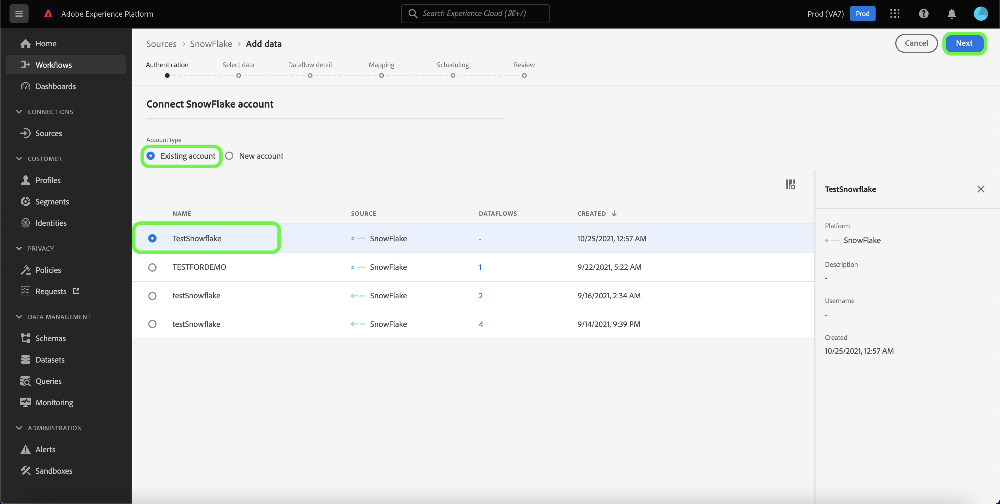

# 建立 [!DNL Snowflake] ui中的來源連線

>[!IMPORTANT]
>
>此 [!DNL Snowflake] 已購買Real-time Customer Data Platform Ultimate的使用者可在來源目錄中取得來源。

本教學課程提供建立 [!DNL Snowflake] 使用Adobe Experience Platform使用者介面的來源聯結器。

## 快速入門

本教學課程需要深入瞭解下列Platform元件：

* [來源](../../../../home.md)： [!DNL Experience Platform] 允許從各種來源擷取資料，同時讓您能夠使用來建構、加標籤和增強傳入資料 [!DNL Platform] 服務。
* [沙箱](../../../../../sandboxes/home.md)： [!DNL Experience Platform] 提供分割單一區域的虛擬沙箱 [!DNL Platform] 將執行個體整合至個別的虛擬環境中，以協助開發及改進數位體驗應用程式。

### 收集必要的認證

若要存取您的Snowflake帳戶，請於 [!DNL Platform]，您必須提供下列驗證值：

| 認證 | 說明 |
| ---------- | ----------- |
| 帳戶 | 與您的帳戶相關聯的完整帳戶名稱 [!DNL Snowflake] 帳戶。 完全合格 [!DNL Snowflake] 帳戶名稱包含您的帳戶名稱、地區和雲端平台。 例如 `cj12345.east-us-2.azure`。如需帳戶名稱的詳細資訊，請參閱此 [[!DNL Snowflake document on account identifiers]](https://docs.snowflake.com/en/user-guide/admin-account-identifier.html). |
| 倉儲 | 此 [!DNL Snowflake] warehouse會管理應用程式的查詢執行程式。 每個 [!DNL Snowflake] warehouse彼此獨立，將資料帶到Platform時必須個別存取。 |
| 資料庫 | 此 [!DNL Snowflake] 資料庫包含您要帶入Platform的資料。 |
| 使用者名稱 | 的使用者名稱 [!DNL Snowflake] 帳戶。 |
| 密碼 | 的密碼 [!DNL Snowflake] 使用者帳戶。 |
| 連線字串 | 用來連線至您的電腦的連線字串 [!DNL Snowflake] 執行個體。 的連線字串模式 [!DNL Snowflake] 是 `jdbc:snowflake://{ACCOUNT_NAME}.snowflakecomputing.com/?user={USERNAME}&password={PASSWORD}&db={DATABASE}&warehouse={WAREHOUSE}` |

如需這些值的詳細資訊，請參閱 [此Snowflake檔案](https://docs.snowflake.com/en/user-guide/key-pair-auth.html).

## 連線您的Snowflake帳戶

在Platform UI中選取 **[!UICONTROL 來源]** 從左側導覽存取 [!UICONTROL 來源] 工作區。 此 [!UICONTROL 目錄] 畫面會顯示您可以用來建立帳戶的各種來源。

您可以從畫面左側的目錄中選取適當的類別。 或者，您也可以使用搜尋列來尋找您要使用的特定來源。

在 [!UICONTROL 資料庫] 類別，選取 **[!UICONTROL Snowflake]** 然後選取 **[!UICONTROL 新增資料]**.

此 **[!UICONTROL 連線到Snowflake]** 頁面便會顯示。 您可以在此頁面使用新的證明資料或現有的證明資料。

### 現有帳戶

若要連線現有帳戶，請選取您要連線的Snowflake帳戶，然後選取 **[!UICONTROL 下一個]** 以繼續進行。

### 新帳戶

如果您使用新認證，請選取 **[!UICONTROL 新帳戶]**. 在出現的輸入表單上，提供名稱、選擇性說明和您的Snowflake認證。 完成後，選取 **[!UICONTROL Connect]** 然後等待一段時間以建立新連線。

## 後續步驟

依照本教學課程，您已建立與Snowflake帳戶的連線。 您現在可以繼續下一節教學課程和 [設定資料流以將資料帶入 [!DNL Platform]](../../dataflow/databases.md).
