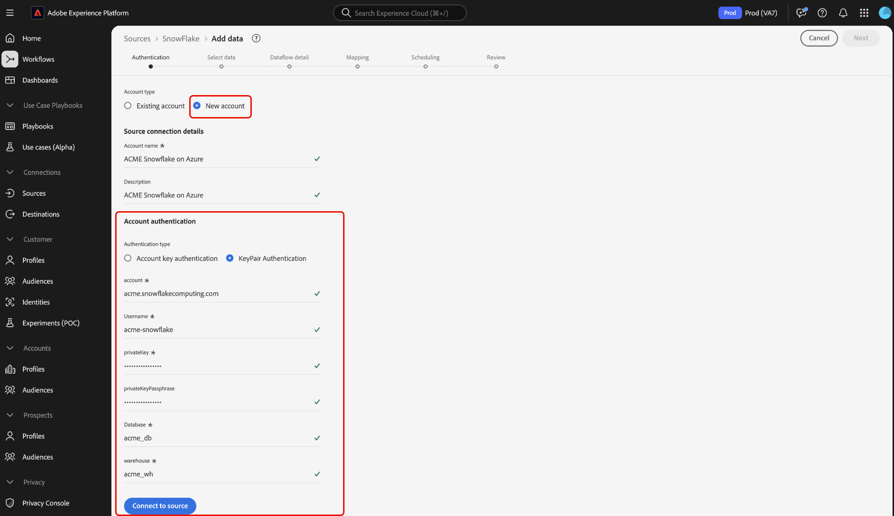

# 使用UI連線[!DNL Snowflake]至Experience Platform

>[!IMPORTANT]
>
>[!DNL Snowflake]來源可在來源目錄中提供給已購買Real-Time Customer Data Platform Ultimate的使用者。

閱讀本指南，瞭解如何使用使用者介面將您的[!DNL Snowflake]帳戶連結至Adobe Experience Platform。

## 快速入門

>[!WARNING]
>
>[!DNL Snowflake]來源的基本驗證（或帳戶金鑰驗證）將於2025年11月被取代。 您必須移至金鑰組型驗證，才能繼續使用該來源，並將資料庫中的資料擷取至Experience Platform。 如需有關棄用的詳細資訊，請閱讀[[!DNL Snowflake] 減少認證洩露風險的最佳實務指南](https://www.snowflake.com/en/resources/white-paper/best-practices-to-mitigate-the-risk-of-credential-compromise/)。

本教學課程需要您實際瞭解下列Experience Platform元件：

* [來源](../../../../home.md)： Experience Platform允許從各種來源擷取資料，同時讓您能夠使用[!DNL Experience Platform]服務來建構、加標籤以及增強傳入的資料。
* [沙箱](../../../../../sandboxes/home.md)： Experience Platform提供的虛擬沙箱可將單一Experience Platform執行個體分割成個別的虛擬環境，以利開發及改進數位體驗應用程式。

>[!NOTE]
>
>您必須將`PREVENT_UNLOAD_TO_INLINE_URL`標幟設定為`FALSE`，以允許從[!DNL Snowflake]資料庫將資料解除安裝至Experience Platform。

## 瀏覽來源目錄 {#navigate}

在Experience Platform UI中，從左側導覽選取&#x200B;**[!UICONTROL 來源]**&#x200B;以存取[!UICONTROL 來源]工作區。 您可以從熒幕左側的目錄中選取適當的類別。 或者，您可以使用搜尋選項來尋找您要使用的特定來源。

在&#x200B;*[!UICONTROL 資料庫]*&#x200B;類別下選取&#x200B;**[!DNL Snowflake]**，然後選取&#x200B;**[!UICONTROL 設定]**。

>[!TIP]
>
>當指定的來源尚未具有已驗證的帳戶時，來源目錄中的來源會顯示&#x200B;**[!UICONTROL 設定]**&#x200B;選項。 一旦驗證帳戶存在，此選項就會變更為&#x200B;**[!UICONTROL 新增資料]**。

## 使用現有帳戶 {#existing}

接下來，您將進入來源工作流程的驗證步驟。 在這裡，您可以使用現有帳戶或建立新帳戶。

若要使用現有的帳戶，請選取您要連線的[!DNL Snowflake]帳戶，然後選取[下一步]**[!UICONTROL 以繼續。]**

## 建立新帳戶 {#create}

如果您沒有現有的帳戶，則必須提供與您來源對應的必要驗證認證，以建立新的帳戶。

若要建立新帳戶，請選取&#x200B;**[!UICONTROL 新帳戶]**，然後提供名稱並選擇性地為您的帳戶新增說明。

### 在Azure上連線到Experience Platform {#azure}

您可以使用帳戶金鑰驗證或金鑰組驗證，將您的[!DNL Snowflake]帳戶連線至Azure上的Experience Platform。

>[!BEGINTABS]

>[!TAB 帳戶金鑰驗證]

若要使用帳戶金鑰驗證，請選取&#x200B;**[!UICONTROL 帳戶金鑰驗證]**，在輸入表單中提供您的連線字串，然後選取&#x200B;**[!UICONTROL 連線至來源]**。

| 認證 | 說明 |
| --- | --- |
| 帳戶 | 帳戶名稱可唯一識別組織內的帳戶。 在此情況下，您必須跨不同的[!DNL Snowflake]組織唯一識別帳戶。 若要這麼做，您必須在帳戶名稱前加上組織名稱。 例如： `orgname-account_name`。 閱讀[擷取 [!DNL Snowflake] 帳戶識別碼](../../../../connectors/databases/snowflake.md#retrieve-your-account-identifier)的指南，以取得其他指引。 如需詳細資訊，請參閱[[!DNL Snowflake] 文件](https://docs.snowflake.com/en/user-guide/admin-account-identifier#format-1-preferred-account-name-in-your-organization)，以瞭解詳情。 |
| 倉儲 | [!DNL Snowflake]倉儲管理應用程式的查詢執行程式。 每個[!DNL Snowflake]倉儲彼此獨立，在將資料帶到Experience Platform時必須個別存取。 |
| 資料庫 | [!DNL Snowflake]資料庫包含您要帶入Experience Platform的資料。 |
| 使用者名稱 | [!DNL Snowflake]帳戶的使用者名稱。 |
| 密碼 | [!DNL Snowflake]使用者帳戶的密碼。 |
| 角色 | 在[!DNL Snowflake]工作階段中使用的預設存取控制角色。 該角色應為已指派給指定使用者的現有角色。 預設角色為`PUBLIC`。 |
| 連接字串 | 用來連線至您[!DNL Snowflake]執行個體的連線字串。 [!DNL Snowflake]的連線字串模式為`jdbc:snowflake://{ACCOUNT_NAME}.snowflakecomputing.com/?user={USERNAME}&password={PASSWORD}&db={DATABASE}&warehouse={WAREHOUSE}` |

>[!TAB 金鑰組驗證]

若要使用金鑰組驗證，請選取&#x200B;**[!UICONTROL KeyPair驗證]**，為您的帳戶、使用者名稱、私密金鑰、私密金鑰密碼、資料庫和倉儲提供值，然後選取&#x200B;**[!UICONTROL 連線至來源]**。

使用金鑰組驗證，您必須產生2048位元RSA金鑰組，然後在為您的[!DNL Snowflake]來源建立帳戶時提供下列值。

| 認證 | 說明 |
| --- | --- |
| 帳戶 | 帳戶名稱可唯一識別組織內的帳戶。 在此情況下，您必須跨不同的[!DNL Snowflake]組織唯一識別帳戶。 若要這麼做，您必須在帳戶名稱前加上組織名稱。 例如： `orgname-account_name`。 閱讀[擷取 [!DNL Snowflake] 帳戶識別碼](../../../../connectors/databases/snowflake.md#retrieve-your-account-identifier)的指南，以取得其他指引。 如需詳細資訊，請參閱[[!DNL Snowflake] 文件](https://docs.snowflake.com/en/user-guide/admin-account-identifier#format-1-preferred-account-name-in-your-organization)，以瞭解詳情。 |
| 使用者名稱 | 您[!DNL Snowflake]帳戶的使用者名稱。 |
| 私密金鑰 | 您[!DNL Snowflake]帳戶的[!DNL Base64-]編碼私密金鑰。 您可以產生加密或未加密的私密金鑰。 如果您使用加密的私密金鑰，則在對Experience Platform進行驗證時，也必須提供私密金鑰複雜密碼。 如需詳細資訊，請參閱[擷取 [!DNL Snowflake] 私密金鑰](../../../../connectors/databases/snowflake.md)的指南。 |
| 私密金鑰複雜密碼 | 私密金鑰複雜密碼是附加的安全性層級，在使用加密的私密金鑰進行驗證時必須使用此層級。 如果您使用未加密的私密金鑰，則不需要提供複雜密碼。 |
| 資料庫 | 包含您要擷取至Experience Platform之資料的[!DNL Snowflake]資料庫。 |
| 倉儲 | [!DNL Snowflake]倉儲管理應用程式的查詢執行程式。 每個[!DNL Snowflake]倉儲彼此獨立，在將資料帶到Experience Platform時必須個別存取。 |

如需這些值的詳細資訊，請參閱[此Snowflake檔案](https://docs.snowflake.com/en/user-guide/key-pair-auth.html)。

>[!ENDTABS]

### 在AWS上連線至Experience Platform {#aws}

>[!AVAILABILITY]
>
>本節適用於在Amazon Web Services (AWS)上執行的Experience Platform實作。 目前有限數量的客戶可使用在AWS上執行的Experience Platform 。 若要進一步瞭解支援的Experience Platform基礎結構，請參閱[Experience Platform多雲端總覽](../../../../../landing/multi-cloud.md)。

若要建立新[!DNL Snowflake]帳戶並連線至AWS上的Experience Platform，請確定您位於VA6沙箱，然後提供驗證所需的認證。

| 認證 | 說明 |
| --- | --- |
| Host | 您的[!DNL Snowflake]帳戶連線到的主機URL。 |
| 連接埠 | [!DNL Snowflake]透過網際網路連線到伺服器時使用的連線埠號碼。 |
| 使用者名稱 | 與您的[!DNL Snowflake]帳戶相關聯的使用者名稱。 |
| 密碼 | 與您的[!DNL Snowflake]帳戶關聯的密碼。 |
| 資料庫 | 將從其中提取資料的[!DNL Snowflake]資料庫。 |
| 結構描述 | 與您的[!DNL Snowflake]資料庫關聯的結構描述名稱。 您必須確保您要授與資料庫存取權的使用者也擁有此綱要的存取權。 |
| 倉儲 | 您正在使用的[!DNL Snowflake]倉儲。 |

### 略過範例資料預覽 {#skip-preview-of-sample-data}

在資料選擇步驟中，您可能會在擷取大型資料表或資料檔案時遭遇逾時。 您可以略過資料預覽以避開逾時，並且仍可檢視您的結構描述，不過沒有範例資料。 若要略過資料預覽，請啟用&#x200B;**[!UICONTROL 略過預覽範例資料]**&#x200B;切換按鈕。

工作流程的其餘部分將維持不變。 唯一的警告是，略過資料預覽可能會阻止在對應步驟期間自動驗證計算和必填欄位，然後您就必須在對應期間手動驗證這些欄位。

## 後續步驟

依照本教學課程中的指示，您已建立與Snowflake帳戶的連線。 您現在可以繼續進行下一個教學課程，並[設定資料流以將資料帶入 [!DNL Experience Platform]](../../dataflow/databases.md)。
