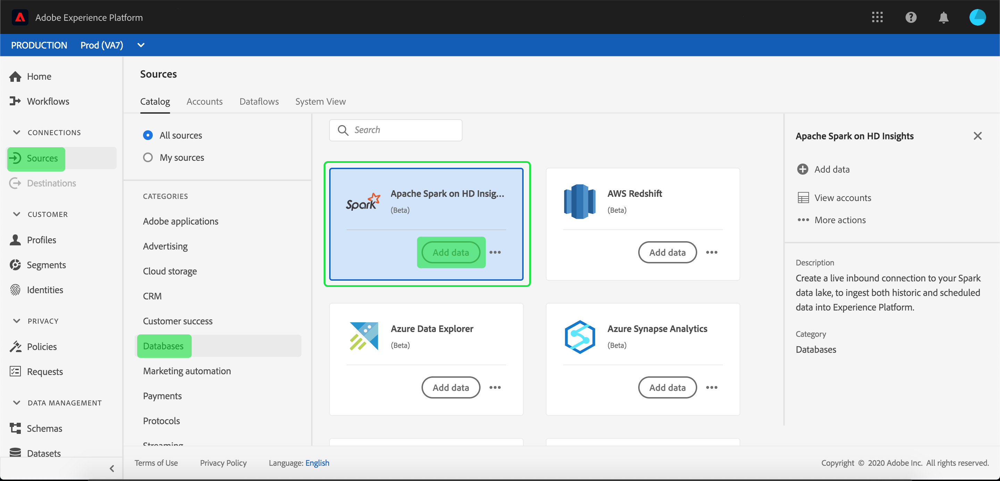

# 在UI的[!DNL Azure HDInsights]源連接上建立[!DNL Apache Spark]

>[!NOTE]
>
> [!DNL Azure HDInsights]連接器上的[!DNL Apache Spark]為beta。 有關使用beta標籤連接器的詳細資訊，請參閱[ Sources綜覽](../../../../home.md#terms-and-conditions)。

Adobe Experience Platform的來源連接器提供按計畫接收外部來源資料的能力。 本教程提供使用[!DNL Platform]用戶介面在[!DNL Azure HDInsights]源連接器上建立[!DNL Apache Spark]的步驟。

## 快速入門

本教學課程需要對Adobe Experience Platform的下列部分有正確的理解：

* [體驗資料模型(XDM)系統](../../../../../xdm/home.md):Experience Platform組織客戶體驗資料的標準化架構。
   * [架構構成基礎](../../../../../xdm/schema/composition.md):瞭解XDM架構的基本建置區塊，包括架構組合的主要原則和最佳實務。
   * [架構編輯器教程](../../../../../xdm/tutorials/create-schema-ui.md):瞭解如何使用架構編輯器UI建立自訂架構。
* [即時客戶個人檔案](../../../../../profile/home.md):根據來自多個來源的匯整資料，提供統一、即時的消費者個人檔案。

如果您已經有有效的[!DNL Spark]連接，則可跳過本文檔的其餘部分，繼續[配置資料流](../../dataflow/databases.md)的教程

### 收集必要的認證

若要存取[!DNL Platform]上的[!DNL Spark]帳戶，您必須提供下列值：

| 憑證 | 說明 |
| ---------- | ----------- |
| `host` | [!DNL Spark]伺服器的IP地址或主機名。 |
| `username` | 用於訪問[!DNL Spark]伺服器的用戶名。 |
| `password` | 與用戶對應的口令。 |

有關入門的詳細資訊，請參閱[此Spark檔案](https://docs.microsoft.com/en-us/azure/hdinsight/spark/apache-spark-overview)。

## 連接您的[!DNL Spark]帳戶

收集完所需憑證後，您可以按照以下步驟將[!DNL Spark]帳戶連結到[!DNL Platform]。

登入[Adobe Experience Platform](https://platform.adobe.com)，然後從左側導覽列選擇&#x200B;**[!UICONTROL Sources]**&#x200B;以存取&#x200B;**[!UICONTROL Sources]**&#x200B;工作區。 **[!UICONTROL Catalog]**&#x200B;畫面會顯示各種來源，您可以用來建立帳戶。

您可以從畫面左側的目錄中選取適當的類別。 或者，您也可以使用搜尋選項找到您要使用的特定來源。

在&#x200B;**[!UICONTROL Databases]**&#x200B;類別下，選擇&#x200B;**[!UICONTROL Spark]**。 如果這是您第一次使用此連接器，請選擇&#x200B;**[!UICONTROL Configure]**。 否則，請選擇&#x200B;**[!UICONTROL Add data]**&#x200B;以建立新的[!DNL Spark]連接器。

此時將顯示&#x200B;**[!UICONTROL Connect to Spark]**&#x200B;頁。 在此頁上，您可以使用新認證或現有認證。

### 新帳戶

如果使用新憑據，請選擇&#x200B;**[!UICONTROL New account]**。 在顯示的輸入表單上，提供名稱、可選說明和您的[!DNL Spark]憑證。 完成後，選擇&#x200B;**[!UICONTROL Connect]** ，然後允許一些時間建立新連接。

### 現有帳戶

要連接現有帳戶，請選擇要連接的[!DNL Spark]帳戶，然後選擇&#x200B;**[!UICONTROL Next]**&#x200B;繼續。

## 後續步驟

在本教學課程之後，您已建立與[!DNL Spark]帳戶的連線。 現在，您可以繼續下一個教程，並[配置資料流以將資料導入 [!DNL Platform]](../../dataflow/databases.md)。
