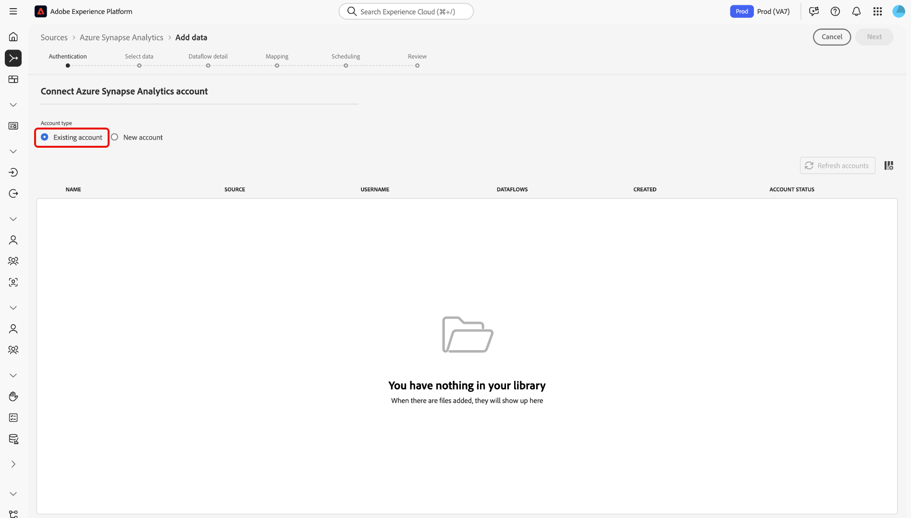

# 在使用者介面中建立[!DNL Azure Synapse Analytics]來源連線

>[!IMPORTANT]
>
>[!DNL Azure Synapse Analytics]來源可在來源目錄中提供給已購買Real-time Customer Data Platform Ultimate的使用者。

本教學課程提供使用[!DNL Platform]使用者介面建立[!DNL Azure Synapse Analytics] （以下稱為「[!DNL Synapse]」）來源聯結器的步驟。

## 快速入門

本教學課程需要您實際瞭解下列Adobe Experience Platform元件：

* [[!DNL Experience Data Model (XDM)] 系統](../../../../../xdm/home.md)： [!DNL Experience Platform]用來組織客戶體驗資料的標準化架構。
   * [結構描述組合的基本概念](../../../../../xdm/schema/composition.md)：瞭解XDM結構描述的基本建置區塊，包括結構描述組合中的關鍵原則和最佳實務。
   * [結構描述編輯器教學課程](../../../../../xdm/tutorials/create-schema-ui.md)：瞭解如何使用結構描述編輯器使用者介面建立自訂結構描述。
* [[!DNL Real-Time Customer Profile]](../../../../../profile/home.md)：根據來自多個來源的彙總資料，提供統一的即時消費者設定檔。

如果您已經有有效的[!DNL Synapse]連線，您可以略過本檔案的其餘部分，並繼續進行有關[設定資料流](../../dataflow/databases.md)的教學課程。

### 收集必要的認證

若要在[!DNL Platform]上存取您的[!DNL Synapse]帳戶，您必須提供下列值：

| 認證 | 說明 |
| ---------- | ----------- |
| `connectionString` | 與您的[!DNL Synapse]驗證關聯的連線字串。 [!DNL Synapse]連線字串模式為`Server=tcp:{SERVER_NAME}.database.windows.net,1433;Database={DATABASE};User ID={USERNAME}@{SERVER_NAME};Password={PASSWORD};Trusted_Connection=False;Encrypt=True;Connection Timeout=30`。 |

如需此值的詳細資訊，請參閱[此 [!DNL Synapse] 檔案](https://docs.microsoft.com/en-us/azure/data-factory/connector-azure-sql-data-warehouse)。

## 連線您的[!DNL Synapse]帳戶

收集必要的認證後，您可以依照下列步驟將[!DNL Synapse]帳戶連結至[!DNL Platform]。

登入[Adobe Experience Platform](https://platform.adobe.com)，然後從左側導覽列中選取&#x200B;**[!UICONTROL 來源]**&#x200B;以存取&#x200B;**[!UICONTROL 來源]**&#x200B;工作區。 **[!UICONTROL 目錄]**&#x200B;畫面會顯示您可以建立帳戶的各種來源。

您可以從熒幕左側的目錄中選取適當的類別。 或者，您可以使用搜尋選項來尋找您要使用的特定來源。

在&#x200B;**[!UICONTROL 資料庫]**&#x200B;類別下，選取&#x200B;**[!UICONTROL Azure synapse分析]**。 如果這是您第一次使用此聯結器，請選取&#x200B;**[!UICONTROL 設定]**。 否則，請選取&#x200B;**[!UICONTROL 新增資料]**&#x200B;以建立新的[!DNL Synapse]聯結器。

**[!UICONTROL 連線至Azure synapse Analytics]**&#x200B;頁面隨即顯示。 您可以在此頁面使用新的證明資料或現有的證明資料。

### 新帳戶

如果您正在使用新認證，請選取&#x200B;**[!UICONTROL 新帳戶]**。 在出現的輸入表單上，提供名稱、選擇性說明和您的[!DNL Synapse]認證。 完成時，請選取&#x200B;**[!UICONTROL 連線]**，然後等待一段時間以建立新連線。

### 現有帳戶

若要連線現有帳戶，請選取您要連線的[!DNL Synapse]帳戶，然後選取[下一步]**[!UICONTROL 以繼續。]**

## 後續步驟

依照本教學課程中的指示，您已建立與[!DNL Synapse]帳戶的連線。 您現在可以繼續進行下一個教學課程，並[設定資料流以將資料帶入 [!DNL Platform]](../../dataflow/databases.md)。
