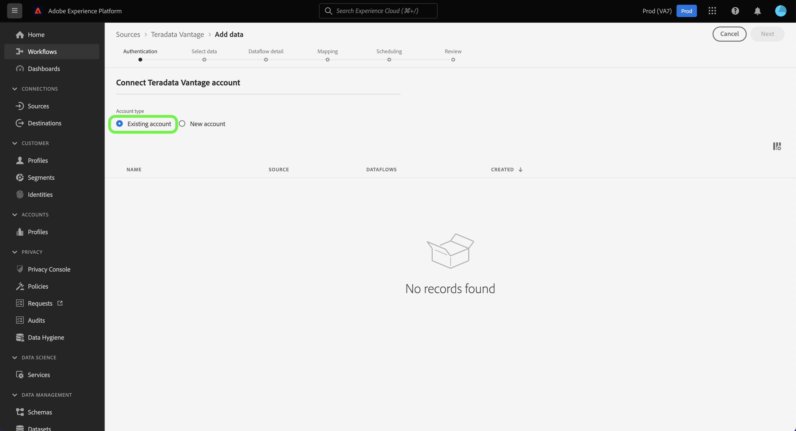

# (Beta)建立 [!DNL Teradata Vantage] ui中的來源連線

>[!NOTE]
>
> 此 [!DNL Teradata Vantage] 來源為測試版。 請參閱 [來源概觀](../../../../home.md#terms-and-conditions) 以取得有關使用測試版標籤來源的詳細資訊。

本教學課程提供建立 [!DNL Teradata Vantage] 來源聯結器，使用Adobe Experience Platform使用者介面。

## 快速入門

本教學課程需要您實際瞭解下列Platform元件：

* [來源](../../../../home.md)：Experience Platform可讓您從各種來源擷取資料，同時使用Experience Platform服務來建構、加標籤及增強傳入資料。
* [沙箱](../../../../../sandboxes/home.md)：Experience Platform提供的虛擬沙箱可將單一Platform執行個體分割成個別的虛擬環境，以利開發及改進數位體驗應用程式。

### 收集必要的認證

為了存取您的 [!DNL Teradata Vantage] Platform上的帳戶，您必須提供下列驗證值：

| 認證 | 說明 |
| ---------- | ----------- |
| 連線字串 | 連線字串是提供有關資料來源以及如何與其連線的資訊的字串。 的連線字串模式 [!DNL Teradata Vantage] 是 `DBCName={SERVER};Uid={USERNAME};Pwd={PASSWORD}`. |

如需入門的詳細資訊，請參閱此 [[!DNL Teradata Vantage] 檔案](https://docs.teradata.com/r/Teradata-VantageTM-Advanced-SQL-Engine-Security-Administration/July-2021/Setting-Up-the-Administrative-Infrastructure/Controlling-Access-to-the-Operating-System/Working-with-OS-Level-Security-Options).

## 連線您的 [!DNL Teradata Vantage] 帳戶

在Platform UI中選取 **[!UICONTROL 來源]** 從左側導覽存取 [!UICONTROL 來源] 工作區。 此 [!UICONTROL 目錄] 畫面會顯示各種來源，供您建立帳戶。

您可以從熒幕左側的目錄中選取適當的類別。 或者，您可以使用搜尋列來尋找您要使用的特定來源。

在 [!UICONTROL 資料庫] 類別，選取 **[!UICONTROL teradata Vantage]** 然後選取 **[!UICONTROL 新增資料]**.

此 **[!UICONTROL 連線到Teradata Vantage]** 頁面便會顯示。 您可以在此頁面使用新的證明資料或現有的證明資料。

### 現有帳戶

若要連線現有帳戶，請選取 [!DNL Teradata Vantage] 您要連線的帳戶，然後選取 **[!UICONTROL 下一個]** 以繼續進行。

### 新帳戶

如果您正在使用新認證，請選取 **[!UICONTROL 新帳戶]**. 在出現的輸入表單上，提供名稱、選擇性說明，以及 [!DNL Teradata Vantage] 認證。 完成後，選取 **[!UICONTROL 連線]** 然後等待一段時間以建立新連線。

## 後續步驟

依照本教學課程中的指示，您已建立與TeradataVantage帳戶的連線。 您現在可以繼續進行下一個教學課程及 [設定資料流以將資料匯入Platform](../../dataflow/databases.md).
