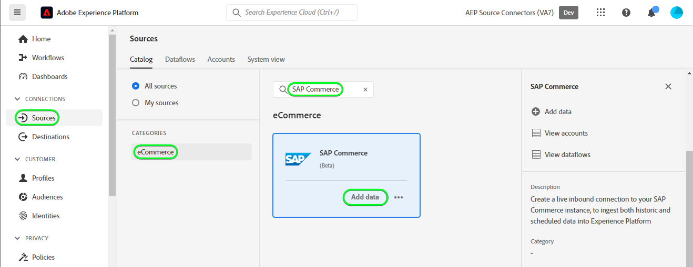

# 在使用者介面中建立[!DNL SAP Commerce]來源連線

>[!NOTE]
>
>[!DNL SAP Commerce]來源是測試版。 如需使用Beta版標示來源的相關資訊，請參閱[來源概觀](../../../../home.md#terms-and-conditions)。

下列教學課程會逐步引導您完成建立[!DNL SAP Commerce]來源連線的步驟，以使用Adobe Experience Platform使用者介面匯入[[!DNL SAP] 訂閱帳單](https://www.sap.com/products/financial-management/subscription-billing.html)聯絡人和客戶資料。

## 快速入門 {#getting-started}

本教學課程需要您實際瞭解下列Experience Platform元件：

* [[!DNL Experience Data Model (XDM)] 系統](../../../../../xdm/home.md)： [!DNL Experience Platform]用來組織客戶體驗資料的標準化架構。
   * [結構描述組合的基本概念](../../../../../xdm/schema/composition.md)：瞭解XDM結構描述的基本建置區塊，包括結構描述組合中的關鍵原則和最佳實務。
   * [結構描述編輯器教學課程](../../../../../xdm/tutorials/create-schema-ui.md)：瞭解如何使用結構描述編輯器使用者介面建立自訂結構描述。
* [[!DNL Real-Time Customer Profile]](../../../../../profile/home.md)：根據來自多個來源的彙總資料，提供統一的即時消費者設定檔。

如果您已經有有效的[!DNL SAP Commerce]帳戶，您可以略過本檔案的其餘部分，並繼續進行有關[設定資料流](../../dataflow/ecommerce.md)的教學課程。

### 收集必要的認證 {#gather-credentials}

為了將[!DNL SAP Commerce]連線到Experience Platform，您必須提供下列連線屬性的值：

| 認證 | 說明 |
| --- | --- |
| 用戶端 ID | 服務金鑰中的`clientId`值。 |
| 用戶端密碼 | 服務金鑰中的`clientSecret`值。 |
| 權杖端點 | 服務機碼中的`url`值，會類似`https://subscriptionbilling.authentication.eu10.hana.ondemand.com`。 |
| 區域 | 您的資料中心位置。 區域出現在`url`中，其值類似於`eu10`或`us10`。 例如，如果`url`是`https://eu10.revenue.cloud.sap/api`，您需要`eu10`。 |

如需詳細資訊，請參閱[[!DNL SAP Commerce] 檔案](https://help.sap.com/docs/CLOUD_TO_CASH_OD/987aec876092428f88162e438acf80d6/c5fcaf96daff4c7a8520188e4d8a1843.html)。

### 建立Platform結構描述 {#create-platform-schema}

在建立[!DNL SAP Commerce]來源連線之前，您也必須先建立Experience Platform結構描述以用於您的來源。 請參閱有關[建立Platform結構描述](../../../../../xdm/schema/composition.md)的教學課程，以瞭解如何建立結構描述的完整步驟。

展開下列區段以檢視結構描述範例。

+++ 檢視結構描述範例

```
{
  "_extconndev": {
    "addresses": [
      {
        "addressUUID": "{ADDRESS_UUID}",
        "city": "Burnaby",
        "country": "Canada",
        "email": "chandni@acme.com",
        "houseNumber": "27",
        "isDefault": false,
        "phone": "123-456-7890",
        "postalCode": "V3J 1X9",
        "state": "British Columbia",
        "street": "Beresford"
      }
    ],
    "changedAt": "1687204041",
    "changedBy": "vero@acme.com",
    "contactNumber": "123-456-7980",
    "corporateInfo": {
      "company": "acme"
    },
    "createAt": "1687204041",
    "createdBy": "vero@acme.com",
    "customReferences": [
      {
        "id": "Sample value",
        "typeCode": "Sample value"
      }
    ],
    "customerNumber": "Sample value",
    "customerType": "Sample value",
    "defaultAddress": {
      "addressUUID": "Sample value",
      "city": "North Vancouver",
      "country": "Canada",
      "email": "chandni@acme.come",
      "houseNumber": "34",
      "isDefault": false,
      "phone": "123-456-7890",
      "postalCode": "V7H 2P1",
      "state": "British Columbia",
      "street": "Maple"
    },
    "externalObjectReferences": [
      {
        "externalId": "{EXTERNAL_ID}",
        "externalIdTypeCode": "{EXTERNAL_ID_TYPE_CODE}",
        "externalSystemId": "{EXTERNAL_SYSTEM_ID}"
      }
    ],
    "markets": [
      {
        "active": false,
        "country": "USA",
        "currency": "USD",
        "marketId": "Sample value",
        "priceinfo": {
          "incoterms": "{INCO_TERMS}",
          "incotermsLocation": "{INCO_TERMS_LOCATION}",
          "priceGroup": "{PRICE_GROUP}",
          "priceListType": "{PRICE_LIST_TYPE}"
        },
        "salesArea": {
          "distributionChannel": "{DISTRIBUTION_CHANNEL}",
          "division": "{DIVISION}",
          "salesOrganization": "{SALES_ORGANIZATION}"
        }
      }
    ],
    "personalInfo": {
      "firstName": "Chandni",
      "lastName": "Kaur"
    }
  },
  "_id": "/uri-reference",
  "_repo": {
    "createDate": "2004-10-23T12:00:00-06:00",
    "modifyDate": "2004-10-23T12:00:00-06:00"
  },
  "createdByBatchID": "/uri-reference",
  "modifiedByBatchID": "/uri-reference",
  "personID": "{PERSON_ID}",
  "repositoryCreatedBy": "kevin@acme.com",
  "repositoryLastModifiedBy": "kevin@acme.com"
}
```

+++

## 連線您的[!DNL SAP Commerce]帳戶 {#connect-account}

在Platform UI中，從左側導覽列選取&#x200B;**[!UICONTROL 來源]**&#x200B;以存取[!UICONTROL 來源]工作區。 [!UICONTROL 目錄]畫面會顯示您可以建立帳戶的各種來源。

您可以從熒幕左側的目錄中選取適當的類別。 或者，您可以使用搜尋選項來尋找您要使用的特定來源。

在&#x200B;*電子商務*&#x200B;類別下，選取&#x200B;**[!UICONTROL SAP Commerce]**，然後選取&#x200B;**[!UICONTROL 新增資料]**。



**[!UICONTROL Connect SAP Commerce帳戶]**&#x200B;頁面隨即顯示。 您可以在此頁面使用新的證明資料或現有的證明資料。

### 現有帳戶 {#existing-account}

若要使用現有帳戶，請選取您要用來建立新資料流的[!DNL SAP Commerce]帳戶，然後選取[下一步] ]**以繼續。**[!UICONTROL 


### 新帳戶 {#new-account}

如果您正在建立新帳戶，請選取&#x200B;**[!UICONTROL 新帳戶]**，然後提供名稱、選擇性說明和您的認證。 完成時，請選取&#x200B;**[!UICONTROL 連線到來源]**，然後等待一段時間以建立新連線。


### 選取資料 {#select-data}

最後，您必須選取要擷取至Platform的物件型別。

| 物件類型 | 說明 |
| --- | --- |
| `Customers` | 擁有訂閱的實體。 |
| `Contacts` | 客戶的聯絡詳細資訊。 |

>[!BEGINTABS]

>[!TAB 客戶]

若要內嵌客戶資料，請選取&#x200B;**[!UICONTROL 客戶]**&#x200B;作為您的物件型別，然後選取&#x200B;**[!UICONTROL 下一步]**。


>[!TAB 連絡人]

若要內嵌連絡人資料，請選取&#x200B;**[!UICONTROL 連絡人]**&#x200B;作為物件型別，然後選取&#x200B;**[!UICONTROL 下一步]**。

![顯示已選取[連絡人]選項之組態的SAP Commerce平台UI熒幕擷取畫面](../../../../images/tutorials/create/ecommerce/sap-commerce/configuration-contacts.png)

>[!ENDTABS]

## 後續步驟 {#next-steps}

依照本教學課程中的指示，您已建立與[!DNL SAP Commerce]帳戶的連線。 您現在可以繼續進行下一個教學課程，並[設定資料流以將資料帶入Platform](../../dataflow/ecommerce.md)。

## 其他資源 {#additional-resources}

以下各節提供在使用[!DNL SAP Commerce]來源時可以參考的其他資源。

### 對應 {#mapping}

Platform會根據您選取的目標結構或資料集，為自動對應的欄位提供智慧型建議。 您可以手動調整對應規則以符合您的使用案例。 您可以根據自己的需求，選擇直接對應欄位，或使用資料準備函式來轉換來源資料，以衍生計算或計算的值。 如需使用對應程式介面和計算欄位的完整步驟，請參閱[資料準備UI指南](../../../../../data-prep/ui/mapping.md)。

資料流的對應設定會因您的結構描述以及您選取要擷取的物件型別而異。

>[!BEGINTABS]

>[!TAB 客戶]

針對客戶資料，[!DNL SAP Commerce]使用[!DNL SAP Business Partners] API的[客戶](https://api.sap.com/api/BusinessPartner_APIs/path/GET_customers)和[客戶聯絡人關係](https://api.sap.com/api/BusinessPartner_APIs/path/GET_relationships-customer-contacts)端點來擷取資料

以下是為客戶資料的[!DNL SAP Commerce]資料流對應設定的範例：

| 目標欄位 | 說明 |
| --- | --- |
| `customerNumber` | 客戶的號碼。 |
| `corporateInfo` | 客戶的號碼。 |
| `customerType` | 客戶型別。 |
| `createdAt` | 表示客戶建立時間的時間戳記。 |
| `changedAt` | 表示上次更新客戶的時間戳記。 |
| `markets[*].country` | 客戶市場，以陣列物件的形式擷取。 |
| `addresses[*].email` | 與客戶多個地址相關聯的電子郵件，以陣列物件的形式擷取。 |
| `addresses[*].city` | 與客戶多個地址相關聯的城市，以陣列物件的形式擷取。 |
| `addresses[*].addressUUID` | 與客戶多個地址相關聯的ID，以陣列物件的形式擷取。 |
| `externalObjectReferences[*].externalSystemId` | 其他資料，擷取為陣列物件。 |
| `externalObjectReferences[*].externalId` | 其他資料，擷取為陣列物件。 |
| `customReferences[*].id` | 其他資料，擷取為陣列物件。 |
| `customReferences[*].typeCode` | 其他資料，擷取為陣列物件。 |


>[!TAB 連絡人]

針對連絡人資料，[!DNL SAP Commerce]使用[!DNL SAP Business Partners] API的[連絡人](https://api.sap.com/api/BusinessPartner_APIs/path/GET_contacts)端點來擷取資料。

下列是連絡人資料[!DNL SAP Commerce]資料流的對應設定範例：

| 目標欄位 | 說明 |
| --- | --- |
| `contactNumber` | 連絡人的電話。 |
| `createdAt` | 表示連絡人建立時間的時間戳記。 |
| `changedAt` | 表示上次更新連絡人的時間戳記。 |
| `personalInfo.lastName` | 連絡人的姓氏。 |
| `personalInfo.firstName` | 連絡人的名字。 |
| `externalObjectReferences[*].externalSystemId` | 其他資料，擷取為陣列物件。 |
| `externalObjectReferences[*].externalId` | 其他資料，擷取為陣列物件。 |
| `externalObjectReferences[*].externalIdTypeCode` | 其他資料，擷取為陣列物件。 |


>[!ENDTABS]
