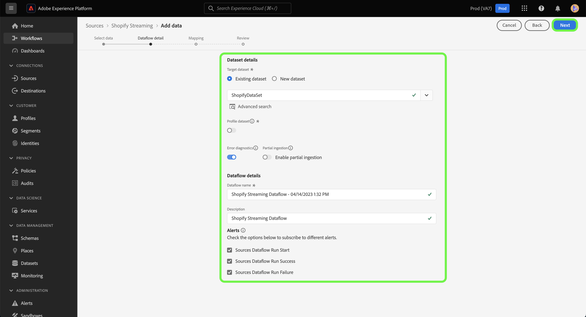

# 為建立源連接和資料流 [!DNL Shopify Streaming] 使用UI的資料

本教學課程提供建立 [!DNL Shopify Streaming] 源連接和資料流。

## 快速入門 {#getting-started}

本教學課程需要妥善了解下列Experience Platform元件：

* [[!DNL Experience Data Model (XDM)] 系統](../../../../../xdm/home.md):標準化框架 [!DNL Experience Platform] 組織客戶體驗資料。
   * [結構構成基本概念](../../../../../xdm/schema/composition.md):了解XDM結構描述的基本建置組塊，包括結構描述的主要原則和最佳實務。
   * [結構編輯器教學課程](../../../../../xdm/tutorials/create-schema-ui.md):了解如何使用結構編輯器UI建立自訂結構。
* [[!DNL Real-Time Customer Profile]](../../../../../profile/home.md):根據來自多個來源的匯總資料，提供統一的即時消費者設定檔。

>[!IMPORTANT]
>
>本教學課程需要您完成 [!DNL Shopify Streaming] 帳戶。 如需設定帳戶的步驟，請閱讀 [[!DNL Shopify Streaming] 概述](../../../../connectors/ecommerce/shopify-streaming.md).

## 連接您的 [!DNL Shopify Streaming] 帳戶

在平台UI中，選取 **[!UICONTROL 來源]** 從左側導覽列存取 [!UICONTROL 來源] 工作區。 此 [!UICONTROL 目錄] 畫面會顯示您可建立帳戶的各種來源。

您可以從畫面左側的目錄中選取適當的類別。 或者，您也可以使用搜尋選項找到您要使用的特定來源。

在 **電子商務** 類別，選擇 [!DNL Shopify Streaming]，然後選取 **[!UICONTROL 新增資料]**.

## 選擇資料

此 **[!UICONTROL 選擇資料]** 步驟，提供介面供您選取您帶入Platform的資料。

* 介面的左側是瀏覽器，可讓您檢視帳戶內可用的資料流；
* 介面的右側可讓您從JSON檔案預覽最多100列資料。

選擇 **[!UICONTROL 上傳檔案]** 從本機系統上傳JSON檔案。 或者，您也可以將要上傳的JSON檔案拖放至 [!UICONTROL 拖放檔案] 中。

上傳檔案後，預覽介面會更新，顯示您上傳之結構的預覽。 預覽介面可讓您檢查檔案的內容和結構。 您也可以使用 [!UICONTROL 搜尋欄位] 從架構中存取特定項目的公用程式。

完成後，請選取 **[!UICONTROL 下一個]**.

## 資料流詳細資訊

此 **資料流詳細資訊** 此時將顯示一個步驟，為您提供使用現有資料集或為資料流建立新資料集的選項，以及為資料流提供名稱和說明的機會。 在此步驟中，您也可以設定設定檔擷取、錯誤診斷、部分擷取和警報的設定。

完成後，請選取 **[!UICONTROL 下一個]**.

## 映射

此 [!UICONTROL 對應] 步驟，提供您一個介面，將來源架構的來源欄位對應至目標架構中適當的目標XDM欄位。

Platform會根據您選取的目標結構或資料集，為自動對應欄位提供智慧型建議。 您可以手動調整對應規則以符合您的使用案例。 您可以視需要選擇直接映射欄位，或使用資料準備函式來轉換源資料，以導出計算值或計算值。 有關使用映射器介面和計算欄位的完整步驟，請參閱 [資料準備UI指南](https://experienceleague.adobe.com/docs/experience-platform/data-prep/ui/mapping.html).

成功映射源資料後，請選擇 **[!UICONTROL 下一個]**.

## 請檢閱

此 **[!UICONTROL 檢閱]** 步驟顯示，允許您在建立新資料流之前對其進行查看。 詳細資料會分組為下列類別：

* **[!UICONTROL 連線]**:顯示源類型、所選源檔案的相關路徑以及該源檔案中的列數。
* **[!UICONTROL 指派資料集和對應欄位]**:顯示要擷取來源資料的資料集，包括資料集所遵守的結構。

審核資料流後，請選擇 **[!UICONTROL 完成]** 並允許建立資料流的時間。

## 取得您的串流端點URL

建立流資料流後，您現在可以檢索流終結點URL。 此端點將用於訂閱您的Webhook，讓您的串流來源可與Experience Platform通訊。

若要擷取串流端點，請前往 [!UICONTROL 資料流活動] 資料流的頁，並從資料流的底部複製端點 [!UICONTROL 屬性] 中。

## 後續步驟

按照本教程，您已建立了與 [!DNL Shopify Streaming] 帳戶。 有關如何連接 [!DNL Shopify Streaming] 帳戶，請參閱 [建立源連接和資料流 [!DNL Shopify] 使用流量服務API的資料](../../../api/create/ecommerce/shopify-streaming.md).

