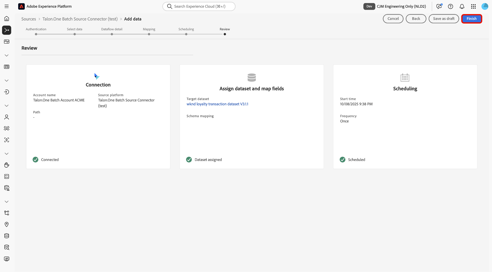

# 使用UI將批次資料從[!DNL Talon.One]擷取到Experience Platform

>[!AVAILABILITY]
>
>[!DNL Talon.One]來源是測試版。 閱讀來源概觀中的[條款與條件](../../../../home.md#terms-and-conditions)，以取得有關使用測試版標籤之來源的詳細資訊。

閱讀本教學課程，瞭解如何使用UI中的來源工作區將批次資料從您的[!DNL Talon.One]帳戶擷取到Adobe Experience Platform。

## 快速入門

本教學課程需要您實際瞭解下列Experience Platform元件：

* [[!DNL Experience Data Model (XDM)] 系統](../../../../../xdm/home.md)： Experience Platform用來組織客戶體驗資料的標準化架構。
   * [結構描述組合的基本概念](../../../../../xdm/schema/composition.md)：瞭解XDM結構描述的基本建置區塊，包括結構描述組合中的關鍵原則和最佳實務。
   * [結構描述編輯器教學課程](../../../../../xdm/tutorials/create-schema-ui.md)：瞭解如何使用結構描述編輯器使用者介面建立自訂結構描述。
* [[!DNL Real-Time Customer Profile]](../../../../../profile/home.md)：根據來自多個來源的彙總資料，提供統一的即時消費者設定檔。

>[!IMPORTANT]
>
>閱讀[[!DNL Talon.One] 總覽](../../../../connectors/loyalty/talon-one.md)，瞭解將帳戶連線至Experience Platform之前需要完成的先決條件步驟。

## 瀏覽來源目錄

在Experience Platform UI中，從左側導覽選取&#x200B;**[!UICONTROL 來源]**&#x200B;以存取&#x200B;*[!UICONTROL 來源]*&#x200B;工作區。 在&#x200B;*[!UICONTROL 類別]*&#x200B;面板中選取適當的類別。 或者，使用搜尋列導覽至您要使用的特定來源。

若要從[!DNL Talon.One]擷取資料，請選取&#x200B;**[!UICONTROL 忠誠度]**&#x200B;下的&#x200B;*[!UICONTROL Talon.One批次Source聯結器]*&#x200B;來源卡，然後選取&#x200B;**[!UICONTROL 新增資料]**。

>[!TIP]
>
>當指定的來源尚未具有已驗證的帳戶時，來源目錄中的來源會顯示&#x200B;**[!UICONTROL 設定]**&#x200B;選項。 建立已驗證的帳戶後，此選項會變更為&#x200B;**[!UICONTROL 新增資料]**。

### 建立新帳戶

若要為您的[!DNL Talon.One]來源建立新帳戶，請選取&#x200B;**[!UICONTROL 新增帳戶]**，並為您的帳戶提供名稱和選擇性說明。 接下來，提供您的[!DNL Talon.One]網域和您的[!UICONTROL Talon.One管理API金鑰]。 完成時，請選取&#x200B;**[!UICONTROL 連線到來源]**，並等待一段時間讓您的連線建立。

### 使用現有帳戶

若要使用現有帳戶，請選取&#x200B;**[!UICONTROL 現有帳戶]**，然後從帳戶介面選取您要使用的[!DNL Talon.One]帳戶。

## 選取資料

驗證之後，請提供您&#x200B;**applicationId**&#x200B;和&#x200B;**sessionType**&#x200B;的值。 在此步驟中，您可以使用預覽功能來檢查資料的結構。 完成後，選取&#x200B;**[!UICONTROL 下一步]**&#x200B;以繼續。

## 設定資料集和資料流詳細資料

接下來，您必須提供有關資料集和資料流的資訊。

### 資料集詳細資料

資料集是資料集合的儲存和管理結構，通常是包含方案（欄/欄位）和記錄（列）的表格。 成功內嵌至Experience Platform的資料會以資料集的形式保留在資料湖中。

在此步驟中，您可以使用現有的資料集或建立新的資料集。

>[!NOTE]
>
>無論您是使用現有資料集還是建立新資料集，都必須確保您的資料集已啟用設定檔&#x200B;**內嵌**。

+++選取以啟用設定檔擷取、錯誤診斷及部分擷取的步驟。

如果您的資料集已啟用即時客戶個人檔案，那麼在此步驟中，您可以切換&#x200B;**[!UICONTROL 個人檔案資料集]**&#x200B;以啟用您的資料以進行個人檔案擷取。 您也可以使用此步驟來啟用&#x200B;**[!UICONTROL 錯誤診斷]**&#x200B;和&#x200B;**[!UICONTROL 部分擷取]**。

* **[!UICONTROL 錯誤診斷]**：選取&#x200B;**[!UICONTROL 錯誤診斷]**&#x200B;以指示來源產生錯誤診斷，以便您稍後在監視資料集活動和資料流狀態時參考。
* **[!UICONTROL 部分擷取]**：部分批次擷取可擷取含有錯誤的資料，最多可達到特定可設定的臨界值。 此功能可讓您將所有精確資料成功擷取到Experience Platform，同時所有不正確的資料會個別批次處理，並提供無效原因的資訊。

+++

## 資料流詳細資料

設定資料集後，您必須提供資料流的詳細資訊，包括名稱、選用的說明和警報設定。

| 資料流設定 | 說明 |
| --- | --- |
| 資料流名稱 | 資料流的名稱。 依預設，這將使用正在匯入的檔案名稱。 |
| 說明 | （選用）資料流的簡短說明。 |
| 警報 | Experience Platform可產生使用者可訂閱的事件型警報，這些選項可讓執行中的資料流觸發這些警報。  如需詳細資訊，請閱讀[警示概述](../../alerts.md) <ul><li>**來源資料流執行開始**：選取此警示以在您的資料流執行開始時收到通知。</li><li>**來源資料流執行成功**：選取此警示以在您的資料流結束且沒有任何錯誤時接收通知。</li><li>**來源資料流執行失敗**：選取此警示以在您的資料流執行結束時發生任何錯誤時接收通知。</li></ul> |

{style="table-layout:auto"}

## 對應

在設定資料集和資料流詳細資料後，您現在可以繼續將來源資料欄位對應到其適當的目標XDM欄位。 在將資料擷取至Experience Platform之前，請使用對應介面將來源資料對應至適當的結構描述欄位。 如需詳細資訊，請閱讀UI[中的](../../../../../data-prep/ui/mapping.md)對應指南。

>[!IMPORTANT]
>
>如需對應您[!DNL Talon.One]來源資料的其他指引，請閱讀[[!DNL Talon.One] 概觀](../../../../connectors/loyalty/talon-one.md#mapping)。

## 排程您的資料流擷取

[!UICONTROL 排程]步驟隨即顯示。 使用介面設定擷取排程，以使用已設定的對應自動擷取選取的來源資料。 根據預設，排程設定為`Once`。 若要調整您的擷取頻率，請選取&#x200B;**[!UICONTROL 頻率]**，然後從下拉式選單中選取選項。

>[!TIP]
>
>在一次性內嵌期間看不到間隔和回填。

如果您將擷取頻率設為`Minute`、`Hour`、`Day`或`Week`，則必須設定間隔，以在每次擷取之間建立設定的時間範圍。 例如，擷取頻率設為`Day`，而間隔設為`15`，表示您的資料流已排程每15天擷取一次資料。

在此步驟中，您也可以啟用&#x200B;**回填**，並定義資料增量擷取的資料行。 回填是用來擷取歷史資料，而您為增量擷取定義的欄則可區分新資料與現有資料。

請參閱下表以取得排程設定的詳細資訊。

| 正在排程設定 | 說明 |
| --- | --- |
| 頻率 | 設定頻率以指出資料流執行的頻率。 您可以將頻率設為： <ul><li>**一次**：將您的頻率設定為`once`以建立一次性內嵌。 建立一次性擷取資料流時，無法使用間隔和回填的設定。 依預設，排程頻率會設定為一次。</li><li>**分鐘**：將頻率設為`minute`，排程您的資料流以每分鐘擷取資料。</li><li>**小時**：將頻率設為`hour`，排程您的資料流以每小時為基礎擷取資料。</li><li>**天**：將您的頻率設為`day`，排程您的資料流每天擷取資料。</li><li>**周**：將頻率設為`week`，排程您的資料流每週擷取資料。</li></ul> |
| 間隔 | 選取頻率後，您就可以設定間隔設定，以建立每次擷取之間的時間範圍。 例如，如果您將頻率設為「天」，並將間隔設為15，則您的資料流將每隔15天執行一次。 您不能將間隔設定為零。 每個頻率的最小接受間隔值如下：<ul><li>**一次**：不適用</li><li>**分鐘**： 15</li><li>**小時**： 1</li><li>**天**： 1</li><li>**周**： 1</li></ul> |
| 開始時間 | 預計執行的時間戳記，以UTC時區顯示。 |
| 回填 | 回填會決定最初要擷取的資料。 如果已啟用回填，則會在第一次排程擷取期間擷取指定路徑中的所有目前檔案。 如果停用回填，則只會擷取在第一次內嵌執行到開始時間之間載入的檔案。 將不會擷取在開始時間之前載入的檔案。 |

## 審閱

*[!UICONTROL 檢閱]*&#x200B;步驟隨即顯示，可讓您在建立資料流之前先檢閱資料流的詳細資訊。 詳細資料會分組到以下類別中：

* **[!UICONTROL 連線]**：顯示帳戶名稱、來源平台和來源名稱。
* **[!UICONTROL 指派資料集和對應欄位]**：顯示目標資料集和資料集所遵守的結構描述。

確認詳細資料正確之後，請選取&#x200B;**[!UICONTROL 完成]**。

## 監視資料流

建立資料流後，您可以監視透過該資料流擷取的資料，以檢視擷取率、成功和錯誤的資訊。 如需有關如何監視資料流的詳細資訊，請參閱有關UI[中](../../../../../dataflows/ui/monitor-sources.md)監視帳戶和資料流的教學課程。