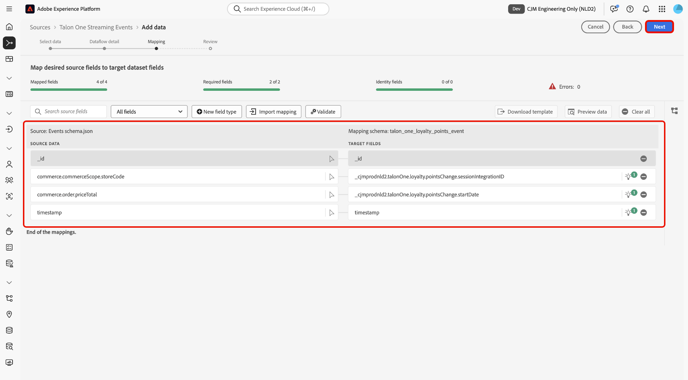
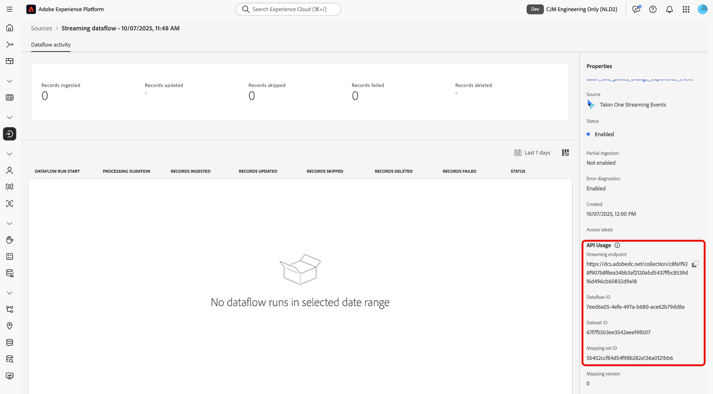

# 使用UI將[!DNL Talon.One]資料串流到Experience Platform

>[!AVAILABILITY]
>
>[!DNL Talon.One]來源是測試版。 閱讀來源概觀中的[條款與條件](../../../../home.md#terms-and-conditions)，以取得有關使用測試版標籤之來源的詳細資訊。

閱讀本指南，瞭解如何使用UI中的來源工作區將您的資料從[!DNL Talon.One]連線並串流至Adobe Experience Platform。

## 快速入門

本教學課程需要您實際瞭解下列Experience Platform元件：

* [[!DNL Experience Data Model (XDM)] 系統](../../../../../xdm/home.md)： Experience Platform用來組織客戶體驗資料的標準化架構。
   * [結構描述組合的基本概念](../../../../../xdm/schema/composition.md)：瞭解XDM結構描述的基本建置區塊，包括結構描述組合中的關鍵原則和最佳實務。
   * [結構描述編輯器教學課程](../../../../../xdm/tutorials/create-schema-ui.md)：瞭解如何使用結構描述編輯器使用者介面建立自訂結構描述。
* [[!DNL Real-Time Customer Profile]](../../../../../profile/home.md)：根據來自多個來源的彙總資料，提供統一的即時消費者設定檔。

>[!IMPORTANT]
>
>閱讀[[!DNL Talon.One] 總覽](../../../../connectors/loyalty/talon-one.md)，瞭解將帳戶連線至Experience Platform之前需要完成的先決條件步驟。

## 瀏覽來源目錄

在Experience Platform UI中，從左側導覽選取&#x200B;**[!UICONTROL 來源]**&#x200B;以存取&#x200B;*[!UICONTROL 來源]*&#x200B;工作區。 在&#x200B;*[!UICONTROL 類別]*&#x200B;面板中選取適當的類別。 或者，使用搜尋列導覽至您要使用的特定來源。

若要從[!DNL Talon.One]串流資料，請選取&#x200B;**[!UICONTROL 忠誠度]**&#x200B;下的&#x200B;*[!UICONTROL Talon.One串流事件]*&#x200B;來源卡，然後選取&#x200B;**[!UICONTROL 新增資料]**。

>[!TIP]
>
>當指定的來源尚未具有已驗證的帳戶時，來源目錄中的來源會顯示&#x200B;**[!UICONTROL 設定]**&#x200B;選項。 建立已驗證的帳戶後，此選項會變更為&#x200B;**[!UICONTROL 新增資料]**。

## 選取資料

接下來，使用&#x200B;*[!UICONTROL 選取資料]*&#x200B;介面上傳範例JSON檔案以定義您的來源結構描述。 在此步驟中，您可以使用預覽介面來檢視裝載的檔案結構。 完成後，選取&#x200B;**[!UICONTROL 下一步]**。

## 資料流詳細資料

接下來，您必須提供有關資料集和資料流的資訊。

### 資料集詳細資料

資料集是資料集合的儲存和管理結構，通常是包含方案（欄/欄位）和記錄（列）的表格。 成功內嵌至Experience Platform的資料會以資料集的形式保留在資料湖中。

在此步驟中，您可以使用現有的資料集或建立新的資料集。

>[!NOTE]
>
>無論您是使用現有資料集還是建立新資料集，都必須確保您的資料集已啟用設定檔&#x200B;**內嵌**。

+++選取以啟用設定檔擷取、錯誤診斷及部分擷取的步驟。

如果您的資料集已啟用即時客戶個人檔案，那麼在此步驟中，您可以切換&#x200B;**[!UICONTROL 個人檔案資料集]**&#x200B;以啟用您的資料以進行個人檔案擷取。 您也可以使用此步驟來啟用&#x200B;**[!UICONTROL 錯誤診斷]**&#x200B;和&#x200B;**[!UICONTROL 部分擷取]**。

* **[!UICONTROL 錯誤診斷]**：選取&#x200B;**[!UICONTROL 錯誤診斷]**&#x200B;以指示來源產生錯誤診斷，以便您稍後在監視資料集活動和資料流狀態時參考。
* **[!UICONTROL 部分擷取]**：部分批次擷取可擷取含有錯誤的資料，最多可達到特定可設定的臨界值。 此功能可讓您將所有精確資料成功擷取到Experience Platform，同時所有不正確的資料會個別批次處理，並提供無效原因的資訊。

+++

### 資料流詳細資料

設定資料集後，您必須提供資料流的詳細資訊，包括名稱、選用的說明和警報設定。

| 資料流設定 | 說明 |
| --- | --- |
| 資料流名稱 | 資料流的名稱。 依預設，這將使用正在匯入的檔案名稱。 |
| 說明 | （選用）資料流的簡短說明。 |
| 警報 | Experience Platform可產生使用者可訂閱的事件型警報，這些選項可讓執行中的資料流觸發這些警報。  如需詳細資訊，請閱讀[警示概述](../../alerts.md) <ul><li>**來源資料流執行開始**：選取此警示以在您的資料流執行開始時收到通知。</li><li>**來源資料流執行成功**：選取此警示以在您的資料流結束且沒有任何錯誤時接收通知。</li><li>**來源資料流執行失敗**：選取此警示以在您的資料流執行結束時發生任何錯誤時接收通知。</li></ul> |

{style="table-layout:auto"}

## 對應

在將資料擷取至Experience Platform之前，請使用對應介面將來源資料對應至適當的結構描述欄位。 如需詳細資訊，請閱讀UI[中的](../../../../../data-prep/ui/mapping.md)對應指南。

<!--
>[!TIP]
>
>You can download the [Events and Profile mappings](../../../../images/tutorials/create/capillary/mappings.zip) for [!DNL Capillary] and [import the files to Data Prep](../../../../../data-prep/ui/mapping.md#import-mapping) when you are ready to map your data.
-->

## 審閱

*[!UICONTROL 檢閱]*&#x200B;步驟隨即顯示，可讓您在建立資料流之前先檢閱資料流的詳細資訊。 詳細資料會分組到以下類別中：

* **[!UICONTROL 連線]**：顯示帳戶名稱、來源平台和來源名稱。
* **[!UICONTROL 指派資料集和對應欄位]**：顯示目標資料集和資料集所遵守的結構描述。

確認詳細資料正確之後，請選取&#x200B;**[!UICONTROL 完成]**。

## 擷取串流端點URL

建立連線後，來源詳細資訊頁面就會顯示。 此頁面顯示您新建立之連線的詳細資料，包括先前執行的資料流、ID和串流端點URL。

## 監視資料流

建立資料流後，您可以監視透過該資料流擷取的資料，以檢視擷取率、成功和錯誤的資訊。 如需有關如何監視資料流的詳細資訊，請參閱有關UI[中](../../monitor-streaming.md)監視帳戶和資料流的教學課程