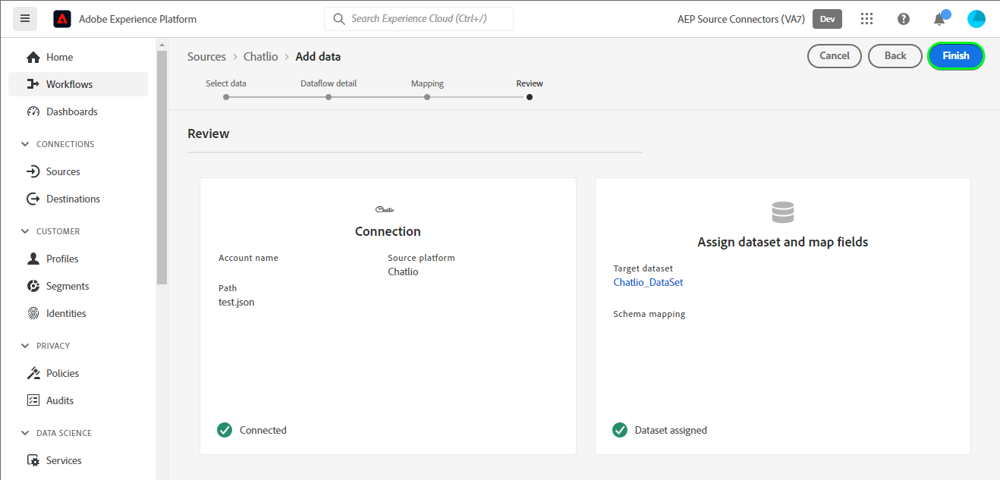
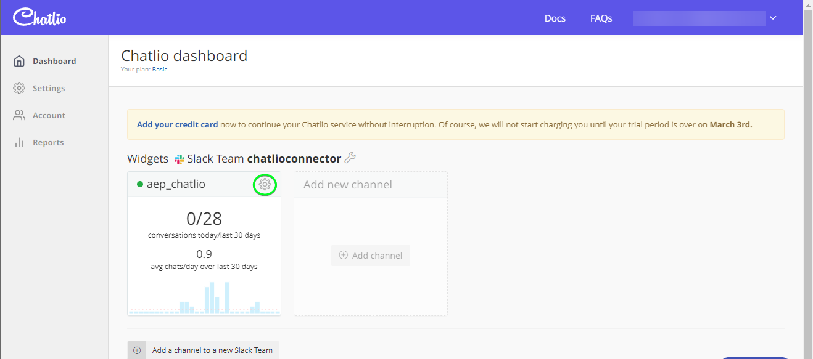

# 在使用者介面中建立[!DNL Chatlio]來源連線

>[!NOTE]
>
>[!DNL Chatlio]來源是測試版。 如需使用Beta版標籤來源的相關資訊，請參閱[來源概觀](../../../../home.md#terms-and-conditions)。

本教學課程提供使用Adobe Experience Platform使用者介面建立[!DNL Chatlio]來源連線的步驟。

## 快速入門 {#getting-started}

本教學課程需要您實際瞭解下列Experience Platform元件：

* [[!DNL Experience Data Model (XDM)] 系統](../../../../../xdm/home.md)： [!DNL Experience Platform]用來組織客戶體驗資料的標準化架構。
   * [結構描述組合的基本概念](../../../../../xdm/schema/composition.md)：瞭解XDM結構描述的基本建置區塊，包括結構描述組合中的關鍵原則和最佳實務。
   * [結構描述編輯器教學課程](../../../../../xdm/tutorials/create-schema-ui.md)：瞭解如何使用結構描述編輯器使用者介面建立自訂結構描述。
* [[!DNL Real-Time Customer Profile]](../../../../../profile/home.md)：根據來自多個來源的彙總資料，提供統一的即時消費者設定檔。

## 先決條件 {#prerequisites}

下節提供建立[!DNL Chatlio]來源連線之前必須完成的必要條件資訊。

### 定義[!DNL Chatlio]之來源結構描述的JSON範例 {#prerequisites-json-schema}

建立[!DNL Chatlio]來源連線之前，您需要提供來源結構描述。 您可以使用下方的JSON。

```
{
  "visitor": {
    "email": "test@example.com",
    "UUID": "2d3f4260-2235-903b-0a82-a23d326cc257"
  },
   "message": "Hi",
  "channelId": "C04J7M7LCMQ",
  "slackChannelName": "aep",
  "slackChannelId": "C04JVR71WKS"
}
```

### 建立[!DNL Chatlio]的平台結構描述 {#create-platform-schema}

您也必須確保建立用於來源的Platform結構。 閱讀有關[建立Platform結構描述](../../../../../xdm/schema/composition.md)的教學課程，以瞭解如何建立結構描述的完整步驟。


## 連線您的[!DNL Chatlio]帳戶 {#connect-account}

在Platform UI中，從左側導覽選取&#x200B;**[!UICONTROL 來源]**&#x200B;以存取[!UICONTROL 來源]工作區，並檢視Experience Platform中可用的來源目錄。

使用&#x200B;*[!UICONTROL 類別]*&#x200B;功能表，依類別篩選來源。 或者，在搜尋列中輸入來源名稱，從目錄中尋找特定來源。

移至[!UICONTROL 行銷自動化]類別以檢視[!DNL Chatlio]來源卡。 若要開始，請選取&#x200B;**[!UICONTROL 新增資料]**。


## 選取資料 {#select-data}

**[!UICONTROL 選取資料]**&#x200B;步驟隨即顯示，提供介面供您選取要帶到Platform的資料。

* 介面的左側是瀏覽器，可讓您檢視帳戶內的可用資料流；
* 介面的右側部分可讓您預覽JSON檔案中最多100列的資料。

選取&#x200B;**[!UICONTROL 上傳檔案]**&#x200B;以從您的本機系統上傳JSON檔案。 或者，您也可以將要上傳的JSON檔案拖放至[!UICONTROL 拖放檔案]面板。


上傳檔案後，預覽介面會更新，以顯示您上傳的結構描述預覽。 預覽介面可讓您檢查檔案的內容和結構。 您也可以使用[!UICONTROL 搜尋欄位]公用程式來存取結構描述中的特定專案。

完成後，選取&#x200B;**[!UICONTROL 下一步]**。


## 資料流詳細資料 {#dataflow-detail}

**資料流詳細資料**&#x200B;步驟隨即顯示，為您提供使用現有資料集或建立資料流新資料集的選項，以及提供資料流名稱和說明的機會。 在此步驟中，您還可以配置設定檔擷取、錯誤診斷、部分擷取和警報的設定。

完成後，選取&#x200B;**[!UICONTROL 下一步]**。


## 對應 {#mapping}

[!UICONTROL 對應]步驟出現，為您提供介面，用於將來源結構描述中的來源欄位對應到目標結構描述中適當的目標XDM欄位。

Platform會根據您選取的目標結構或資料集，為自動對應的欄位提供智慧型建議。 您可以手動調整對應規則以符合您的使用案例。 您可以根據自己的需求，選擇直接對應欄位，或使用資料準備函式來轉換來源資料，以衍生計算或計算的值。 如需使用對應程式介面和計算欄位的完整步驟，請參閱[資料準備UI指南](../../../../../data-prep/ui/mapping.md)。

下列對應是強制性的，在繼續進行[!UICONTROL 檢閱]階段之前應先進行設定。

| 目標欄位 | 說明 |
| --- | --- |
| `UUID` | 事件的[!DNL Chatlio]識別碼。 |

成功對應來源資料後，請選取&#x200B;**[!UICONTROL 下一步]**。


## 檢閱 {#review}

**[!UICONTROL 檢閱]**&#x200B;步驟隨即顯示，可讓您在建立新資料流之前先檢閱該資料流。 詳細資料會分組到以下類別中：

* **[!UICONTROL 連線]**：顯示來源型別、所選來源檔案的相關路徑，以及該來源檔案中的欄數。
* **[!UICONTROL 指派資料集與對應欄位]**：顯示要將來源資料擷取到哪個資料集，包括資料集所堅持的結構描述。

檢閱您的資料流後，請選取&#x200B;**[!UICONTROL 完成]**，並等待一些時間來建立資料流。



## 取得您的串流端點URL {#get-streaming-endpoint-url}

建立串流資料流後，您現在可以擷取串流端點URL。 此端點將用於訂閱您的webhook，允許您的串流來源與Experience Platform通訊。

若要建構用來在[!DNL Chatlio]上設定webhook的URL，您必須擷取下列專案：

* **[!UICONTROL 資料流ID]**
* **[!UICONTROL 串流端點]**

若要擷取您的&#x200B;**[!UICONTROL 資料流ID]**&#x200B;和&#x200B;**[!UICONTROL 串流端點]**，請移至您剛才建立之資料流的[!UICONTROL 資料流活動]頁面，並從[!UICONTROL 屬性]面板底部複製詳細資料。


擷取串流端點與資料流ID後，請根據下列模式建置URL： ```{STREAMING_ENDPOINT}?x-adobe-flow-id={DATAFLOW_ID}```。 例如，建構的webhook URL可能如下所示： ``https://dcs.adobedc.net/collection/d56b47ee3985104beaf724efcd78a3e1a863d720471a482bebac0acc1ab95983``

## 在[!DNL Chatlio]中設定webhook {#set-up-webhook}

建立webhook URL後，您現在可以使用[!DNL Chatlio]使用者介面設定webhook。

登入您的[[!DNL Chatlio]](https://chatlio.com/)帳戶，並遵循[安裝與安裝指南](https://chatlio.com/docs/setup/)來建立Widget。

建立Widget後，請導覽至Widget的設定頁面，將您的webhook URL新增至該Widget。



接著，選取「**[!DNL Behavior]**」標籤，並將您的webhook URL新增至「*[!DNL Webhook when a new conversation starts]*」欄位以及您要訂閱的任何其他webhook事件欄位。


>[!TIP]
>
>您可以為您的[!DNL Chatlio] webhook訂閱各種不同的活動。 如需不同事件的詳細資訊，請參閱[[!DNL Chatlio] 事件檔案](https://chatlio.com/docs/webhooks/)。

## 後續步驟 {#next-steps}

依照本教學課程中的指示，您已成功設定串流資料流，以將您的[!DNL Chatlio]資料帶入Experience Platform。 若要監視正在擷取的資料，請參閱[使用Platform UI監視串流資料流](../../monitor-streaming.md)的指南。

## 其他資源 {#additional-resources}

以下各節提供在使用[!DNL Chatlio]來源時可以參考的其他資源。

### 驗證 {#validation}

若要驗證您已正確設定來源，而且正在擷取[!DNL Chatlio]則訊息，請遵循下列步驟：

* 您可以檢查[!DNL Chatlio] **[!UICONTROL 報告]** > **[!UICONTROL 聊天記錄]**&#x200B;頁面，以識別[!DNL Chatlio]擷取的事件。


* 在Platform UI中，選取來源目錄上[!DNL Chatlio]卡片功能表旁的&#x200B;**[!UICONTROL 檢視資料流程]**。 接著，選取&#x200B;**[!UICONTROL 預覽資料集]**&#x200B;以驗證針對您已在[!DNL Chatlio]中設定的Webhook所擷取的資料。


如需[!DNL Chatlio]的其他資訊，請瀏覽[[!DNL Chatlio] 檔案](https://chatlio.com/docs/)和[常見問答集](https://chatlio.com/pricing/#FAQ)。
