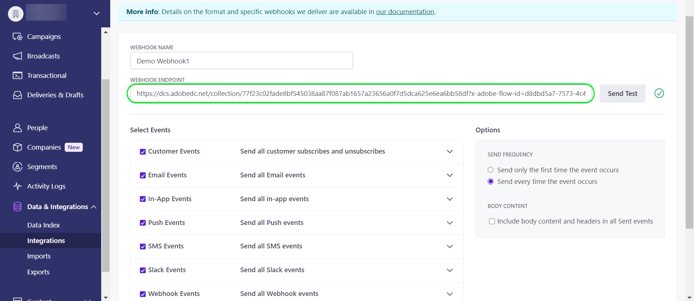

# 建立 [!DNL Customer.io] 源連接和UI中的資料流

>[!NOTE]
>
>此 [!DNL Customer.io] 來源為測試版。 請閱讀 [來源概觀](../../../../home.md#terms-and-conditions) 以取得使用測試版標籤來源的詳細資訊。

本教學課程提供建立 [!DNL Customer.io] 源連接和資料流(使用Adobe Experience Platform用戶介面)。

## 快速入門 {#getting-started}

本教學課程需要妥善了解下列Experience Platform元件：

* [[!DNL Experience Data Model (XDM)] 系統](../../../../../xdm/home.md):標準化框架 [!DNL Experience Platform] 組織客戶體驗資料。
   * [結構構成基本概念](../../../../../xdm/schema/composition.md):了解XDM結構描述的基本建置組塊，包括結構描述的主要原則和最佳實務。
   * [結構編輯器教學課程](../../../../../xdm/tutorials/create-schema-ui.md):了解如何使用結構編輯器UI建立自訂結構。
* [[!DNL Real-Time Customer Profile]](../../../../../profile/home.md):根據來自多個來源的匯總資料，提供統一的即時消費者設定檔。

## 先決條件 {#prerequisites}

下節提供建立前需先完成的必要條件的資訊 [!DNL Customer.io] 源連接。

### 定義來源結構的範例JSON [!DNL Customer.io] {#prerequisites-json-schema}

建立之前 [!DNL Customer.io] 源連接時，需要提供源架構。 您可以使用下列JSON。

```
{
  "event_id": "01E4C4CT6YDC7Y5M7FE1GWWPQJ",
  "object_type": "customer",
  "metric": "subscribed",
  "timestamp": 1613063089,
  "data": {
    "customer_id": "42",
    "email_address": "test@example.com",
    "identifiers": {
      "id": "42",
      "email": "test@example.com",
      "cio_id": "d9c106000001"
    }
  }
}
```

### 建立平台結構 [!DNL Customer.io] {#create-platform-schema}

您也必須確定要建立要用於來源的平台結構。 請參閱 [建立平台結構](../../../../../xdm/schema/composition.md) 以取得如何建立結構的完整步驟。


## 連接您的 [!DNL Customer.io] 帳戶 {#connect-account}

在平台UI中，選取 **[!UICONTROL 來源]** 從左側導覽器存取 [!UICONTROL 來源] 工作區，並查看Experience Platform中可用的來源目錄。

使用 *[!UICONTROL 類別]* 功能表來依類別篩選來源。 或者，在搜索欄中輸入源名稱，從目錄中查找特定源。

前往 [!UICONTROL 行銷自動化] 類別，以查看 [!DNL Customer.io] 源卡。 若要開始，請選取 [!UICONTROL 新增資料].


## 選擇資料 {#select-data}

此 **[!UICONTROL 選擇資料]** 步驟，提供介面供您選取您帶入Platform的資料。

* 介面的左側是瀏覽器，可讓您檢視帳戶內可用的資料流；
* 介面的右側可讓您從JSON檔案預覽最多100列資料。

選擇 **[!UICONTROL 上傳檔案]** 從本機系統上傳JSON檔案。 或者，您也可以將要上傳的JSON檔案拖放至 [!UICONTROL 拖放檔案] 中。


上傳檔案後，預覽介面會更新，顯示您上傳之結構的預覽。 預覽介面可讓您檢查檔案的內容和結構。 您也可以使用 [!UICONTROL 搜尋欄位] 從架構中存取特定項目的公用程式。

完成後，請選取 **[!UICONTROL 下一個]**.


## 資料流詳細資訊 {#dataflow-detail}

此 **資料流詳細資訊** 此時將顯示一個步驟，為您提供使用現有資料集或為資料流建立新資料集的選項，以及為資料流提供名稱和說明的機會。 在此步驟中，您也可以設定設定檔擷取、錯誤診斷、部分擷取和警報的設定。

完成後，請選取 **[!UICONTROL 下一個]**.


## 映射 {#mapping}

此 [!UICONTROL 對應] 步驟，提供您一個介面，將來源架構的來源欄位對應至目標架構中適當的目標XDM欄位。

Platform會根據您選取的目標結構或資料集，為自動對應欄位提供智慧型建議。 您可以手動調整對應規則以符合您的使用案例。 您可以視需要選擇直接映射欄位，或使用資料準備函式來轉換源資料，以導出計算值或計算值。 有關使用映射器介面和計算欄位的完整步驟，請參閱 [資料準備UI指南](../../../../../data-prep/ui/mapping.md).

下列所有對應都是必填的，應先設定，再繼續前往 [!UICONTROL 檢閱] 舞台。

| 目標欄位 | 說明 |
| --- | --- |
| `object_type` | 物件類型，請參閱 [!DNL Customer.io] [事件](https://customer.io/docs/webhooks/#events) 支援類型的檔案。 |
| `id` | 物件的識別碼。 |
| `email` | 與物件相關聯的電子郵件地址。 |
| `event_id` | 事件的唯一識別碼。 |
| `cio_id` | 此 [!DNL Customer.io] 事件的識別碼。 |
| `metric` | 事件類型。 如需詳細資訊，請參閱 [!DNL Customer.io] [事件](https://customer.io/docs/webhooks/#events) 支援類型的檔案。 |
| `timestamp` | 發生事件的時間戳記。 |

>[!IMPORTANT]
>
>不映射 `cio_id` 執行 [!DNL Customer.io] 網頁鈎 `test mode` 因為將不會從 [!DNL Customer.io].

成功映射源資料後，請選擇 **[!UICONTROL 下一個]**.


## 請檢閱 {#review}

此 **[!UICONTROL 檢閱]** 步驟顯示，允許您在建立新資料流之前對其進行查看。 詳細資料會分組為下列類別：

* **[!UICONTROL 連線]**:顯示源類型、所選源檔案的相關路徑以及該源檔案中的列數。
* **[!UICONTROL 指派資料集和對應欄位]**:顯示要擷取來源資料的資料集，包括資料集所遵守的結構。

審核資料流後，請選擇 **[!UICONTROL 完成]** 並允許建立資料流的時間。


## 取得您的串流端點URL {#get-streaming-endpoint}

建立流資料流後，您現在可以檢索流終結點URL。 此端點將用於訂閱您的Webhook，讓您的串流來源可與Experience Platform通訊。

以建構用來設定Webhook的URL [!DNL Customer.io] 必須檢索以下內容：

* **[!UICONTROL 資料流ID]**
* **[!UICONTROL 串流端點]**

若要擷取 **[!UICONTROL 資料流ID]** 和 **[!UICONTROL 串流端點]**，前往 [!UICONTROL 資料流活動] 資料流的頁面，並從 [!UICONTROL 屬性] 中。


擷取串流端點和資料流ID後，請根據下列模式建立URL: ```{STREAMING_ENDPOINT}?x-adobe-flow-id={DATAFLOW_ID}```. 例如，已建構的網頁連結URL看起來可能類似： ``https://dcs.adobedc.net/collection/febc116d22ba0ea2868e9c93b199375302afb8a589617700991bb8f3f0341ad7?x-adobe-flow-id=439b3fc4-3042-4a3a-b5e0-a494898d3fb0``

## 在中設定報告Webhook [!DNL Customer.io] {#set-up-webhook}

建立網頁連結URL後，您現在可以使用 [!DNL Customer.io] 使用者介面。 有關設定報告Webhook的步驟，請閱讀 [[!DNL Customer.io] 指南](https://customer.io/docs/webhooks/#setup) 設定Webhook。

在 [!DNL Customer.io] 使用者介面，輸入 [網頁連結URL](#get-streaming-endpoint-url) 在 [!DNL WEBHOOK ENDPOINT] 欄位。



>[!TIP]
>
>您可以訂閱報表網頁連結的各種不同事件。 當 [!DNL Customer.io] 動作事件觸發條件符合。 有關不同事件的詳細資訊，請參閱 [[!DNL Customer.io] 事件檔案](https://customer.io/docs/webhooks/#events).

## 後續步驟 {#next-steps}

按照本教程，您已成功配置了流資料流，以將 [!DNL Customer.io] 資料Experience Platform。 若要監控正在擷取的資料，請參閱 [使用Platform UI監控串流資料流](../../monitor-streaming.md).

## 其他資源 {#additional-resources}

以下各節提供您在使用 [!DNL Customer.io] 來源。

### 護欄 {#guardrails}

有關護欄的資訊，請參閱 [[!DNL Customer.io] 逾時和失敗頁面](https://customer.io/docs/webhooks/#timeouts-and-failures).

### 驗證 {#validation}

驗證您已正確設定來源和 [!DNL Customer.io] 正在擷取訊息，請遵循下列步驟：

* 您可以檢查 [!DNL Customer.io] **[!UICONTROL 活動記錄]** 頁面，識別要擷取的事件 [!DNL Customer.io].


* 在平台UI中，選取 **[!UICONTROL 查看資料流]** 旁邊 [!DNL Customer.io] 來源目錄上的卡片功能表。 下一步，選擇 **[!UICONTROL 預覽資料集]** 驗證針對您在中選取的事件所擷取的資料 [!DNL Customer.io].


