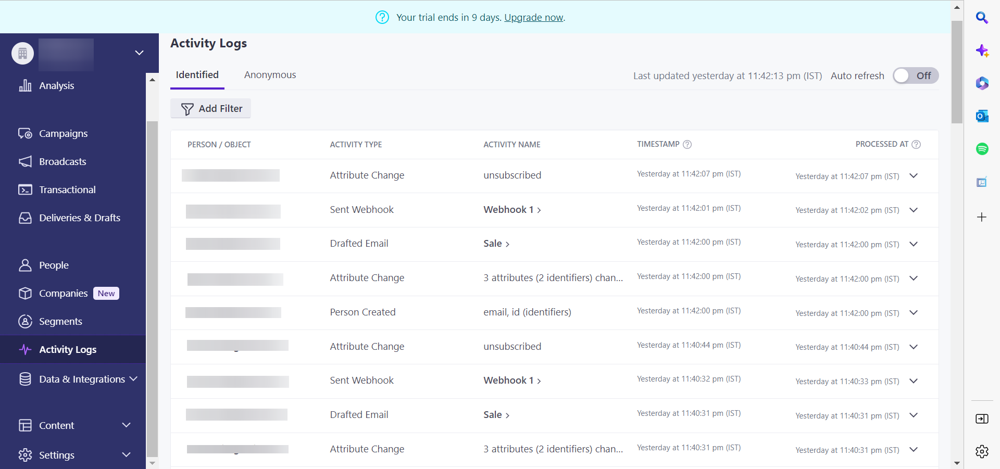

# 建立 [!DNL Customer.io] 源連接和UI中的資料流

>[!NOTE]
>
>的 [!DNL Customer.io] 源為beta。 請閱讀 [源概述](../../../../home.md#terms-and-conditions) 的子菜單。

本教程提供建立 [!DNL Customer.io] 源連接和資料流。

## 快速入門 {#getting-started}

本教程需要對以下Experience Platform組成部分進行有效理解：

* [[!DNL Experience Data Model (XDM)] 系統](../../../../../xdm/home.md):標準化框架 [!DNL Experience Platform] 組織客戶體驗資料。
   * [架構組合的基礎](../../../../../xdm/schema/composition.md):瞭解XDM架構的基本構建基塊，包括架構組成中的關鍵原則和最佳做法。
   * [架構編輯器教程](../../../../../xdm/tutorials/create-schema-ui.md):瞭解如何使用架構編輯器UI建立自定義架構。
* [[!DNL Real-Time Customer Profile]](../../../../../profile/home.md):基於來自多個源的聚合資料提供統一、即時的用戶配置檔案。

## 先決條件 {#prerequisites}

以下部分提供了有關在建立 [!DNL Customer.io] 源連接。

### 定義源架構的示例JSON [!DNL Customer.io] {#prerequisites-json-schema}

在建立 [!DNL Customer.io] 源連接，需要提供源架構。 可以使用以下JSON。

```
{
  "event_id": "01E4C4CT6YDC7Y5M7FE1GWWPQJ",
  "object_type": "customer",
  "metric": "subscribed",
  "timestamp": 1613063089,
  "data": {
    "customer_id": "42",
    "email_address": "test@example.com",
    "identifiers": {
      "id": "42",
      "email": "test@example.com",
      "cio_id": "d9c106000001"
    }
  }
}
```

### 建立平台架構 [!DNL Customer.io] {#create-platform-schema}

還必須確保建立用於源的平台架構。 請參閱上的教程 [建立平台架構](../../../../../xdm/schema/composition.md) 有關如何建立架構的全面步驟。


## 連接 [!DNL Customer.io] 帳戶 {#connect-account}

在平台UI中，選擇 **[!UICONTROL 源]** 從左側導航 [!UICONTROL 源] 工作區，並查看Experience Platform中可用的源目錄。

使用 *[!UICONTROL 類別]* 按類別篩選源。 或者，在搜索欄中輸入源名稱以從目錄中查找特定源。

轉到 [!UICONTROL 營銷自動化] 類別以查看 [!DNL Customer.io] 源卡。 要開始，請選擇 **[!UICONTROL 添加資料]**。


## 選擇資料 {#select-data}

的 **[!UICONTROL 選擇資料]** 步驟，為您提供一個介面，以選擇要帶到平台的資料。

* 介面的左側部分是一個瀏覽器，允許您查看帳戶中的可用資料流；
* 該介面的右部分允許您從JSON檔案預覽多達100行的資料。

選擇 **[!UICONTROL 上載檔案]** 從本地系統上載JSON檔案。 或者，可以將要上載的JSON檔案拖放到 [!UICONTROL 拖放檔案] 的子菜單。


上載檔案後，預覽介面將更新以顯示上載的架構的預覽。 預覽介面允許您檢查檔案的內容和結構。 您還可以使用 [!UICONTROL 搜索欄位] 用於從架構中訪問特定項的實用程式。

完成後，選擇 **[!UICONTROL 下一個]**。


## 資料流詳細資訊 {#dataflow-detail}

的 **資料流詳細資訊** 步驟，為您提供了使用現有資料集或為資料流建立新資料集的選項，以及為資料流提供名稱和說明的機會。 在此步驟中，您還可以配置配置檔案接收、錯誤診斷、部分接收和警報的設定。

完成後，選擇 **[!UICONTROL 下一個]**。


## 映射 {#mapping}

的 [!UICONTROL 映射] 步驟，提供一個介面，用於將源欄位從源架構映射到目標架構中相應的目標XDM欄位。

平台根據您選擇的目標架構或資料集為自動映射欄位提供智慧建議。 您可以手動調整映射規則以適合您的使用情形。 根據您的需要，您可以選擇直接映射欄位，或使用資料準備函式轉換源資料以導出計算值或計算值。 有關使用映射器介面和計算欄位的全面步驟，請參見 [資料準備UI指南](../../../../../data-prep/ui/mapping.md)。

下面列出的所有映射都是必需的，在繼續到 [!UICONTROL 審閱] 。

| 目標欄位 | 說明 |
| --- | --- |
| `object_type` | 對象類型，請參閱 [!DNL Customer.io] [事件](https://customer.io/docs/webhooks/#events) 文檔。 |
| `id` | 對象的標識符。 |
| `email` | 與對象關聯的電子郵件地址。 |
| `event_id` | 事件的唯一標識符。 |
| `cio_id` | 的 [!DNL Customer.io] 事件的標識符。 |
| `metric` | 事件類型。 有關詳細資訊，請參閱 [!DNL Customer.io] [事件](https://customer.io/docs/webhooks/#events) 文檔。 |
| `timestamp` | 事件發生時的時間戳。 |

>[!IMPORTANT]
>
>不映射 `cio_id` 執行 [!DNL Customer.io] 網鈎 `test mode` 因為沒有從發送的關聯欄位 [!DNL Customer.io]。

成功映射源資料後，選擇 **[!UICONTROL 下一個]**。


## 請檢閱 {#review}

的 **[!UICONTROL 審閱]** 步驟，允許您在建立新資料流之前查看它。 詳細資訊按以下類別分組：

* **[!UICONTROL 連接]**:顯示源類型、所選源檔案的相關路徑以及該源檔案中的列數。
* **[!UICONTROL 分配資料集和映射欄位]**:顯示源資料正被攝取到的資料集，包括該資料集所遵循的架構。

查看資料流後，選擇 **[!UICONTROL 完成]** 並為建立資料流留出一些時間。


## 獲取流終結點URL {#get-streaming-endpoint}

建立流資料流後，現在可以檢索流終結點URL。 此終結點將用於訂閱Webhook，允許流源與Experience Platform通信。

為了構造用於在上配置Webhook的URL [!DNL Customer.io] 必須檢索以下內容：

* **[!UICONTROL 資料流ID]**
* **[!UICONTROL 流式處理終結點]**

要檢索 **[!UICONTROL 資料流ID]** 和 **[!UICONTROL 流式處理終結點]**，轉到 [!UICONTROL 資料流活動] 您剛建立的資料流的頁，並從 [!UICONTROL 屬性] 的子菜單。


檢索到流終結點和資料流ID後，基於以下模式生成URL: ```{STREAMING_ENDPOINT}?x-adobe-flow-id={DATAFLOW_ID}```。 例如，構造的Webhook URL可能如下所示： ``https://dcs.adobedc.net/collection/febc116d22ba0ea2868e9c93b199375302afb8a589617700991bb8f3f0341ad7?x-adobe-flow-id=439b3fc4-3042-4a3a-b5e0-a494898d3fb0``

## 在中設定報告網頁掛接 [!DNL Customer.io] {#set-up-webhook}

建立Webhook URL後，您現在可以使用 [!DNL Customer.io] 用戶介面。 有關設定報告Webhook的步驟，請閱讀 [[!DNL Customer.io] 引導](https://customer.io/docs/webhooks/#setup) 設定Webhooks。

在 [!DNL Customer.io] 用戶介面，輸入 [網頁掛接URL](#get-streaming-endpoint-url) 的 [!DNL WEBHOOK ENDPOINT] 的子菜單。


>[!TIP]
>
>您可以為報告網頁掛接訂閱各種不同的事件。 每個事件的消息將在 [!DNL Customer.io] 滿足操作事件觸發條件。 有關不同事件的詳細資訊，請參閱 [[!DNL Customer.io] 事件文檔](https://customer.io/docs/webhooks/#events)。

## 後續步驟 {#next-steps}

通過遵循本教程，您已成功配置流資料流，以 [!DNL Customer.io] 資料到Experience Platform。 要監視正在攝取的資料，請參閱上的指南 [使用平台UI監視流資料流](../../monitor-streaming.md)。

## 其他資源 {#additional-resources}

以下各節提供了在使用 [!DNL Customer.io] 源。

### 護欄 {#guardrails}

有關護欄的資訊，請參閱 [[!DNL Customer.io] 超時和失敗頁](https://customer.io/docs/webhooks/#timeouts-and-failures)。

### 驗證 {#validation}

驗證是否正確設定了源和 [!DNL Customer.io] 正在接收消息，請執行以下步驟：

* 您可以檢查 [!DNL Customer.io] **[!UICONTROL 活動日誌]** 頁，用於標識捕獲的事件 [!DNL Customer.io]。



* 在平台UI中，選擇 **[!UICONTROL 查看資料流]** 欄 [!DNL Customer.io] 源目錄上的卡菜單。 下一步，選擇 **[!UICONTROL 預覽資料集]** 驗證為您在中選擇的事件接收的資料 [!DNL Customer.io]。


