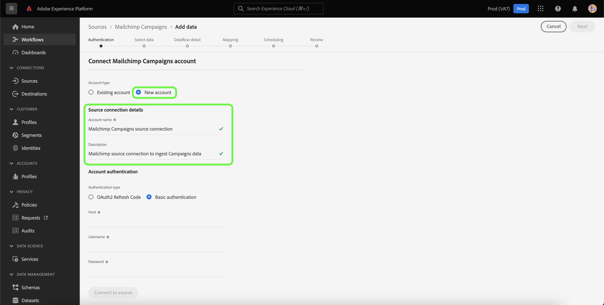

# 使用Experience Platform UI建立[!DNL Mailchimp Campaigns]來源連線

本教學課程提供建立[!DNL Mailchimp]來源聯結器的步驟，以使用使用者介面將[!DNL Mailchimp Campaigns]資料擷取至Adobe Experience Platform。

## 快速入門

本指南需要您深入了解下列 Adobe Experience Platform 元件：

* [來源](../../../../home.md)： Experience Platform允許從各種來源擷取資料，同時讓您能夠使用[!DNL Experience Platform]服務來建構、加標籤以及增強傳入的資料。
* [沙箱](../../../../../sandboxes/home.md)： Experience Platform提供的虛擬沙箱可將單一Experience Platform執行個體分割成個別的虛擬環境，以利開發及改進數位體驗應用程式。

## 收集必要的認證

為了將您的[!DNL Mailchimp Campaigns]資料帶入Experience Platform，您必須先提供對應至您[!DNL Mailchimp]帳戶的適當驗證認證。

[!DNL Mailchimp Campaigns]來源同時支援OAuth 2 Refresh Code和基本驗證，請參閱下表以瞭解這些驗證型別的詳細資訊。

### OAuth 2重新整理程式碼

| 認證 | 說明 |
| --- | --- |
| 網域 | 用來連線至MailChimp API的根URL。 根URL的格式為`https://{DC}.api.mailchimp.com`，其中`{DC}`代表與您的帳戶對應的資料中心。 |
| 授權測試URL | 將[!DNL Mailchimp]連線至Experience Platform時，會使用授權測試URL來驗證認證。 如果未提供，則會在來源連線建立步驟期間自動檢查認證。 |
| 存取權杖 | 用來驗證來源的對應存取權杖。 這是OAuth型驗證的必要專案。 |

如需使用OAuth 2向Experience Platform驗證您[!DNL Mailchimp]帳戶的詳細資訊，請參閱有關使用OAuth 2](https://mailchimp.com/developer/marketing/guides/access-user-data-oauth-2/)的此[[!DNL Mailchimp] 檔案。

### 基本驗證

| 認證 | 說明 |
| --- | --- |
| 網域 | 用來連線至MailChimp API的根URL。 根URL的格式為`https://{DC}.api.mailchimp.com`，其中`{DC}`代表與您的帳戶對應的資料中心。 |
| 使用者名稱 | 與您的MailChimp帳戶對應的使用者名稱。 這是基本驗證的必要專案。 |
| 密碼 | 與您的MailChimp帳戶對應的密碼。 這是基本驗證的必要專案。 |

## 將您的[!DNL Mailchimp Campaigns]帳戶連線至Experience Platform

在Experience Platform UI中，從左側導覽列選取&#x200B;**[!UICONTROL 來源]**&#x200B;以存取[!UICONTROL 來源]工作區。 [!UICONTROL 目錄]畫面會顯示您可以建立帳戶的各種來源。

您可以從熒幕左側的目錄中選取適當的類別。 或者，您可以使用搜尋選項來尋找您要使用的特定來源。

在[!UICONTROL 行銷自動化]類別下，選取&#x200B;**[!UICONTROL Mailchimp行銷活動]**，然後選取&#x200B;**[!UICONTROL 新增資料]**。

**[!UICONTROL 連線Mailchimp行銷活動帳戶]**&#x200B;頁面隨即顯示。 在此頁面中，您可以選取是要存取現有帳戶，還是選擇建立新帳戶。

### 現有帳戶

若要使用現有帳戶，請選取您要用來建立新資料流的[!DNL Mailchimp Campaigns]帳戶，然後選取[下一步] ]**以繼續。**[!UICONTROL 

### 新帳戶

如果您正在建立新帳戶，請選取&#x200B;**[!UICONTROL 新帳戶]**，然後為您的[!DNL Mailchimp Campaigns]來源連線詳細資料提供名稱和說明。

#### 使用OAuth 2進行驗證

若要使用OAuth 2，請選取[!UICONTROL OAuth 2重新整理代碼]，提供您網域的值、授權測試URL和存取權杖，然後選取&#x200B;**[!UICONTROL 連線至來源]**。 請稍等片刻讓您的認證驗證，然後選取[下一步] **[!UICONTROL 以繼續。]**

#### 使用基本驗證進行驗證

若要使用基本驗證，請選取[!UICONTROL 基本驗證]，提供您網域、使用者名稱和密碼的值，然後選取&#x200B;**[!UICONTROL 連線到來源]**。 請稍等片刻讓您的認證驗證，然後選取[下一步] **[!UICONTROL 以繼續。]**

### 選取[!DNL Mailchimp Campaigns]資料

在驗證您的來源之後，您必須提供與您的[!DNL Mailchimp Campaigns]帳戶相對應的`campaignId`。

在[!UICONTROL 選取資料]頁面上，輸入您的`campaignId`，然後選取&#x200B;**[!UICONTROL 探索]**。

頁面會更新為互動式結構描述樹狀結構，讓您探索及檢查資料的階層。 選取&#x200B;**[!UICONTROL 下一步]**&#x200B;以繼續。

## 後續步驟

在您的[!DNL Mailchimp]帳戶通過驗證且已選取[!DNL Mailchimp Campaigns]資料後，您現在可以開始建立資料流，將您的資料匯入Experience Platform。 如需有關如何建立資料流的詳細步驟，請參閱有關[建立資料流，以將行銷自動化資料帶到Experience Platform](../../dataflow/marketing-automation.md)的檔案。
