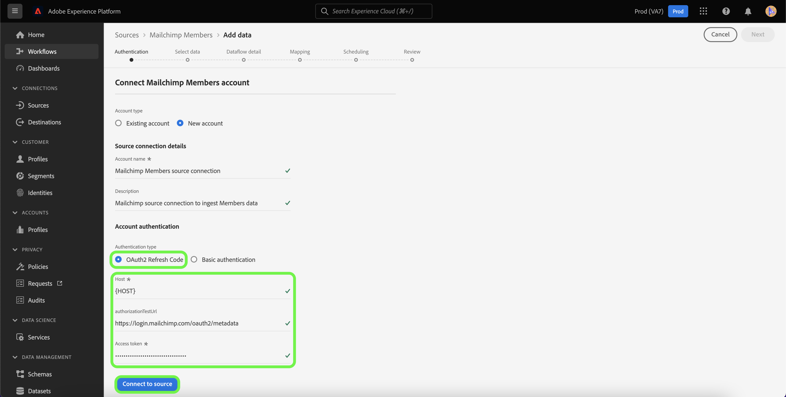

# 建立 [!DNL Mailchimp Members] 使用平台UI的源連接

本教程提供建立 [!DNL Mailchimp] 源連接器以接收 [!DNL Mailchimp Members] 資料到Adobe Experience Platform。

## 快速入門

本指南要求對Adobe Experience Platform的下列組成部分有工作上的理解：

* [源](../../../../home.md):平台允許從各種源接收資料，同時讓您能夠使用 [!DNL Platform] 服務。
* [沙箱](../../../../../sandboxes/home.md):平台提供虛擬沙箱，將單個平台實例分區為獨立的虛擬環境，以幫助開發和發展數字型驗應用程式。

## 收集所需憑據

為了把你 [!DNL Mailchimp Members] 資料到平台時，必須首先提供與您的 [!DNL Mailchimp] 帳戶。

的 [!DNL Mailchimp Members] 源支援OAuth 2刷新代碼和基本身份驗證。 有關這些驗證類型的詳細資訊，請參閱下表。

### OAuth 2刷新代碼

| 憑據 | 說明 |
| --- | --- |
| 網域 | 用於連接到MailChimp API的根URL。 根URL的格式為 `https://{DC}.api.mailchimp.com`，也請參見Wiki頁。 `{DC}` 表示與您的帳戶對應的資料中心。 |
| 授權testURL | 授權testURL用於在連接時驗證憑據 [!DNL Mailchimp] 到平台。 如果未提供此功能，則在建立源連接步驟期間會自動檢查憑據。 |
| 訪問令牌 | 用於驗證源的相應訪問令牌。 這是基於OAuth的身份驗證所必需的。 |

有關使用OAuth 2驗證您的 [!DNL Mailchimp] 帳戶到平台，請參閱 [[!DNL Mailchimp] 使用OAuth 2的文檔](https://mailchimp.com/developer/marketing/guides/access-user-data-oauth-2/)。

### 基本身份驗證

| 憑據 | 說明 |
| --- | --- |
| 網域 | 用於連接到MailChimp API的根URL。 根URL的格式為 `https://{DC}.api.mailchimp.com`，也請參見Wiki頁。 `{DC}` 表示與您的帳戶對應的資料中心。 |
| 用戶名 | 與MailChimp帳戶對應的用戶名。 這是基本身份驗證所必需的。 |
| 密碼 | 與MailChimp帳戶對應的密碼。 這是基本身份驗證所必需的。 |

## 連接 [!DNL Mailchimp Members] 帳戶到平台

在平台UI中，選擇 **[!UICONTROL 源]** 從左導航欄訪問 [!UICONTROL 源] 工作區。 的 [!UICONTROL 目錄] 螢幕顯示可建立帳戶的各種源。

可以從螢幕左側的目錄中選擇相應的類別。 或者，您可以使用搜索選項找到要使用的特定源。

在 [!UICONTROL 營銷自動化] 類別，選擇 **[!UICONTROL Mailchimp活動]**，然後選擇 **[!UICONTROL 添加資料]**。

的 **[!UICONTROL 連接郵件活動帳戶]** 的子菜單。 在此頁上，您可以選擇是訪問現有帳戶還是選擇建立新帳戶。

### 現有帳戶

要使用現有帳戶，請選擇 [!DNL Mailchimp Members] 要使用建立新資料流的帳戶，然後選擇 **[!UICONTROL 下一個]** 繼續。

### 新帳戶

如果要建立新帳戶，請選擇 **[!UICONTROL 新帳戶]**，然後提供您的名稱和說明 [!DNL Mailchimp Members] 源連接詳細資訊。

#### 使用OAuth 2進行身份驗證

要使用OAuth 2，請選擇 [!UICONTROL OAuth 2刷新代碼]，為域、授權testURL和訪問令牌提供值，然後選擇 **[!UICONTROL 連接到源]**。 允許您的憑據稍作驗證，然後選擇 **[!UICONTROL 下一個]** 繼續。

#### 使用基本身份驗證進行身份驗證

要使用基本身份驗證，請選擇 [!UICONTROL 基本身份驗證]，提供域、用戶名和密碼的值，然後選擇 **[!UICONTROL 連接到源]**。 允許您的憑據稍作驗證，然後選擇 **[!UICONTROL 下一個]** 繼續。

### 選擇 [!DNL Mailchimp Members] 資料

在源經過身份驗證後，必須提供 `listId` 與 [!DNL Mailchimp Members] 帳戶。

在 [!UICONTROL 選擇資料] 輸入 `listId` ，然後選擇 **[!UICONTROL 瀏覽]**。

該頁將更新到互動式架構樹中，以便您瀏覽和檢查資料的層次結構。 選擇 **[!UICONTROL 下一個]** 繼續。

## 後續步驟

與 [!DNL Mailchimp] 已驗證帳戶， [!DNL Mailchimp Members] 選擇資料後，您現在可以開始建立資料流，以將資料帶到平台。 有關如何建立資料流的詳細步驟，請參見上的文檔 [建立資料流，將營銷自動化資料帶到平台](../../dataflow/marketing-automation.md)。
