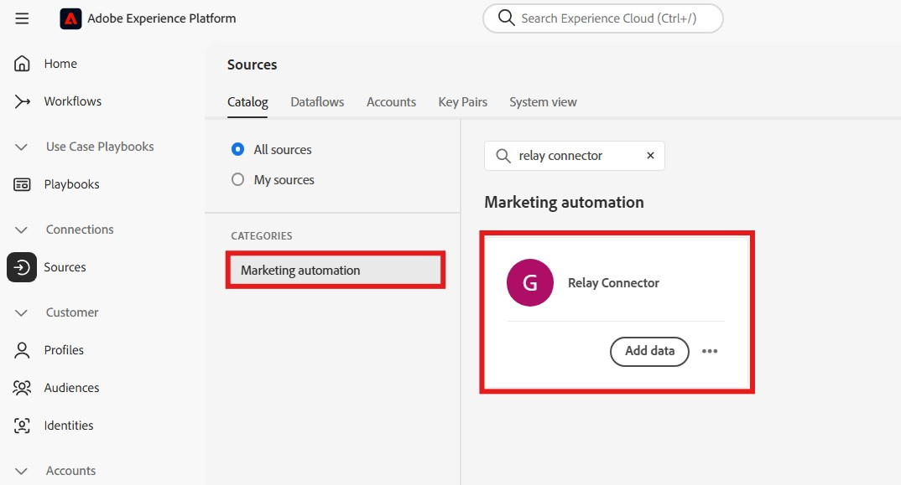
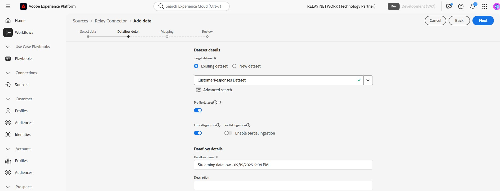

# 在UI中將轉送連線至Experience Platform

>[!NOTE]
>
>[!DNL Relay Connector]來源是測試版。 如需使用Beta版標籤來源的相關資訊，請參閱[來源概觀](../../../../home.md#terms-and-conditions)。

透過[!DNL Relay Connector]，您可以在客戶歷程中最有意義的時刻，為其提供個人化體驗，協助您建立更穩固的關係，並透過建立輸入連線，將事件從您的[!DNL Relay Network]整合至Adobe Experience Platform串流，以提高忠誠度和價值。

閱讀本指南以瞭解如何在Experience Platform UI的來源工作區中使用[!DNL Relay Connector]。

>[!IMPORTANT]
>
>此檔案頁面是由&#x200B;*[!DNL Relay Network]*&#x200B;團隊維護。 若有任何查詢或更新要求，請直接透過&#x200B;*[[!DNL Relay Network]](https://www.relaynetwork.com/)或電子郵件[info@relaynetwork.com](mailto:info@relaynetwork.com)*&#x200B;聯絡他們。

## 連線您的[!DNL Relay Connector]來源

在Experience Platform UI中，從左側導覽列選取&#x200B;**[!UICONTROL 來源]**&#x200B;以存取[!UICONTROL 來源]工作區。 [!UICONTROL 目錄]畫面會顯示您可以建立帳戶的各種來源。 您可以從畫面左側的目錄中選取適當的類別，或使用搜尋選項來尋找特定來源。

在&#x200B;*[!UICONTROL 行銷自動化]*&#x200B;類別下，選取[!DNL Relay Connector]來源卡片並選取&#x200B;**[!UICONTROL 新增資料]**。

>[!TIP]
>
>當不存在已驗證的帳戶時，來源目錄中的來源會顯示&#x200B;**[!UICONTROL 設定]**&#x200B;選項。 帳戶通過驗證後，此選項會變更為&#x200B;**[!UICONTROL 新增資料]**。

### 選取資料

**[!UICONTROL 連線轉送聯結器來源]**&#x200B;介面出現。 使用&#x200B;*[!UICONTROL 選取資料]*&#x200B;介面來瀏覽或指定來源資料結構描述。 或者，您可以上傳範例JSON檔案來定義來源結構描述。

>[!NOTE]
>
>可接受的檔案大小為1GB。

上傳資料後，您可以使用[!UICONTROL 預覽範例資料]區段來預覽資料。

### 資料流詳細資料

接著，使用&#x200B;*[!UICONTROL 資料流詳細資料]*&#x200B;介面為您的資料流提供&#x200B;**名稱**&#x200B;和&#x200B;**選擇性描述**。 此外，請選取您要使用的&#x200B;**[!UICONTROL 目標資料集]**。 您可以建立新資料集或使用現有資料集。

### 對應

您可以使用自動對應功能將來源欄位對應至XDM結構描述欄位（此功能會根據欄位的名稱來比對欄位），或是建立自訂對應以取得更精確的控制項。 如有需要，您也可以套用串連、格式化或重新命名等轉換，以確保您的資料完全符合目標結構描述。 如需對應的詳細資訊，請閱讀[資料準備UI指南](../../../../../data-prep/ui/mapping.md)。

>[!TIP]
>
>如需Relay將傳送至您來源的事件型別和資料值詳細資訊，請閱讀[[!DNL Relay Network] 推播事件](https://docs.relaynetwork.com/docs/push-events)檔案。 此資訊可協助您正確設計&#x200B;**體驗事件結構描述**。

### 審閱

最後，檢閱所有設定，包括您的&#x200B;**來源、資料集和對應**。 完成後，選取&#x200B;**完成**&#x200B;以建立資料流。

### 擷取您的串流端點URL

建立資料流後，您會在資料流頁面右側的&#x200B;*屬性*&#x200B;區段中，找到&#x200B;**串流端點URL**&#x200B;及其他相關詳細資料。

使用這些值在&#x200B;**轉送主控台**&#x200B;中設定webhook。 如需設定推播的詳細指示，請參閱轉送檔案： [設定推播API](https://docs.relaynetwork.com/docs/configuring-the-push-api)。

## 其他資源

* [使用Flow Service API建立新的連線規格](https://experienceleague.adobe.com/en/docs/experience-platform/sources/sdk/streaming-sdk/create)
* [使用UI連線到您的來源](https://experienceleague.adobe.com/en/docs/experience-platform/sources/sdk/streaming-sdk/submit#test-your-source-using-the-ui)
