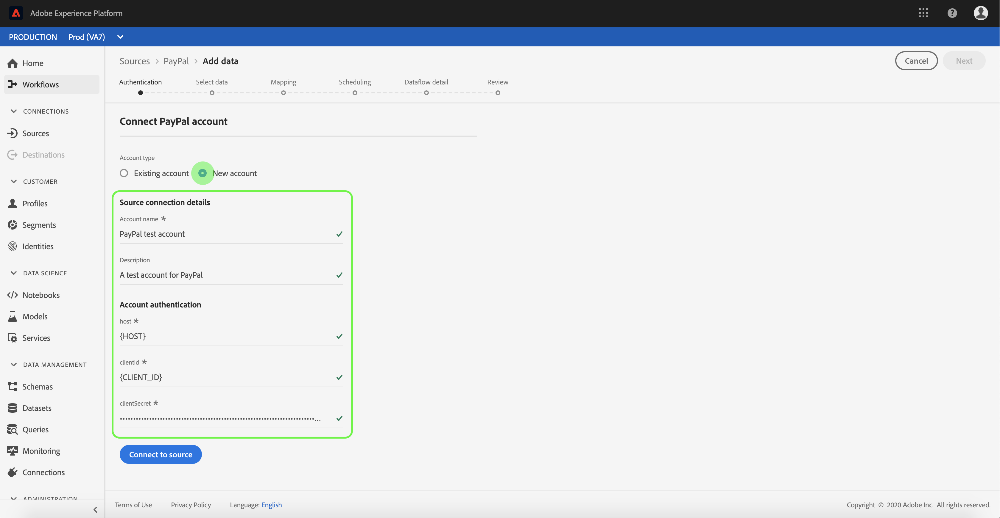

# 在使用者介面中建立[!DNL PayPal]來源連線

>[!IMPORTANT]
>
>[!DNL PayPal]來源將於2025年5月底淘汰。

Adobe Experience Platform中的Source聯結器可讓您依排程擷取外部來源資料。 本教學課程提供使用Platform使用者介面建立[!DNL PayPal]來源聯結器的步驟。

## 快速入門

本教學課程需要您實際瞭解下列Adobe Experience Platform元件：

* [[!DNL Experience Data Model (XDM)] 系統](../../../../../xdm/home.md)： [!DNL Experience Platform]用來組織客戶體驗資料的標準化架構。
   * [結構描述組合的基本概念](../../../../../xdm/schema/composition.md)：瞭解XDM結構描述的基本建置區塊，包括結構描述組合中的關鍵原則和最佳實務。
   * [結構描述編輯器教學課程](../../../../../xdm/tutorials/create-schema-ui.md)：瞭解如何使用結構描述編輯器使用者介面建立自訂結構描述。
* [[!DNL Real-Time Customer Profile]](../../../../../profile/home.md)：根據來自多個來源的彙總資料，提供統一的即時消費者設定檔。

如果您已經有有效的[!DNL PayPal]連線，您可以略過本檔案的其餘部分，並繼續進行有關[設定資料流](../../dataflow/payments.md)的教學課程

### 收集必要的認證

若要存取您的[!DNL PayPal]帳戶平台，您必須提供下列值：

| 認證 | 說明 |
| ---------- | ----------- |
| `host` | [!DNL PayPal]執行個體的網址。 |
| `clientID` | 與您的[!DNL PayPal]應用程式關聯的使用者端識別碼。 |
| `clientSecret` | 與您的[!DNL PayPal]應用程式關聯的使用者端密碼。 |

如需開始使用的詳細資訊，請參閱此[[!DNL PayPal] 檔案](https://developer.paypal.com/docs/api/overview/#get-credentials)

## 連線您的[!DNL PayPal]帳戶

收集必要的認證後，您可以依照下列步驟將[!DNL PayPal]帳戶連結至Platform。

登入[Adobe Experience Platform](https://platform.adobe.com)，然後從左側導覽列中選取&#x200B;**[!UICONTROL 來源]**&#x200B;以存取&#x200B;**[!UICONTROL 來源]**&#x200B;工作區。 **[!UICONTROL 目錄]**&#x200B;畫面會顯示您可以建立帳戶的各種來源。

您可以從熒幕左側的目錄中選取適當的類別。 或者，您可以使用搜尋選項來尋找您要使用的特定來源。

在&#x200B;**[!UICONTROL 付款]**&#x200B;類別下，選取&#x200B;**[!UICONTROL PayPal]**。 如果這是您第一次使用此聯結器，請選取&#x200B;**[!UICONTROL 設定]**。 否則，請選取&#x200B;**[!UICONTROL 新增資料]**&#x200B;以建立新的[!DNL PayPal]聯結器。

**[!UICONTROL 連線至PayPal]**&#x200B;頁面隨即顯示。 您可以在此頁面使用新的證明資料或現有的證明資料。

### 新帳戶

如果您正在使用新認證，請選取&#x200B;**[!UICONTROL 新帳戶]**。 在出現的輸入表單上，提供名稱、選擇性說明和您的[!DNL PayPal]認證。 完成時，請選取&#x200B;**[!UICONTROL 連線]**，然後等待一段時間以建立新連線。

### 現有帳戶

若要連線現有帳戶，請選取您要連線的[!DNL PayPal]帳戶，然後選取[下一步]**[!UICONTROL 以繼續。]**

## 後續步驟

依照本教學課程中的指示，您已建立與[!DNL PayPal]帳戶的連線。 您現在可以繼續下一個教學課程，並[設定資料流，將付款資料帶入Platform](../../dataflow/payments.md)。
