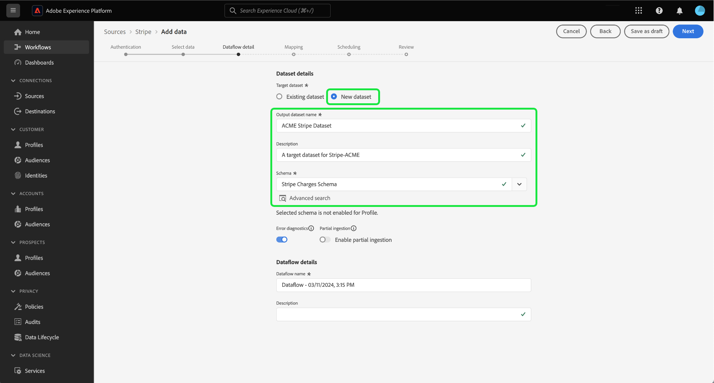
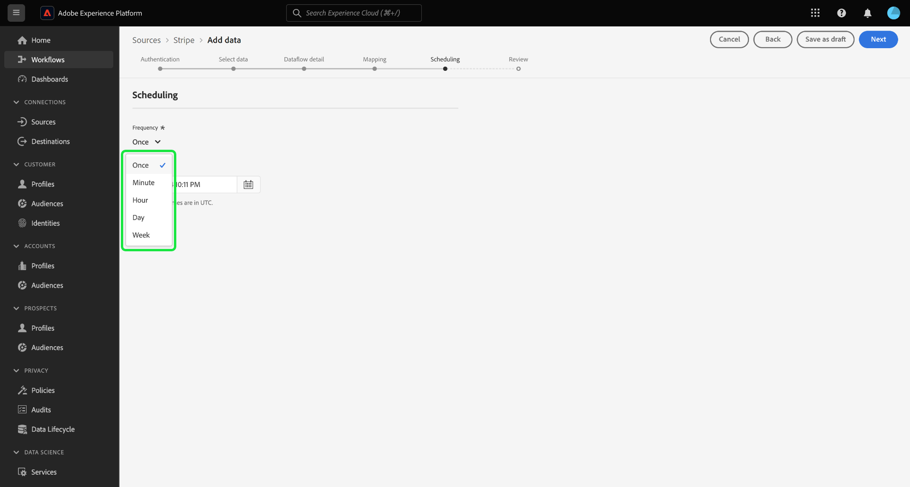

# 從您的擷取付款資料 [!DNL Stripe] 使用使用者介面Experience Platform的帳戶

>[!NOTE]
>
>此 [!DNL Stripe] 來源為測試版。 閱讀 [條款與條件](../../../../home.md#terms-and-conditions) 如需使用Beta版標籤來源的詳細資訊，請參閱來源概觀。

請閱讀下列教學課程，瞭解如何從擷取付款資料 [!DNL Stripe] 使用使用者介面登入Adobe Experience Platform帳戶。

## 快速入門

本教學課程需要您實際瞭解下列Experience Platform元件：

* [[!DNL Experience Data Model (XDM)] 系統](../../../../../xdm/home.md)：作為依據的標準化架構 [!DNL Experience Platform] 組織客戶體驗資料。
   * [結構描述組合基本概念](../../../../../xdm/schema/composition.md)：瞭解XDM結構描述的基本建置區塊，包括結構描述組合中的關鍵原則和最佳實務。
   * [結構描述編輯器教學課程](../../../../../xdm/tutorials/create-schema-ui.md)：瞭解如何使用結構編輯器UI建立自訂結構描述。
* [[!DNL Real-Time Customer Profile]](../../../../../profile/home.md)：根據來自多個來源的彙總資料，提供統一的即時消費者個人檔案。

### 驗證

閱讀 [[!DNL Stripe] 概述](../../../../connectors/payments/stripe.md) 以取得如何擷取驗證認證的相關資訊。

## 連線您的 [!DNL Stripe] 帳戶 {#connect}

在Platform UI中選取 **[!UICONTROL 來源]** 從左側導覽存取 [!UICONTROL 來源] 工作區。 您可以從熒幕左側的目錄中選取適當的類別。 或者，您可以使用搜尋選項來尋找您要使用的特定來源。

在 *付款* 類別，選取 **[!DNL Stripe]**，然後選取 **[!UICONTROL 設定]**.

>[!TIP]
>
>來源目錄中的來源會顯示 **[!UICONTROL 設定]** 選項，當指定的來源尚未擁有已驗證的帳戶時。 一旦驗證帳戶存在，此選項就會變更為 **[!UICONTROL 新增資料]**.

此 **[!UICONTROL 連線Stripe帳戶]** 頁面便會顯示。 您可以在此頁面使用新的或現有的證明資料。

>[!BEGINTABS]

>[!TAB 建立新帳戶]

若要建立新帳戶，請選取 **[!UICONTROL 新帳戶]** 並提供名稱、選擇性說明和您的認證。

完成後，選取 **[!UICONTROL 連線到來源]** 然後等待一段時間以建立新連線。

| 認證 | 說明 |
| --- | --- |
| 存取權杖 | 您的 [!DNL Stripe] 存取權杖。 如需如何擷取存取Token的詳細資訊，請參閱 [[!DNL Stripe] 驗證指南](../../../../connectors/payments/stripe.md). |

>[!TAB 使用現有帳戶]

若要使用現有帳戶，請選取 **[!UICONTROL 現有帳戶]** 然後從現有帳戶目錄中選取您要使用的帳戶。

選取 **[!UICONTROL 下一個]** 以繼續進行。

>[!ENDTABS]

## 選取資料 {#select-data}

現在您已擁有帳戶的存取權，您必須識別 [!DNL Stripe] 您要擷取的資料。 選取 **[!UICONTROL 資源路徑]** 然後選取您要從中擷取資料的端點。 可用的 [!DNL Stripe] 端點包括：

* 費用
* 訂閱
* 退款
* 餘額交易
* 客戶
* 價格

選取端點後，介面會更新為預覽畫面，顯示 [!DNL Stripe] 您選取的端點。 選取 **[!UICONTROL 下一個]** 以繼續進行。

## 提供資料集和資料流詳細資料 {#provide-dataset-and-dataflow-details}

接下來，您必須提供有關資料集和資料流的資訊。

### 資料集詳細資訊 {#dataset-details}

資料集是資料集合的儲存和管理結構，通常是包含方案 (欄) 和欄位 (列) 的表格。 成功擷取到Experience Platform的資料會以資料集的形式儲存在資料湖中。 在此步驟中，您可以建立新資料集或使用現有資料集。

>[!BEGINTABS]

>[!TAB 使用新資料集]

若要使用新資料集，請選取「 」 **[!UICONTROL 新資料集]** 然後為您的資料集提供名稱和說明（選用）。 您也必須選取您的資料集所要遵守的Experience Data Model (XDM)結構。

| 新資料集詳細資料 | 說明 |
| --- | --- |
| 輸出資料集名稱 | 新資料集的名稱。 |
| 說明 | （選用）新資料集的簡短說明。 |
| 綱要 | 貴組織中現有的結構描述下拉式清單。 您也可以在來源設定程式之前建立自己的結構描述。 如需詳細資訊，請閱讀以下指南： [在UI中建立XDM結構描述](../../../../../xdm/tutorials/create-schema-ui.md). |

>[!TAB 使用現有的資料集]

如果您已有現有的資料集，請選取「 」 **[!UICONTROL 現有資料集]** 然後使用 **[!UICONTROL 進階搜尋]** 用於檢視貴組織中所有資料集視窗的選項，包括其個別詳細資訊，例如是否啟用這些資料集以擷取至即時客戶設定檔。

>[!ENDTABS]

+++選取步驟以啟用設定檔擷取、錯誤診斷及部分擷取。

如果您的資料集已啟用即時客戶個人檔案，那麼在此步驟中，您可以切換 **[!UICONTROL 設定檔資料集]** 啟用您的資料以供設定檔擷取。 您也可以使用此步驟來啟用 **[!UICONTROL 錯誤診斷]** 和 **[!UICONTROL 部分擷取]**.

* **[!UICONTROL 錯誤診斷]**：選取 **[!UICONTROL 錯誤診斷]** 指示來源產生錯誤診斷，以便您稍後在監控資料集活動和資料流狀態時參考。
* **[!UICONTROL 部分擷取]**：部分批次擷取是指擷取包含錯誤的資料的能力，上限為特定可設定的臨界值。 此功能可讓您將所有精確資料成功擷取到Experience Platform，同時所有不正確的資料會個別批次處理，並提供無效原因的資訊。

+++

### 資料流詳細資料 {#dataflow-details}

設定資料集後，您必須提供資料流的詳細資訊，包括名稱、選用的說明和警報設定。

| 資料流設定 | 說明 |
| --- | --- |
| 資料流名稱 | 資料流的名稱。  依預設，這將使用正在匯入的檔案名稱。 |
| 說明 | （選用）資料流的簡短說明。 |
| 警報 | Experience Platform可產生使用者可訂閱的事件型警報。 這些選項都需要執行中的資料流才能觸發。  如需詳細資訊，請閱讀 [警報概觀](../../alerts.md) <ul><li>**來源資料流執行開始**：選取此警報以在資料流執行開始時收到通知。</li><li>**來源資料流執行成功**：選取此警報可在您的資料流結束且沒有任何錯誤時收到通知。</li><li>**來源資料流執行失敗**：選取此警報可在您的資料流執行結束時，收到任何錯誤的通知。</li></ul> |

完成後，選取 **[!UICONTROL 下一個]** 以繼續進行。

## 將欄位對應至XDM結構描述 {#mapping}

此 **[!UICONTROL 對應]** 步驟隨即顯示。 使用對應介面將來源資料對應到適當的結構描述欄位，然後再將該資料擷取到Experience Platform。 如需如何使用對應介面的詳細指南，請參閱 [資料準備UI指南](../../../../../data-prep/ui/mapping.md) 以取得詳細資訊。

## 設定擷取排程 {#scheduling}

接下來，使用排程介面為資料流建立擷取排程。

選取頻率下拉式清單，以設定資料流的擷取頻率。

您也可以選取行事曆圖示，並使用快顯行事曆來設定擷取開始時間。

| 正在排程設定 | 說明 |
| --- | --- |
| 頻率 | 設定頻率以指出資料流執行的頻率。 您可以將頻率設為： <ul><li>**一次**：將頻率設為 `once` 以建立一次性內嵌。 建立一次性擷取資料流時，無法使用間隔和回填的設定。 依預設，排程頻率會設定為一次。</li><li>**分鐘**：將頻率設為 `minute` 排程您的資料流以每分鐘擷取資料。</li><li>**小時**：將頻率設為 `hour` 排程您的資料流以每小時擷取資料。</li><li>**日**：將頻率設為 `day` 排程您的資料流每日擷取資料。</li><li>**周**：將頻率設為 `week` 排程您的資料流每週擷取資料。</li></ul> |
| 間隔 | 選取頻率後，您就可以設定間隔設定，以建立每次擷取之間的時間範圍。 例如，如果您將頻率設為「天」，並將間隔設為15，則您的資料流將每隔15天執行一次。 **注意**：您無法將間隔設為零。 |
| 開始時間 | 預計執行的時間戳記，以UTC時區顯示。 |
| 回填 | 回填會決定最初要擷取的資料。 如果已啟用回填，則會在第一次排程擷取期間擷取指定路徑中的所有目前檔案。 如果停用回填，則只會擷取在第一次內嵌執行到開始時間之間載入的檔案。 將不會擷取在開始時間之前載入的檔案。 |

設定資料流的擷取排程後，請選取「 」 **[!UICONTROL 下一個]**.

## 檢閱您的資料流

資料流建立流程的最後一步是在執行資料流之前進行檢閱。 使用 **[!UICONTROL 檢閱]** 執行此步驟前，請先檢閱新資料流的詳細資訊。 詳細資料會分組到以下類別中：

* **連線**：顯示來源型別、所選來源檔案的相關路徑，以及該來源檔案中的欄數。
* **指派資料集並對映欄位**：顯示要將來源資料擷取到哪個資料集中，包括資料集所堅持的結構描述。
* **正在排程**：顯示擷取排程的作用中期間、頻率和間隔。

檢閱資料流後，選取「 」 **[!UICONTROL 完成]** 並留出一些時間建立資料流。

## 後續步驟

按照本教學課程中的指示，您已成功建立資料流，以將付款資料從 [!DNL Stripe] 來源以Experience Platform。 如需其他資源，請瀏覽以下概述的檔案。

### 監視資料流

建立資料流後，您可以監視透過它擷取的資料，以檢視擷取率、成功和錯誤的資訊。 如需如何監視資料流的詳細資訊，請瀏覽上的教學課程 [在UI中監視帳戶和資料流](../../../../../dataflows/ui/monitor-sources.md).

### 更新您的資料流

若要更新資料流排程、對應和一般資訊的設定，請造訪本教學課程： [在UI中更新來源資料流程](../../update-dataflows.md).

### 刪除您的資料流

您可以刪除不再需要的資料流，或是使用建立的資料流不正確。 **[!UICONTROL 刪除]** 函式位於 **[!UICONTROL 資料流]** 工作區。 如需如何刪除資料流的詳細資訊，請前往上的教學課程： [在UI中刪除資料流](../../delete.md).
