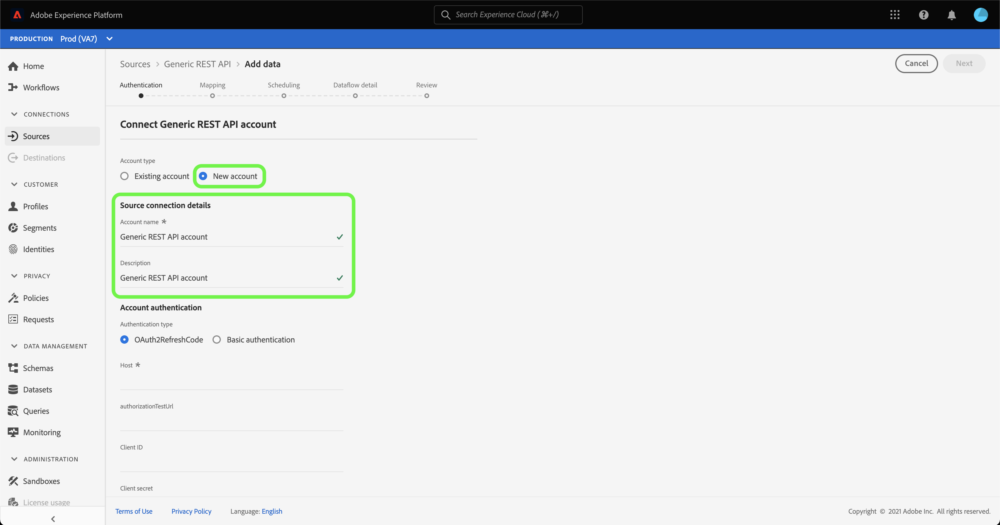

# 建立 [!DNL Generic REST API] UI中的源連接

>[!NOTE]
>
> 此 [!DNL Generic REST API] 來源為測試版。 請參閱 [來源概觀](../../../../home.md#terms-and-conditions) 有關使用測試版標籤連接器的詳細資訊。

本教學課程提供建立 [!DNL Generic REST API] 來源連接器(使用Adobe Experience Platform使用者介面)。

## 快速入門

本教學課程需要妥善了解Platform的下列元件：

* [來源](../../../../home.md):Experience Platform可讓您從各種來源擷取資料，同時使用Platform服務來建構、加標籤及增強傳入資料。
* [沙箱](../../../../../sandboxes/home.md):Experience Platform提供可將單一Platform執行個體分割成個別虛擬環境的虛擬沙箱，以協助開發及改進數位體驗應用程式。

### 收集所需憑據

若要存取 [!DNL Generic REST API] 帳戶，您必須針對您選擇的驗證類型提供有效憑證。 一般REST API支援OAuth 2重新整理程式碼和基本驗證。 有關兩種受支援身份驗證類型的憑據的資訊，請參閱下表。

#### OAuth 2重新整理程式碼

| 憑據 | 說明 |
| --- | --- |
| Host | 您向其提出請求的來源的主機URL。 此值為必要值，無法使用請求參數覆蓋來略過此值。 |
| 授權測試URL | （可選）建立基本連線時，授權測試URL用於驗證憑證。 如果未提供，則在建立源連接步驟期間將自動檢查憑據。 |
| 用戶端ID | （選用）與您的使用者帳戶相關聯的用戶端ID。 |
| 用戶端密碼 | （選用）與您的使用者帳戶相關聯的用戶端密碼。 |
| 存取權杖 | 用於訪問應用程式的主身份驗證憑據。 存取權杖代表您應用程式存取使用者資料之特定方面的授權。 此值為必要值，無法使用請求參數覆蓋來略過此值。 |
| 重新整理Token | （選用）存取權杖過期時用來產生新存取權杖的權杖。 |
| 存取權杖URL | （選用）用來擷取存取權杖的URL端點。 |
| 請求參數覆寫 | （可選）可讓您指定要覆寫的憑證參數的屬性。 |

#### 基本驗證

| 憑據 | 說明 |
| --- | --- |
| Host | 您向其提出請求的來源的主機URL。 |
| 使用者名稱 | 與您的使用者帳戶對應的使用者名稱。 |
| 密碼 | 與您的使用者帳戶對應的密碼。 |

## 連線您的一般REST API帳戶

在平台UI中，選取 **[!UICONTROL 來源]** 從左側導覽器存取 [!UICONTROL 來源] 工作區。 此 [!UICONTROL 目錄] 畫面會顯示您可以用來建立帳戶的各種來源。

您可以從畫面左側的目錄中選取適當的類別。 或者，您也可以使用搜尋列找到您要使用的特定來源。

在 [!UICONTROL 通訊協定] 類別，選擇 **[!UICONTROL 一般REST API]** 然後選取 **[!UICONTROL 新增資料]**.

此 **[!UICONTROL 連線至一般REST API]** 頁。 在此頁面上，您可以使用新憑證或現有憑證。

### 現有帳戶

若要連線現有帳戶，請選取您要連線的一般REST API帳戶，然後選取 **[!UICONTROL 下一個]** 繼續。

### 新帳戶

如果您要建立新帳戶，請選取 **[!UICONTROL 新帳戶]**，然後提供新的 [!DNL Generic REST API] 帳戶。

#### 使用OAuth 2重新整理程式碼進行驗證

[!DNL Generic REST API] 支援OAuth 2重新整理程式碼和基本驗證。 若要使用OAuth2驗證進行驗證，請選取 **[!UICONTROL OAuth2RefreshCode]**，請提供您的OAuth 2憑證，然後選取 **[!UICONTROL 連接到源]**.

#### 使用基本身份驗證進行身份驗證

要使用基本身份驗證，請選擇 **[!UICONTROL 基本驗證]**，請提供您的主機、使用者名稱和密碼，然後選取 **[!UICONTROL 連接到源]**.

## 後續步驟

依照本教學課程，您已建立與一般REST API帳戶的連線。 您現在可以繼續下一個教學課程，以及 [配置資料流以將資料導入Platform](../../dataflow/protocols.md).
