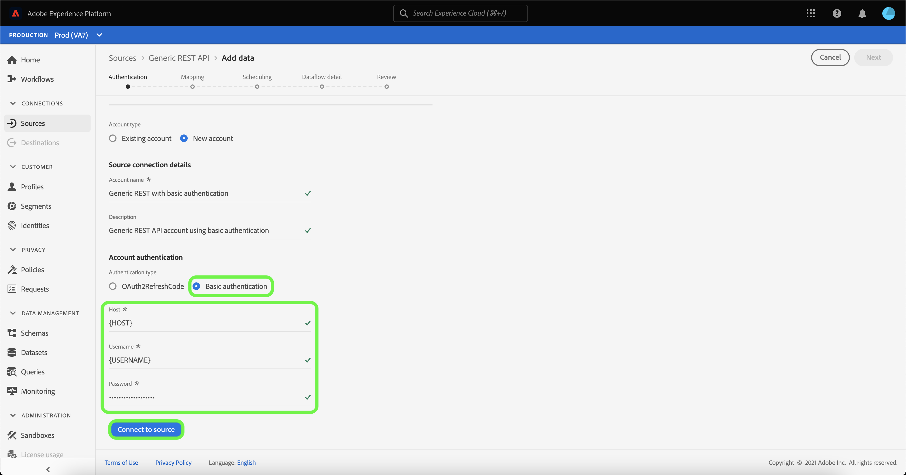

# 建立 [!DNL Generic REST API] UI中的源連接

>[!NOTE]
>
> 的 [!DNL Generic REST API] 源為beta。 查看 [源概述](../../../../home.md#terms-and-conditions) 的子菜單。

本教程提供建立 [!DNL Generic REST API] 使用Adobe Experience Platform用戶介面的源連接器。

## 快速入門

本教程需要瞭解平台的以下元件：

* [源](../../../../home.md):Experience Platform允許從各種源接收資料，同時讓您能夠使用平台服務構建、標籤和增強傳入資料。
* [沙箱](../../../../../sandboxes/home.md):Experience Platform提供虛擬沙箱，將單個平台實例分區為獨立的虛擬環境，以幫助開發和發展數字型驗應用程式。

### 收集所需憑據

為了訪問 [!DNL Generic REST API] 帳戶，必須為所選的身份驗證類型提供有效的憑據。 通用REST API支援OAuth 2刷新代碼和基本身份驗證。 有關兩種支援的身份驗證類型的憑據的資訊，請參見下表。

#### OAuth 2刷新代碼

| 憑據 | 說明 |
| --- | --- |
| Host | 向其請求的源的主機URL。 此值是必需的，無法使用請求參數覆蓋跳過。 |
| 授權testURL | （可選）授權testURL用於在建立基連接時驗證憑據。 如果未提供，則在建立源連接步驟期間會自動檢查憑據。 |
| 客戶端ID | （可選）與您的用戶帳戶關聯的客戶端ID。 |
| 客戶端密碼 | （可選）與您的用戶帳戶關聯的客戶端密碼。 |
| 訪問令牌 | 用於訪問應用程式的主身份驗證憑據。 訪問令牌表示應用程式訪問用戶資料的特定方面的授權。 此值是必需的，無法使用請求參數覆蓋跳過。 |
| 刷新標籤 | （可選）當訪問令牌過期時用於生成新訪問令牌的令牌。 |
| 訪問令牌URL | （可選）用於獲取訪問令牌的URL終結點。 |
| 請求參數覆蓋 | （可選）允許指定要覆蓋的憑據參數的屬性。 |

#### 基本身份驗證

| 憑據 | 說明 |
| --- | --- |
| Host | 向其請求的源的主機URL。 |
| 用戶名 | 與您的用戶帳戶對應的用戶名。 |
| 密碼 | 與您的用戶帳戶對應的密碼。 |

## 連接通用REST API帳戶

在平台UI中，選擇 **[!UICONTROL 源]** 從左側導航 [!UICONTROL 源] 工作區。 的 [!UICONTROL 目錄] 螢幕顯示可建立帳戶的各種源。

可以從螢幕左側的目錄中選擇相應的類別。 或者，您可以使用搜索欄找到要使用的特定源。

在 [!UICONTROL 協定] 類別，選擇 **[!UICONTROL 通用REST API]** ，然後選擇 **[!UICONTROL 添加資料]**。

的 **[!UICONTROL 連接到通用REST API]** 的子菜單。 在此頁上，您可以使用新憑據或現有憑據。

### 現有帳戶

要連接現有帳戶，請選擇要連接的通用REST API帳戶，然後選擇 **[!UICONTROL 下一個]** 繼續。

### 新帳戶

如果要建立新帳戶，請選擇 **[!UICONTROL 新帳戶]**，然後提供新名稱和選項說明 [!DNL Generic REST API] 帳戶。

#### 使用OAuth 2刷新代碼進行身份驗證

[!DNL Generic REST API] 支援OAuth 2刷新代碼和基本身份驗證。 要使用OAuth2身份驗證進行身份驗證，請選擇 **[!UICONTROL OAuth2RefreshCode]**，提供OAuth 2憑據，然後選擇 **[!UICONTROL 連接到源]**。

#### 使用基本身份驗證進行身份驗證

要使用基本身份驗證，請選擇 **[!UICONTROL 基本身份驗證]**，提供主機、用戶名和密碼，然後選擇 **[!UICONTROL 連接到源]**。

## 後續步驟

按照本教程，您已建立了與通用REST API帳戶的連接。 現在，您可以繼續下一個教程， [配置資料流以將資料引入平台](../../dataflow/protocols.md)。
