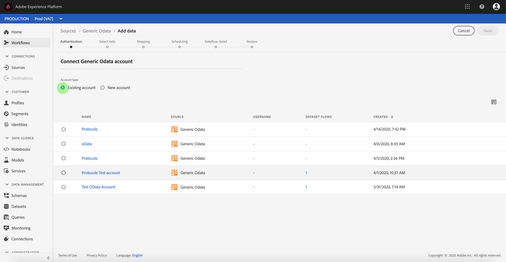

# 在UI中建立通用OData來源連接器

> [!NOTE]
> Generic OData連接器為beta版。 如需使用 [測試版標籤連接器的詳細資訊](../../../../home.md#terms-and-conditions) ，請參閱來源概觀。

Adobe Experience Platform中的來源連接器可讓您依計畫吸收外部來源的資料。 本教學課程提供使用平台使用者介面建立通用開放資料通訊協定（以下稱為「OData」）來源連接器的步驟。

## 快速入門

本教學課程需要對Adobe Experience Platform的下列元件有正確的認識：

* [體驗資料模型(XDM)系統](../../../../../xdm/home.md): Experience Platform組織客戶體驗資料的標準化架構。
   * [架構構成基礎](../../../../../xdm/schema/composition.md): 瞭解XDM架構的基本建置區塊，包括架構組合的主要原則和最佳實務。
   * [架構編輯器教程](../../../../../xdm/tutorials/create-schema-ui.md): 瞭解如何使用架構編輯器UI建立自訂架構。
* [即時客戶個人檔案](../../../../../profile/home.md): 根據來自多個來源的匯整資料，提供統一、即時的消費者個人檔案。

如果您已經有有效的OData連線，則可略過本文檔的其餘部分，繼續學習有關配置協定資料 [集流的教程](../../dataflow/protocols.md)

### 收集必要的認證

要訪問平台中的OData帳戶，必須提供以下值：

| 憑證 | 說明 |
| ---------- | ----------- |
| `url` | OData服務的根URL。 |

有關快速入門的詳細資訊，請參 [閱此OData文檔](https://www.odata.org/getting-started/basic-tutorial/)。

## 連接您的OData帳戶

收集完所需的認證後，您可以遵循以下步驟建立新的OData帳戶以連接到平台。

登入 <a href="https://platform.adobe.com" target="_blank">Adobe Experience Platform</a> ，然後從左側導覽列選取 **Sources** ，以存取 ** Sources工作區。 「目 *錄* 」畫面會顯示多種來源，您可以為其建立傳入帳戶。 每個來源會顯示與其關聯的現有帳戶和資料集流的數量。

您可以從畫面左側的目錄中選取適當的類別。 或者，您也可以使用搜尋選項找到您要使用的特定來源。

在「 *協定* 」類別下，選擇「 **Generic OData** 」（通用OData）以在螢幕右側顯示資訊欄。 資訊列提供所選來源的簡短說明，以及與來源連線或檢視其檔案的選項。 要建立新入站連接，請選擇「連 **接源」**。

此時 *將顯示「連接到通用OData* 」頁。 在此頁上，您可以使用新認證或現有認證。

### 新帳戶

如果您使用新認證，請選擇「新 **帳戶」**。 在顯示的輸入表單上，提供名稱、可選說明和OData憑據的連接。 完成後，選擇 **Connect** ，然後為新帳戶建立留出一些時間。

### 現有帳戶

要連接現有帳戶，請選擇要連接的OData帳戶，然後選擇「下 **一步** 」繼續。

## 後續步驟

在本教程中，您已建立了與OData帳戶的連接。 您現在可以繼續下一個教學課程，並設 [定資料集流程，將通訊協定資料匯入平台](../../dataflow/protocols.md)。